# Пользовательские сценарии Джарвиса — трассировка ПО КОДУ (2026-09-02)

> Метод: четыре агента (по лимиту владельца ≤5) прочитали карту, инструменты (`packages/tools`), роутер, петлю, хендлеры, актуаторы клиента, рецепты `app-channels` и сид-навыки — и для каждой роли протрассировали 8 самых частых голосовых просьб: маршрутизация → цепочка инструментов (файл:строка) → чем сверяется исход → где ломается. Вердикты — ПО КОДУ, не по живому прогону (мозг на резерве подписки, живые прогоны дороги). Схемы ниже — BPM-подобные flowchart'ы (mermaid), сгенерированы из структурированных трассировок без ручной правки.

## Итог одним экраном (синтез ассистента поверх трассировок)

**72 сценария, 9 ролей.** По коду: ✅ работает 28, 🟡 частично 38, ❌ нет 6. «Частично» почти всегда означает не «нет
инструмента», а одну из восьми СТРУКТУРНЫХ причин ниже — они повторяются в 4–6 ролях каждая, и закрывать надо их,
а не сценарии по одному. Оценка — по коду, не живьём (мозг на резерве подписки); честность исходов у Джарвиса
везде на месте: там, где он не может, он говорит «не вышло», а не врёт «Готово».

| № | Структурная причина | Кого бьёт | Цена | Что делать |
|---|---|---|---|---|
| 1 ✅ закрыто 2026-09-02 | **tier0 `LAUNCH_RE` съедает доменные существительные** («включи стрим/запись/сцену», «запусти тесты/сервер/билд/скрипт», «открой лекцию на ютубе про…», «включи видео про котиков», «открой ютуб студию») → `app.launch`/главная сервиса и честный провал БЕЗ отката в LLM | стример S1, программист P1/P7, девопс D8, студент S5, дом H2, блогер B1 | **S** | расширить `LAUNCH_CONTENT_RE` стемами (стрим/трансляц/запис/сцен/тест/сборк/билд/сервер/скрипт/деплой/лекци/видео) + при `not_found` в `runLocalIntent` уходить в LLM, а не в терминал; при известном сервисе с содержательным остатком — LLM/searchUrl |
| 2 ✅ закрыто 2026-09-02 | **`code_run` ≤30 с (env не поднят), кламп 180 с, cwd — temp-папка, фоновых заданий нет** | программист P1/P4/P6, девопс D8, блогер/студент (транскрипт, рендер), видео-план | **S→M** | S: `JARVIS_CODE_TIMEOUT_MS=180000`, параметр `cwd` в `code.run`, рецепт `Set-Location`; M: `job_start/job_status` + `wait_for{kind:"file"/"process"}` |
| 3 ✅ почта и CDP-upload закрыты 2026-09-02 (файл в Chrome/Telegram — открыто) | **Нет класса «отправить/загрузить файл» и исходящей почты** | офис O4, блогер B6/B7, дом H5, бухгалтер | **M** | `mail_send`+`mail_imap` парой (калька `telegramSendLocked`), intent `upload` в `browser_act` (DataTransfer / `DOM.setFileInputFiles`), файл в Telegram |
| 4 ✅ закрыто 2026-09-02 | **Необратимые клики в вебе/GUI без кодового §14-гейта** («Опубликовать», «Оплатить», «Провести», «Подписать», Enter в WhatsApp/Discord/VK) | бухгалтер A6/A7/A8, блогер B3, дом H3/H5, стример S5 | **S** | серверный гейт в `browserAct`/`ui_invoke`/`input_key Enter` по хосту/процессу из списка (банки, ЭДО, 1С, соцсети, маркетплейсы) + `declined` в результат |
| 5 ✅ закрыто 2026-09-02 | **Ежедневные инструменты в COLD** (`office_word/excel`, `obs_request`, `fs_move/delete`, `telegram_read`, `system_power`) — лишний раунд `tool_load` на каждую бытовую просьбу | офис, бухгалтер, стример, дом | **S** | промоут в HOT по детекту программы (Office/OBS установлены → горячие) |
| 6 ✅ закрыто 2026-09-02 | **Чтение больших файлов и репозиториев**: `fs_read` без `tail/offset`, `fs_search` без ignore (`node_modules/.git/dist`) и без рецепта `git grep`/ripgrep, серверного капа tool_result нет | программист P3/P6, девопс | **S** | `tail`/`offset` в `fs_read`, ignore по умолчанию + рецепт `git grep -n`, кап символов в dispatch |
| 7 | **Нет классификации «нужны права администратора»**: `Access Denied` звучит как «не получилось» | девопс D1, службы/сеть/планировщик | **S** (elevate — L) | классификатор Access Denied → честное «нужен ваш клик UAC» |
| 8 | **Shadow DOM невидим для `browser_read`** (YouTube Studio, Twitch-статистика, донаты) | блогер B2/B3, стример S7/S8 | **S** | пробивать открытые shadowRoot в `readPageInPage`, как уже делает `inspect` |

**Отдельно (M/L), по видео и медиа** — см. [VIDEO_PLAN_2026-09-02.md](VIDEO_PLAN_2026-09-02.md): локальный ASR
(faster-whisper/Parakeet на RTX 5080), `file_view` для кадра видео, фоновые задания — закрывают «запиши лекцию и
сделай транскрипт» (студент S6, ❌), «сделай нарезку/шортсы» (блогер), «перескажи ролик».

**Что осознанно не закрываем** (решения владельца): 1С/банк-клиент/КЭП — только гейты, не каналы; Discord —
без self-bot; печать/сканер/умный дом; античит-гард — под ответственность владельца.

**Ограничение метода:** трассировки читают код, а не гоняют его. Живые прогоны по одному сценарию на роль (текст-
драйвер + Electron) — следующий шаг после закрытия причин 1 и 2, они дешёвые и бьют по всем ролям сразу.

## Сводка по ролям

| Роль | Сценариев | ✅ Работает | 🟡 Частично | ❌ Нет |
|---|---|---|---|---|
| ПРОГРАММИСТ | 8 | 2 | 5 | 1 |
| DEVOPS/АДМИН | 8 | 5 | 3 | 0 |
| ОФИСНЫЙ РАБОТНИК | 8 | 3 | 4 | 1 |
| БУХГАЛТЕР | 8 | 2 | 4 | 2 |
| СТРИМЕР | 8 | 4 | 4 | 0 |
| БЛОГЕР / ЮТУБЕР | 8 | 3 | 5 | 0 |
| ГЕЙМЕР | 8 | 3 | 5 | 0 |
| СТУДЕНТ/ШКОЛЬНИК | 8 | 3 | 3 | 2 |
| ДОМАШНИЙ ПОЛЬЗОВАТЕЛЬ | 8 | 3 | 5 | 0 |
| **Итого** | **72** | **28** | **38** | **6** |

## Бэклог пробелов (по цене закрытия)

| Цена | Вердикт | Роль | Сценарий | Пробел |
|---|---|---|---|---|
| S | ❌ НЕТ | ПРОГРАММИСТ | P1 «Джарвис, запусти тесты» | Самая естественная фраза умирает в tier0; в LLM-пути тесты не влезают в 30 с. Нужно: (а) в LAUNCH_CONTENT_RE (router:531) добавить тест*/сборк*/билд/сервер*/скрипт*/деплой ИЛИ фолбэк в LLM при not_found в runLocalIntent; (б) JARVIS_CODE_TIMEOUT_MS=180000 в .env (S) либо фоновый прогон с опросом (M). |
| S | ❌ НЕТ | БУХГАЛТЕР | A8 «Подпиши акт электронной подписью и отправь в налоговую.» | по замыслу — не открывать канал; закрыть ОСТАТОК: гейт/блок на клики «Подписать» в вкладках операторов ЭДО и в окнах КриптоПро (список хостов/процессов данными, как античит-гард 2.7) + контейнеры КриптоПро в денилист секретов |
| S | ❌ НЕТ | СТУДЕНТ/ШКОЛЬНИК | S5 «Открой лекцию на ютубе про интегралы» | В matchLocalIntent: если после сервиса остался содержательный остаток (LAUNCH_CONTENT_RE/≥2 значимых токенов) — не tier0, а LLM либо searchUrl сервиса |
| S | 🟡 ЧАСТИЧНО | ПРОГРАММИСТ | P3 «Где в проекте определяется функция resolveUserId?» | fs_search без ignore-списка (node_modules/.git/dist) и без рецепта `git grep`/ripgrep для репозиториев; на реальном монорепо честно «не досмотрел», но ответа не даёт с первого раза. |
| S | 🟡 ЧАСТИЧНО | ПРОГРАММИСТ | P4 «Закоммить всё с сообщением «фикс роутера» и запушь» | Работает после лишнего раунда; нужно: указать cwd в рецепте git/gh или добавить cwd в code.run (S); confirm на push/merge — правило в code-guard (`git push`) + `confirm:[…]` для github в mcp.json (S). |
| S | 🟡 ЧАСТИЧНО | ПРОГРАММИСТ | P6 «Покажи последние ошибки в логе сервера» | fs_read нужен tail/offset (и серверный кап символов tool_result); до этого — рецепт «логи читать code_run Get-Content -Tail». |
| S | 🟡 ЧАСТИЧНО | ПРОГРАММИСТ | P7 «Открой проект в VS Code» | Полная фраза работает; короткий алиас умирает в tier0. Прокинуть aliases из CHANNEL_RECIPES/ClientEnv в резолвер клиента или фолбэк not_found → LLM. |
| S | 🟡 ЧАСТИЧНО | ОФИСНЫЙ РАБОТНИК | O6 «Открой ворд и создай служебную записку на имя директора о перенос… | office_word без форматирования (нужны op=insert_heading/table или шаблон docx), office_* в COLD |
| S | 🟡 ЧАСТИЧНО | БУХГАЛТЕР | A2 «Добавь в реестр счетов строку: ООО Ромашка, счёт пятнадцать, соро… | office_excel: insert_row/write_range с учётом таблицы (ListObject) и строки итогов, честная ошибка на залоченном файле с подсказкой xlwings |
| S | 🟡 ЧАСТИЧНО | БУХГАЛТЕР | A4 «Напомни оплатить НДС двадцать пятого и аренду офиса каждое первое… | day_of_month 29-31/«последний рабочий день», repeat=monthly у set_reminder |
| S | 🟡 ЧАСТИЧНО | БУХГАЛТЕР | A5 «Открой счёт от Ромашки в загрузках — это скан в PDF — и скажи сум… | кросс-сверка извлечённых сумм/дат двумя источниками (pdftotext/OCR-текст ↔ vision) как правило рецепта; бандл PDF-рендера без зависимости от python |
| S | 🟡 ЧАСТИЧНО | СТРИМЕР | S1 «Джарвис, включи стрим / запусти трансляцию» | (1) LAUNCH_CONTENT_RE (router:540) не знает стрим/трансляц/запис/сцен/микрофон → tier0 app.launch вместо LLM, без отката; (2) obs_request держать HOT при детекте obs64.exe; (3) поле пароля OBS в настройках клиента + единый источник для паспорта. |
| S | 🟡 ЧАСТИЧНО | СТРИМЕР | S7 «Сколько у меня сейчас зрителей? / сколько народу на стриме» | (S) пробивать shadowRoot в readPageInPage, как уже делает inspect; (M) канал статистики платформы без OAuth невозможен — остаётся DOM залогиненной вкладки. |
| S | 🟡 ЧАСТИЧНО | БЛОГЕР / ЮТУБЕР | B1 «Джарвис, открой ютуб студию» | findWebService должен матчить сервис ТОЛЬКО когда токен = вся фраза или добавить «ютуб студия/youtube studio» → studio.youtube.com в WEB_SERVICES; лишние токены при известном сервисе → в LLM. |
| S | 🟡 ЧАСТИЧНО | БЛОГЕР / ЮТУБЕР | B2 «Сколько просмотров набрало последнее видео? / какая статистика ка… | (S) пробивать shadowRoot в readPageInPage; (M) программный канал статистики без OAuth невозможен. |
| S | 🟡 ЧАСТИЧНО | БЛОГЕР / ЮТУБЕР | B3 «Прочитай новые комментарии под последним видео и ответь на них «с… | (S) confirm-гейт на публичный коммит в браузере (submit/enter/«Опубликовать» на соц-хостах) в dispatch/browserAct; (S) включить AX-Ref/browser_batch после смоука. |
| S | 🟡 ЧАСТИЧНО | БЛОГЕР / ЮТУБЕР | B7 «Опубликуй в мой телеграм-канал: «вышло новое видео …»» | Явный опт-ин канала в telegram_send (напр. флаг channel:true или адресация peer отрицательного id) с ОБЯЗАТЕЛЬНЫМ confirm каждый раз; медиа — отдельный M-гэп загрузки файлов. |
| S | 🟡 ЧАСТИЧНО | ГЕЙМЕР | G4 «Открой дискорд и зайди в голосовой канал «Общий»» | Аргументы ярлыка в резолвере + tier0 читать note о неподтверждённом запуске; RPC-канал для readback голоса |
| S | 🟡 ЧАСТИЧНО | ГЕЙМЕР | G6 «Поставь на паузу / включи следующий трек (музыка играет в браузер… | tier0 media: после клавиши читать system_media state / GSMTC PlaybackStatus и честно говорить «звук не сменился» |
| S | 🟡 ЧАСТИЧНО | ГЕЙМЕР | G7 «Запусти стрим на твиче / включи запись» | Настройка obs-websocket/пароля из UI Джарвиса (settings-store) |
| S | 🟡 ЧАСТИЧНО | ДОМАШНИЙ ПОЛЬЗОВАТЕЛЬ | H1 «Включи музыку / вруби мою волну» | Autoplay: после честного промаха — физ.клик по кнопке через canvas-хатч уже разрешён (browser.ts:112-127), но не автоматизирован как fallback |
| S | 🟡 ЧАСТИЧНО | ДОМАШНИЙ ПОЛЬЗОВАТЕЛЬ | H2 «Включи видео про котиков на ютубе» | Фикс жадного tier0 (см. S5) |
| S | 🟡 ЧАСТИЧНО | ДОМАШНИЙ ПОЛЬЗОВАТЕЛЬ | H7 «Покажи фотки с моря / найди фото с дня рождения» | Открытие НЕ-exe пути (Invoke-Item/ShellExecute с проверкой окна); семантический поиск фото — отдельно (L) |
| M | ❌ НЕТ | ОФИСНЫЙ РАБОТНИК | O4 «Ответь Петрову на его письмо, что я согласен, и отправь.» | mail_send (SMTP с паролем приложения) + mail_imap «Отправленные» по Message-ID — калька telegramSendLocked с channel:"email" (CAPABILITY_GAPS §4 L177); гейты consent/resendGuard/cadence/idempotency уже принимают channel:string |
| M | ❌ НЕТ | БУХГАЛТЕР | A7 «Открой 1С и проведи поступление от Ромашки по счёту пятнадцать.» | рецепт CHANNEL_RECIPES для 1С (COMConnector/OData/веб-клиент через browser_inspect+act с readback документа) + confirm-гейт на «Провести/Провести и закрыть» |
| M | 🟡 ЧАСТИЧНО | ПРОГРАММИСТ | P8 «Выполни запрос в базе: сколько строк в таблице users» | Работает только с pgpass/trust-auth. Для запросов к БД нужен либо postgres-MCP (перенос из _disabled + прогрев — S), либо secretRef-механизм (M). |
| M | 🟡 ЧАСТИЧНО | DEVOPS/АДМИН | D1 «Проверь, запущена ли служба WSearch, и если нет — перезапусти её» | Чтение — работает; управление службами без админа честно падает. Нужен хотя бы классификатор Access Denied → «нужны права администратора» (S), полноценный elevate — L. |
| M | 🟡 ЧАСТИЧНО | DEVOPS/АДМИН | D2 «Кто держит порт 3000? Убей его» | Гард самозащиты должен сравнивать с реальными PID Джарвиса (electron/node-сервер/sidecar), а не с именем `node` в тексте (code-guard.ts:55-60). |
| M | 🟡 ЧАСТИЧНО | DEVOPS/АДМИН | D8 «Запусти скрипт deploy.ps1 с рабочего стола» | Короткие скрипты работают; долгие обрываются на 30 с (S: поднять JARVIS_CODE_TIMEOUT_MS; M: фоновый запуск Start-Process + wait_for{process/file}). tier0-перехват «запусти <скрипт>» — тот же фикс, что P1. |
| M | 🟡 ЧАСТИЧНО | ОФИСНЫЙ РАБОТНИК | O3 «Что нового в почте? Есть что-нибудь от Иванова?» | чтение ТЕЛА письма и вложений только generic-браузером (без сверки, без скачивания); нет mail_imap; нет настройки важных отправителей |
| M | 🟡 ЧАСТИЧНО | ОФИСНЫЙ РАБОТНИК | O7 «Сделай презентацию на пять слайдов про итоги квартала по этому от… | нет визуальной сверки слайдов (рендер pptx→png через PowerPoint COM Export или officecli view + file_view) и нет актуатора презентаций |
| M | 🟡 ЧАСТИЧНО | БУХГАЛТЕР | A6 «Зайди в банк-клиент и скажи остаток на расчётном счёте.» | finance_guard: серверная классификация «банковская/платёжная вкладка» (хост из целевой вкладки, не из аргумента) + обязательный ctx.confirm на mutate-действия в ней (CAPABILITY_GAPS §4 L189) |
| M | 🟡 ЧАСТИЧНО | СТРИМЕР | S5 «Напиши модерам в дискорде, что стрим начнётся через десять минут» | Честный канал Discord: либо discord_rpc-зонд (CAPABILITY_GAPS §4), либо GUI-обёртка discord_send с §14 confirm-once + сверкой хвоста ленты + ресенд-гардом (как telegram_send). |
| M | 🟡 ЧАСТИЧНО | СТРИМЕР | S8 «Скажи, когда придёт донат / следи за донатами и озвучивай их» | Чекер/предикат, умеющий читать залогиненную вкладку (browser_read в checker или op 'changed' + сниппет в уведомлении), чтобы озвучивать ник и сумму, а не факт «что-то появилось». |
| M | 🟡 ЧАСТИЧНО | БЛОГЕР / ЮТУБЕР | B6 «Выложи видео на ютуб / загрузи файл в студию» | Интент upload в browser_act (DataTransfer в контексте страницы) и/или DOM.setFileInputFiles в jarvis-browser + confirm-гейт на «Опубликовать»; либо принять GUI-путь как штатный и добавить его сид-навыком. |
| M | 🟡 ЧАСТИЧНО | ГЕЙМЕР | G2 «Найди матч в доте (обычную)» | Античит-гард данными (список защищённых процессов + гейт input_* в dispatch, CAPABILITY_GAPS 2.7); принятие матча — watch с OCR-предикатом вместо LLM-раунда |
| M | 🟡 ЧАСТИЧНО | ГЕЙМЕР | G3 «Скажи, когда матч найдётся» | gsi_provision (записать cfg, проверить факт пуша) + рецепт про -gamestateintegration |
| M | 🟡 ЧАСТИЧНО | СТУДЕНТ/ШКОЛЬНИК | S3 «Сделай конспект третьей главы учебника (PDF на рабочем столе) и с… | Drag&drop файла в чат; страничная обработка длинного PDF как фоновая работа (render_job, CAPABILITY_GAPS §4) |
| M | 🟡 ЧАСТИЧНО | СТУДЕНТ/ШКОЛЬНИК | S7 «Проверь мой реферат в ворде на ошибки и исправь» | Точечная правка .docx (find/replace по абзацам через COM/python-docx) как инструмент или рецепт |
| M | 🟡 ЧАСТИЧНО | СТУДЕНТ/ШКОЛЬНИК | S8 «Что у меня сегодня по расписанию / когда ближайший дедлайн?» | calendar_ics_read + чтение дедлайнов из LMS (site-recipe) |
| M | 🟡 ЧАСТИЧНО | ДОМАШНИЙ ПОЛЬЗОВАТЕЛЬ | H3 «Закажи корм для кота на озоне / найди чёрные шорты на вайлдберриз… | Убрать/переписать order_place; confirm-гейт на коммит заказа в браузере (по хосту маркетплейса); живой смоук и включение JARVIS_BROWSER_REF (3.12) |
| M | 🟡 ЧАСТИЧНО | ДОМАШНИЙ ПОЛЬЗОВАТЕЛЬ | H5 «Напиши бабушке в ватсап, что мы приедем в субботу» | Общий гейт отправки для веб-мессенджеров: confirm+дедуп на commit (type+enter) по хостам мессенджеров ИЛИ инструмент whatsapp_send через расширение |
| L | ❌ НЕТ | СТУДЕНТ/ШКОЛЬНИК | S6 «Запиши лекцию с микрофона и сделай транскрипт» | Фоновая работа (render_job/wait_for file) + media_transcribe на faster-whisper (RTX) |
| L | 🟡 ЧАСТИЧНО | ОФИСНЫЙ РАБОТНИК | O8 «Поставь встречу с Ивановым на четверг в три часа дня.» | calendar_create/update с честной сверкой (CalDAV If-Match/ETag либо site-recipe Google Calendar под включённым ref-режимом) + confirm-гейт на приглашение участников |

## Сквозные пробелы (повторяются в нескольких ролях)

- tier0 LAUNCH_RE (router/index.ts:100) + looksLikeAppName (:537) глотают «запусти тесты/сервер/билд/сборку/скрипт X/деплой» → app.launch → «не нашёл» БЕЗ фолбэка в LLM (agent/index.ts:3634-3641). Фикс S: расширить LAUNCH_CONTENT_RE (router:531) стемами тест*/сборк*/билд/сервер*/скрипт*/деплой ИЛИ при not_found в runLocalIntent передавать реплику в LLM.
- code_run: cwd = свежая temp-папка (code-runner.ts:91), параметра cwd в протоколе нет (protocol/actions.ts:196); рецепты git/gh (app-channels.ts:339-346, 566-579) об этом молчат → первый git/npm/docker-вызов падает «not a git repository». Фикс S: cwd в code.run или строка «сначала Set-Location <repo>» в рецептах.
- code_run WALL_CLOCK 30 с (code-runner.ts:49-52; JARVIS_CODE_TIMEOUT_MS в .env не задан, кламп ≤180 с) + нет фонового исполнения и wait_for{process|file} (sensors-cheap.ts:123-189; CAPABILITY_GAPS 3.2/3.14/§4 render_job) → тесты, сборки, деплой, миграции обрываются посередине с побочками. S (env) / M (фоновый job + опрос).
- code-guard регексы контекст-слепы (code-guard.ts:55-65): self-kill блокирует `Stop-Process … node` для ЛЮБОГО node.exe (dev-сервер владельца), power блокирует `shutdown` даже внутри ssh-команды на удалённый хост. Фикс M: сверять с реальными PID Джарвиса; power-правило — только для локального вызова (не после ssh/Invoke-Command).
- Секреты недоступны code_run по политике: runnerEnv вырезает *KEY/TOKEN/PASSWORD и URL с кредами (code-runner.ts:63-73), .env закрыт для fs_read (self-guard.ts:140-200) → psql/DATABASE_URL, API с Bearer, gh с токеном из env — только через pgpass/собственную конфигурацию утилит; postgres-MCP в mcp.json._disabled. Механизм secretRef — «потом» (CAPABILITY_GAPS §4). M.
- Серверного капа на размер tool_result нет (grep MAX_TOOL_RESULT — пусто); fs_read до 2 МБ (fs.ts:106) без offset/tail → «последние ошибки в логе» через fs_read = либо усечение с начала, либо contextWrap. Фикс S: tail/offset в fs_read + кап символов в dispatch; рецепт «логи — Get-Content -Tail».
- fs_search (fs.ts:298-388) без ignore-списка (node_modules/.git/dist) и без рецепта git grep/ripgrep; Windows-индекс не покрывает репозиторий и .md/.ts (app-channels.ts:440-444) → поиск по коду на монорепо честно «не досмотрел». S: ignore по умолчанию + рецепт `git grep -n`.
- GitHub MCP подключён (mcp.json servers.github) БЕЗ `confirm` → create/merge PR, push_files, delete идут мимо §14 (dispatch.ts:507 гейтит только декларированное); git push также без кодового гейта (только limits рецепта). S: `confirm:[…]` в mcp.json + правило confirm на `git push --force|push` в code-guard.
- Нет повышения прав и его классификации: Restart-Service/Set-Service/netsh set/Register-ScheduledTask -RunLevel Highest/Security-журнал → Access Denied, модель говорит «не получилось» вместо «нужен ваш клик UAC» (CAPABILITY_GAPS §4 elevate_run шаг 1 — S; само повышение — L).
- Персистентность (Register-ScheduledTask/schtasks /create/HKCU\…\Run) ставится без подтверждения — code-guard правил нет (CAPABILITY_GAPS 2.4). S.
- Физический ввод в IDE/терминал (input_type/input_key/ui_invoke) — BLIND_MUTATE (error-voice.ts:166) + USER_BUSY при активности владельца ≤4 с (client index.ts:50,181) — программист почти всегда «за вводом»; рабочий путь — code_run; персона это и велит (persona.md:334-336), но «NOT a coding assistant» (persona.md:664) не даёт модели самой предлагать git/терминал.
- Вопросительные формулировки инженера («где определяется», «кто держит порт», «были ли ошибки» — QUESTION_FIRST/QUESTION_LI_RE router:585-635) уходят в conversational: без §20-чипа, кап 12 раундов (agent:1503), code_run последовательно (не в PARALLEL_READONLY_TOOLS agent:172) — работает, но молча и медленнее.
- COLD-инструменты для этих персон: self_*, system_power, fs_delete, fs_move/mkdir/append, все mcp__github__* (tools index.ts:1987-2076) → tool_load-танец +1 раунд; при этом рецепт «планировщик/службы» горячий через app_channels — разница в 1 раунд на каждую редкую команду.
- ОФИСНЫЕ ИНСТРУМЕНТЫ В COLD: office_excel/office_word (tools/index.ts:2017-2018), fs_move (2023), fs_delete (2051), message_send (2020), telegram_read (2033) требуют tool_load и вызова на СЛЕДУЮЩЕМ ходу — для этих двух персон Office ежедневный, а cold-танец задокументирован как класс промаха (tools:2013-2015, прецедент watch_*/ui_*). S: промоут office_* и fs_move в горячие.
- ПУТЬ К ФАЙЛУ ДИКТУЕТСЯ ГОЛОСОМ: вложений/drag&drop в чат нет (CAPABILITY_GAPS §6 L236); каждый сценарий с документом начинается с fs_search + рецепта индекса Windows (app-channels.ts:413-452), на большом рабочем столе fs_search покрывает единицы процентов (fs.ts:309-323). S: приём файла в панель чата → путь в контекст.
- НЕТ ИСХОДЯЩЕЙ ПОЧТЫ И ОТПРАВКИ ФАЙЛОВ: mail_send отсутствует, рецепт kind:none велит отказать (app-channels.ts:701-721), code_run smtplib — только confirm без анти-дубля (code-guard.ts:94-99); telegram_send шлёт только текст (messaging.ts:236), файл в Telegram — нечем (extension telegram.send_voice только аудио). Это бьёт по «ответь на письмо», «отправь бухгалтеру Excel», «отправь акт». M: mail_send+mail_imap парой (CAPABILITY_GAPS §4 L177) + telegram_send_file.
- НЕОБРАТИМЫЕ КЛИКИ В ВЕБЕ/GUI НЕ ГЕЙТЯТСЯ КОДОМ: dispatch.ts:573-587 подтверждает только fs_delete/system_power/app_close force; code_run — по lint-правилам; order_place/telegram_send/message_send — свои гейты. browser_act click «Отправить/Оплатить/Подписать/Провести» и ui_invoke в банке, ЭДО, 1С, Google Calendar (приглашение) — mutate без confirm, держится лишь persona:316-318. M: finance_guard по хосту целевой вкладки + список чувствительных процессов данными (CAPABILITY_GAPS §4 L189, §2.7-паттерн).
- ЦИФРЫ ИЗ ДОКУМЕНТОВ БЕЗ ВТОРОГО ИСТОЧНИКА: суммы/сроки/ИНН из PDF/скана извлекаются vision (file_view) или OCR, кросс-сверка pdftotext↔vision кодом не требуется (persona «let code compute» покрывает арифметику, не извлечение). Для бухгалтера ошибка в одной цифре невидима и дорога. S: правило в рецептах PDF/OCR «два независимых чтения обязаны совпасть, иначе честное «не уверен»».
- ЗАВИСИМОСТИ НА МАШИНЕ: PDF-зрение требует python+PyMuPDF (file-view-pdf.ts:80-88), docx/pptx без Office — python-docx/python-pptx/officecli, текст PDF — pdftotext, сканы — tesseract/ocrmypdf (system-profiler TOOL_SPECS:204,227,232-234,243). Ошибки честные, но у пользователя без этого стека документный контур схлопывается в «нечем». M: бандл минимального рендера/парсера или инсталлер-предусловие.
- ВЕБ-ПОЧТА/КАЛЕНДАРЬ ТОЛЬКО ДЛЯ ПАТТЕРНОВ РАСШИРЕНИЯ: background.js:2154-2161 (Google/Яндекс/Outlook web) и :2250-2258 (Gmail/Яндекс/Mail.ru/Outlook web); корпоративный OWA on-prem, Exchange, Bitrix24, Zimbra невидимы → noTab; селекторы Google/Mail.ru живьём не подтверждены (CLAUDE.md D-4/D-5). S: расширяемые списки паттернов + фолбэк на активную вкладку по подтверждению.
- КАЛЕНДАРЬ ТОЛЬКО ЧТЕНИЕ: calendar_read есть, calendar_create/update нет (tools OBLIGATION_TOOLS), iCal-рецепт read-only (app-channels.ts:737); запись — GUI в браузере без ref-режима (JARVIS_BROWSER_REF выкл, CAPABILITY_GAPS §3.12) → 8-15 раундов против потолка 240с (index.ts:1511). L: CalDAV с If-Match/ETag; M: site-recipe + включённый ref/browser_batch.
- GUI НАСТОЛЬНЫХ ПРОГРАММ ПРИ ЗАНЯТОМ ВЛАДЕЛЬЦЕ: 1С, толстые банк-клиенты, видимый Excel — физический ввод отклоняется USER_BUSY (actuators/index.ts:181), остаётся ui_invoke по handle (не SendInput) там, где UIA видит элементы; UIA-слепые формы → screen_capture ~2К токенов/взгляд, HARD_STEP_CAP 50 и 240с. Для бухгалтера, сидящего за ПК весь день, это структурный предел десктопных сценариев. M: рецепты программных каналов (1С COMConnector/OData) вместо GUI.
- СЕМАНТИЧЕСКИЙ КЭШ НА РАЗГОВОРНЫХ ВОПРОСАХ СО СВЕЖИМИ ДАННЫМИ: «какой курс евро» без слова «сегодня» кэшируемо (response-cache.ts денилист :41 не содержит «курс»); если модель однажды ответила без инструмента, вчерашний курс повторится $0 (index.ts:943-949, store :3536). S: расширить денилист доменными словами (курс/остаток/ставка/цена) или гейтить кэш по toolTrajectory ретривалом.
- ПЕРСОНА vs §5 CAPABILITY_GAPS: «Не могу — запрещённый ответ» (persona:606-618) толкает модель искать обход там, где код/решение владельца сознательно закрывают канал — печать (§5 L203: code_run Start-Process -Verb Print ничем не блокируется), подпись КЭП (code_run блок, GUI открыт), отправка почты (рецепт none, GUI открыт). Единая политика «что закрыто — закрыто во всех путях» отсутствует; сейчас рубеж есть только в code_run.
- tier0 LAUNCH_RE («открой/запусти/включи X», router/index.ts:100, :350-371) съедает доменные существительные: «включи стрим/трансляцию/запись/сцену/микрофон» → app.launch без отката в LLM (agent/index.ts:3639), «открой ютуб студию» → youtube.com по токену (findWebService :470-478). Фикс S: расширить LAUNCH_CONTENT_RE (:540) и матчить сервис только по всей фразе / добавить sub-сайты в WEB_SERVICES.
- obs_request — ХОЛОДНЫЙ (packages/tools/src/index.ts:2016): каждый OBS-сценарий стоит tool_load-раунд и перезапись префикса кеша (agent/index.ts:1409-1425, :2802); персона про OBS/стрим молчит, знание только в рецепте app-channels.ts:247-255. Пароль obs-websocket читается из env КЛИЕНТА (actuators/obs.ts:38-40), в настройках клиента его нет (settings-store.ts:20), паспорт проверяет env сервера (router-ws.ts:425). S.
- Режима «эфир/запись» нет: любая озвучка (итоги задач, ambient, а urgent-напоминания и watch — даже при fullscreen, voice/pipeline.ts:693-694; router-ws.ts:737-741) идёт в колонки во время стрима/записи; единственный рычаг — ручной mute озвучки §22 (renderer.ts:129-136). Можно вывести автоматически из obs GetStreamStatus/GetRecordStatus → «только текст». M.
- Загрузка/отправка файлов отсутствует как класс: telegram_send — только текст (tools :1310), голосовое — подмена микрофона (background.js:2080), webK блокирует file input (HOW_IT_WORKS §7); у browser_act нет upload-интента (background.js:1730-1890), в jarvis-browser нет DOM.setFileInputFiles. Блокирует «выложи видео», «скинь скрин модерам», «пост с превью в канал». M.
- Все платформенные данные (зрители Twitch, статистика YouTube, донаты, комментарии) читаются только из DOM залогиненных вкладок: API требуют OAuth/регистраций (политика владельца, CAPABILITY_GAPS §4 http_request{secretRef}). При этом browser_read (readPageInPage innerText, background.js:1494-1496) не пробивает shadow DOM, а inspect/act пробивают (:1016, :1233) — YouTube Studio для чтения слеп. S-фикс: обход shadowRoot в readPageInPage.
- Публичные/необратимые действия в GUI и браузере (ответ на комментарий, «Опубликовать», сообщение модерам в Discord, пост в канал через web.telegram) не имеют кодового §14-гейта: ctx.confirm стоит только у telegram_send/message_send/order_place/fs_delete/system_power/app_close force/watch action/MCP (dispatch.ts:577-591, :519; messaging.ts:228; handlers/watch.ts:119-128); в handlers/browser.ts confirm не вызывается вовсе — держится persona.md:316-318 и текстом сид-навыков. S-M: гейт на коммит (submit/enter/«Опубликовать») на соц-хостах и на composed+Enter в чат-приложениях.
- Наблюдения за залогиненным контентом ограничены: LLM-чекер watch умеет только web_search/web_fetch без сессии (proactive/watch/checker.ts:20-25), browser-предикат — только contains/сравнение по селектору (browser-condition.ts:64-80). «Скажи, кто задонатил и сколько», «следи за негативом в комментариях» — не выразимы. M.
- Discord: программного канала от лица владельца нет и не будет (self-bot = бан, app-channels.ts:306-325); всё через GUI+UIA/OCR под арендой ввода; USER_BUSY не блокирует запрошенный ввод (actuators/index.ts:170-190), что для живого эфира правильно, но сверки доставки/анти-дубля (как у telegram_send: resend-guard, probeDelivery) нет. discord_rpc — зонд в CAPABILITY_GAPS §4.
- code_run: WALL_CLOCK_MS деф 30с, кламп ≤180с (code-runner.ts:47-51), потолок задачи 240с (agent/index.ts:1508-1511) — медиа-рендеры/перекодирование упираются в таймаут; wait_for{kind:'file'} и render_job отложены (CAPABILITY_GAPS 3.14, §4). Секреты вырезаются из env раннера (code-runner.ts:63-71) — ключи API платформ через code_run не подставить и не стоит.
- Персона в отвергнутые §5 пункты (печать, умный дом) для этих персон не упирается; ближайшие «потом» из §4, которые реально нужны стримеру/блогеру: push на телефон (3.16) для напоминаний вне ПК, http_request{secretRef} для платформенных API, show_card для показа превью владельцу.
- ЖАДНЫЙ tier0 «открой/включи <контент> на <сервис>»: LAUNCH_RE (router/index.ts:100) + findWebService/fuzzyWebService (router:365-368,470-504) срабатывают ДО looksLikeAppName/LAUNCH_CONTENT_RE (router:371,533) → открывается голая главная сервиса и звучит «Открыл.» без сверки (agent:3626-3633). Бьёт S5, H2, H1 («включи музыку на ютубе»). Цена S: остаток после имени сервиса содержательный → LLM или searchUrl.
- §14-ПОДТВЕРЖДЕНИЕ ТОЛЬКО МЫШЬЮ: user.confirm.request рендерится модалкой (renderer/confirm-dialog.ts:31-38), результат приходит лишь как user.confirm.result из renderer (router-ws.ts:848; session.ts:195-203, окно JARVIS_CONFIRM_WINDOW_MS 60с). Голосового «да» в voice/pipeline нет — реплика уйдёт новым ходом в steer/петлю. Для голосового ассистента все отправки (H4), удаления, выключение, watch с action упираются в клик. Цена M.
- ЗАВИСИМОСТЬ ОТ РАСШИРЕНИЯ CHROME: browser_open/act/read/inspect/tabs/close, calendar_read, mail_read, watch(browser), openOrFocus в tier0 — все через ctx.ext (dispatch.ts:172-188; browser.ts:158-166); без него act/read падают в CDP, мёртвый на Chrome 136+ (CLAUDE.md). Паспорт возможностей это показывает, но онбординг/reload расширения — ручной шаг владельца. Затрагивает H1-H3, H5, S8.
- ЗАВИСИМОСТЬ ОТ САЙДКАРА SidecarWin.exe: input_type/key/click/mouse (input.ts:21 NotImplementedError), ui_snapshot/ui_ground/ui_invoke, screen_read_text (sensors-cheap.ts:52-53), wait_for text/ui, window_focus — весь нативный GUI и игры (G2-G4, S7 частично). Не поднят → честные ошибки, но задачи мертвы.
- НЕВИДИМЫЙ CHROME-ПРОФИЛЬ ДЖАРВИСА ТРЕБУЕТ РАЗОВОГО ВХОДА: telegram_send/read и web_* работают в отдельном профиле (jarvis-browser.ts:43-53), логин — web_login видимым окном (index.ts:522-527) или browser_sync_login (COLD). Первая просьба «напиши маме» у нового пользователя = QR-сессия.
- tier0 НЕ ЧИТАЕТ note/confirmed:false запуска: runLocalIntent берёт только result.ok (agent:3637), а launchApp помечает URI/стаб-лончеры verified=handoff с note «факт запуска НЕ подтверждён» (apps.ts:143-155; app-resolve.ts:228,265) → «Запустил» на непроверенном запуске (ms-settings:, UWP, Discord Update.exe). Цена S.
- ЯРЛЫКИ ПУСКА БЕЗ АРГУМЕНТОВ: резолвер берёт лишь CreateShortcut().TargetPath (app-resolve.ts:184), Arguments (Squirrel `--processStart X.exe` у Discord/Slack/Teams) отбрасываются → запускается стаб Update.exe. Цена S.
- ПОТОЛКИ ВРЕМЕНИ: задача JARVIS_TASK_MAX_MS 240с (agent:1506-1510), HARD_STEP_CAP 50/12 (agent:1503), code_run 30с деф / 180с макс (code-runner.ts:47-50), реестра фоновых работ нет (render_job, wait_for file — CAPABILITY_GAPS §4/3.14). Любая долгая работа (запись лекции S6, большой PDF S3, рендер) структурно вне досягаемости. Цена L.
- ОТПРАВКИ ЧЕРЕЗ БРАУЗЕРНЫЙ UI БЕЗ ГЕЙТОВ: confirm-once/cadence/resend-guard/sent:true живут только в handlers/messaging.ts (:24-38,172,192,248) и OUTBOUND_SEND_TOOLS (error-voice.ts:216); browser_act{type,enter} в WhatsApp/VK/Discord/чекаут маркетплейса (H3, H5, G4) идёт без подтверждения и без анти-дубля — тот же класс, что живой «дубль Кате». Цена M.
- АНТИЧИТ-ГАРДА В КОДЕ НЕТ: рубеж только прозой рецепта (app-channels.ts:175-178,195-199), персона и сид-навык велят действовать как игрок (persona.md:590-603; shared-skills.ts:111) — CAPABILITY_GAPS 2.7. Цена S (данные + гейт в dispatch на input_* при защищённом процессе).
- COLD-ИНСТРУМЕНТЫ ДАЮТ ЛИШНИЙ РАУНД: office_word/office_excel, obs_request, order_place, system_power, fs_delete, telegram_send_voice в COLD_TOOL_NAMES (tools:1987-2075) → tool_load (tools:1884) → следующий ход; бытовые «сохрани в ворд», «включи запись» платят раундом и латентностью. Цена S (промоут office_* в HOT).
- ДОСТАВКА ВНЕ ПК: напоминания/наблюдения/брифинг звучат только у ПК (speakQueued), push на телефон не реализован (CAPABILITY_GAPS 3.16, рецепт ntfy app-channels.ts:650-664 недоступен проактивному контуру). Бьёт S4, H8, G3. Цена M.
- КЛЮЧЕВЫЕ ФИКСЫ ЧЕСТНОСТИ ЖИВУТ В НЕЗАКОММИЧЕННОМ РАБОЧЕМ ДЕРЕВЕ: честный запуск Steam-игры (app-resolve.ts), audio_sessions/audio_set, file_view, mail-send confirm в code-guard — по git status все M. До коммита HEAD врёт «Готово» на steam://rungameid/<мусор> (CAPABILITY_GAPS 3.1). Цена S.
- КОДИРОВКА web_fetch: charset игнорируется (web.ts:101, CAPABILITY_GAPS 3.10) → cp1251-рунет (расписания вузов, ЦБ, старые форумы) приходит мусором; JSON тоже проходит через HTML-очистку. Бьёт S1, H6. Цена S.
- ПЕРСОНА И ОТВЕРГНУТЫЕ КАНАЛЫ (§5 CAPABILITY_GAPS): печать/сканер/умный дом персона инструментами не обещает — но калибровочные реплики «Кофе готов», «Машина у подъезда», «Вызвать машину пораньше?» (persona.md:59,228,236-237) задают ожидание умного дома/сервисов, которых в системе нет; на прямую просьбу «распечатай» модель по закону «не могу — запрещено» (persona.md:606-618) пойдёт в code_run без сверки исхода (именно то, из-за чего печать отвергнута). Стоит оговорить в персоне честный отказ по этим классам (S).

---

## ПРОГРАММИСТ (правка файлов, тесты, git/gh, поиск по репо, ревью PR, логи, IDE/терминал, psql)

**Итог по роли:** Программист счастлив на точечных правках файлов (fs_read/fs_edit — честные ошибки, самоподтверждение), на чтении PR/CI через gh и GitHub MCP, и на любых разовых командах через code_run с полным Windows. Упирается в четыре места: (1) tier0 LAUNCH_RE глотает «запусти тесты/сервер/билд/скрипт» и отвечает «не нашёл» без LLM; (2) code_run — 30 с (env не поднят), временный cwd без параметра, нет фонового исполнения и wait_for process/file — тесты и сборки не влезают; (3) поиск по репозиторию без ignore node_modules и без рецепта git grep; (4) логи: fs_read без tail и без серверного капа результата. Секреты (DATABASE_URL, токены) code_run по политике не видит — запросы к БД и API с ключами требуют pgpass/MCP/secretRef. Физический ввод в IDE/терминал почти всегда упрётся в USER_BUSY (порог 4 с, client index.ts:50,181) — рабочий путь только code_run; персона при этом «NOT a coding assistant» (persona.md:664) и все self_* — COLD.

### ❌ P1. «Джарвис, запусти тесты» — ежедневно

**Маршрут:** tier0-ПЕРЕХВАТ: stripWakeAndFiller → LAUNCH_RE (router/index.ts:100) матчит «запусти тесты», app=«тесты»; looksLikeAppName (router:537) — 1 слово, нет вопросительных/предлогов, «тест» НЕ в LAUNCH_CONTENT_RE (router:531) → LocalIntent app.launch{app:'тесты'} (router:339-372) → agent/index.ts:925-935 runTier0 → runLocalIntent (agent:3610). До LLM не доходит. Перефраз «прогони тесты в проекте» (4 слова с предлогом) → LLM sonnet, фоновая §20 (agent:958-966).

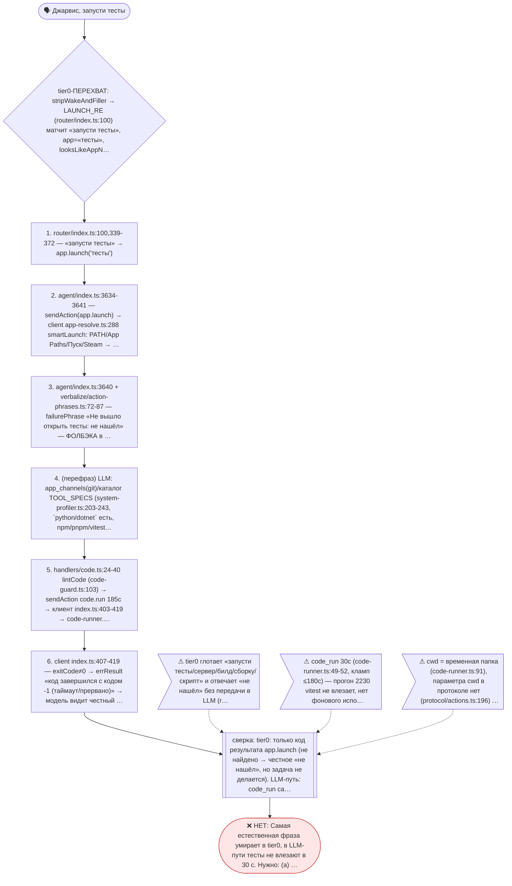
```mermaid
flowchart TD
  U(["🗣 Джарвис, запусти тесты"])
  R{"tier0-ПЕРЕХВАТ: stripWakeAndFiller → LAUNCH_RE (router/index.ts:100) матчит «запусти тесты», app=«тесты», looksLikeAppN…"}
  U --> R
  S1["1. router/index.ts:100,339-372 — «запусти тесты» → app.launch('тесты')"]
  R --> S1
  S2["2. agent/index.ts:3634-3641 — sendAction(app.launch) → client app-resolve.ts:288 smartLaunch: PATH/App Paths/Пуск/Steam → …"]
  S1 --> S2
  S3["3. agent/index.ts:3640 + verbalize/action-phrases.ts:72-87 — failurePhrase «Не вышло открыть тесты: не нашёл» — ФОЛБЭКА в …"]
  S2 --> S3
  S4["4. (перефраз) LLM: app_channels(git)/каталог TOOL_SPECS (system-profiler.ts:203-243, `python/dotnet` есть, npm/pnpm/vitest…"]
  S3 --> S4
  S5["5. handlers/code.ts:24-40 lintCode (code-guard.ts:103) → sendAction code.run 185с → клиент index.ts:403-419 → code-runner.…"]
  S4 --> S5
  S6["6. client index.ts:407-419 — exitCode≠0 → errResult «код завершился с кодом -1 (таймаут/прервано)» → модель видит честный …"]
  S5 --> S6
  V[["сверка: tier0: только код результата app.launch (не найдено → честное «не нашёл», но задача не делается). LLM-путь: code_run са…"]]
  S6 --> V
  OUT(["❌ НЕТ: Самая естественная фраза умирает в tier0, в LLM-пути тесты не влезают в 30 с. Нужно: (а) …"])
  V --> OUT
  B1>"⚠ tier0 глотает «запусти тесты/сервер/билд/сборку/скрипт» и отвечает «не нашёл» без передачи в LLM (r…"]
  B1 -.-> V
  B2>"⚠ code_run 30с (code-runner.ts:49-52, кламп ≤180с) — прогон 2230 vitest не влезает, нет фонового испо…"]
  B2 -.-> V
  B3>"⚠ cwd = временная папка (code-runner.ts:91), параметра cwd в протоколе нет (protocol/actions.ts:196) …"]
  B3 -.-> V
  style OUT fill:#ffe6e6,stroke:#c92a2a
```

**Шаги по коду:**
1. router/index.ts:100,339-372 — «запусти тесты» → app.launch('тесты')
2. agent/index.ts:3634-3641 — sendAction(app.launch) → client app-resolve.ts:288 smartLaunch: PATH/App Paths/Пуск/Steam → не найдено
3. agent/index.ts:3640 + verbalize/action-phrases.ts:72-87 — failurePhrase «Не вышло открыть тесты: не нашёл» — ФОЛБЭКА в LLM НЕТ
4. (перефраз) LLM: app_channels{git}/каталог TOOL_SPECS (system-profiler.ts:203-243, `python/dotnet` есть, npm/pnpm/vitest нет) → code_run powershell (tools index.ts:659) `Set-Location <repo>; npx vitest run`
5. handlers/code.ts:24-40 lintCode (code-guard.ts:103) → sendAction code.run 185с → клиент index.ts:403-419 → code-runner.ts:49-52 WALL_CLOCK 30с (JARVIS_CODE_TIMEOUT_MS в .env не задан) → taskkill дерева → exitCode -1
6. client index.ts:407-419 — exitCode≠0 → errResult «код завершился с кодом -1 (таймаут/прервано)» → модель видит честный провал

**Сверка исхода:** tier0: только код результата app.launch (не найдено → честное «не нашёл», но задача не делается). LLM-путь: code_run самоподтверждающийся (error-voice.ts:155-157) — stdout/exitCode vitest; при таймауте честный err; фонового ожидания нет (wait_for kinds: ui/window/text/sound/gsi/browser — sensors-cheap.ts:123-189, process/file отсутствуют).

**Где ломается / упирается:**
- tier0 глотает «запусти тесты/сервер/билд/сборку/скрипт» и отвечает «не нашёл» без передачи в LLM (router:100,537; agent:3634-3641)
- code_run 30с (code-runner.ts:49-52, кламп ≤180с) — прогон 2230 vitest не влезает; нет фонового исполнения (docs/CAPABILITY_GAPS §4 render_job «потом»)
- cwd = временная папка (code-runner.ts:91), параметра cwd в протоколе нет (protocol/actions.ts:196) — команда без явного cd падает

**Вердикт:** ❌ НЕТ — пробел (S): Самая естественная фраза умирает в tier0; в LLM-пути тесты не влезают в 30 с. Нужно: (а) в LAUNCH_CONTENT_RE (router:531) добавить тест*/сборк*/билд/сервер*/скрипт*/деплой ИЛИ фолбэк в LLM при not_found в runLocalIntent; (б) JARVIS_CODE_TIMEOUT_MS=180000 в .env (S) либо фоновый прогон с опросом (M).

### ✅ P2. «Поправь в конфиге порт на 8080 — файл config.json в проекте» — ежедневно

**Маршрут:** LLM: не вопрос (looksLikeQuestion router:621 — первое слово «поправь»), не smalltalk → sonnet «запрос-действие» (router:213-222) → isActionTask → runActionSyncFirst (agent:958-961), промоушен в фон через 10 с (agent:1010).

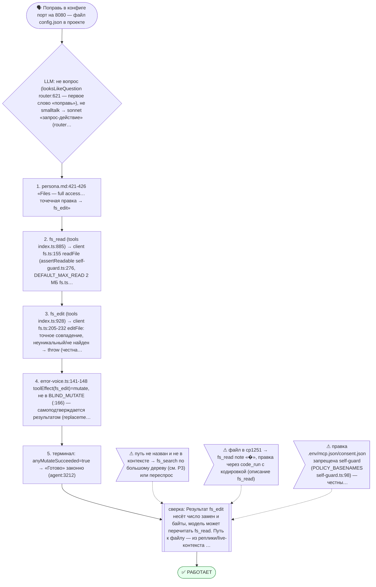
```mermaid
flowchart TD
  U(["🗣 Поправь в конфиге порт на 8080 — файл config.json в проекте"])
  R{"LLM: не вопрос (looksLikeQuestion router:621 — первое слово «поправь»), не smalltalk → sonnet «запрос-действие» (router…"}
  U --> R
  S1["1. persona.md:421-426 «Files — full access… точечная правка → fs_edit»"]
  R --> S1
  S2["2. fs_read (tools index.ts:885) → client fs.ts:155 readFile (assertReadable self-guard.ts:276, DEFAULT_MAX_READ 2 МБ fs.ts…"]
  S1 --> S2
  S3["3. fs_edit (tools index.ts:928) → client fs.ts:205-232 editFile: точное совпадение, неуникальный/не найден → throw (честна…"]
  S2 --> S3
  S4["4. error-voice.ts:141-148 toolEffect(fs_edit)=mutate, не в BLIND_MUTATE (:166) — самоподтверждается результатом (replaceme…"]
  S3 --> S4
  S5["5. терминал: anyMutateSucceeded=true → «Готово» законно (agent:3212)"]
  S4 --> S5
  V[["сверка: Результат fs_edit несёт число замен и байты, модель может перечитать fs_read. Путь к файлу — из реплики/live-контекста …"]]
  S5 --> V
  OUT(["✅ РАБОТАЕТ"])
  V --> OUT
  B1>"⚠ путь не назван и не в контексте → fs_search по большому дереву (см. P3) или переспрос"]
  B1 -.-> V
  B2>"⚠ файл в cp1251 → fs_read note «�», правка через code_run с кодировкой (описание fs_read)"]
  B2 -.-> V
  B3>"⚠ правка .env/mcp.json/consent.json запрещена self-guard (POLICY_BASENAMES self-guard.ts:98) — честны…"]
  B3 -.-> V
  style OUT fill:#e6ffed,stroke:#2b8a3e
```

**Шаги по коду:**
1. persona.md:421-426 «Files — full access… точечная правка → fs_edit»
2. fs_read (tools index.ts:885) → client fs.ts:155 readFile (assertReadable self-guard.ts:276; DEFAULT_MAX_READ 2 МБ fs.ts:106) → результат в <untrusted_content> (dispatch.ts:689)
3. fs_edit (tools index.ts:928) → client fs.ts:205-232 editFile: точное совпадение, неуникальный/не найден → throw (честная ошибка, не no-op)
4. error-voice.ts:141-148 toolEffect(fs_edit)=mutate, не в BLIND_MUTATE (:166) — самоподтверждается результатом {replacements, bytes}
5. терминал: anyMutateSucceeded=true → «Готово» законно (agent:3212)

**Сверка исхода:** Результат fs_edit несёт число замен и байты; модель может перечитать fs_read. Путь к файлу — из реплики/live-контекста окон (заголовок VS Code, persona.md:454-465) или memory; .env/секреты — блок чтения и записи (self-guard.ts:140-200).

**Где ломается / упирается:**
- путь не назван и не в контексте → fs_search по большому дереву (см. P3) или переспрос
- файл в cp1251 → fs_read note «�», правка через code_run с кодировкой (описание fs_read)
- правка .env/mcp.json/consent.json запрещена self-guard (POLICY_BASENAMES self-guard.ts:98) — честный отказ

**Вердикт:** ✅ РАБОТАЕТ

### 🟡 P3. «Где в проекте определяется функция resolveUserId?» — ежедневно

**Маршрут:** ВОПРОС: первое слово «где» ∈ QUESTION_FIRST (router:585-593) → conversational, tier haiku (= Sonnet, Haiku не используется) → синхронный стрим без §20-чипа (agent:974-985), кап HARD_STEP_CAP=12 (agent:1503); инструменты разрешены.

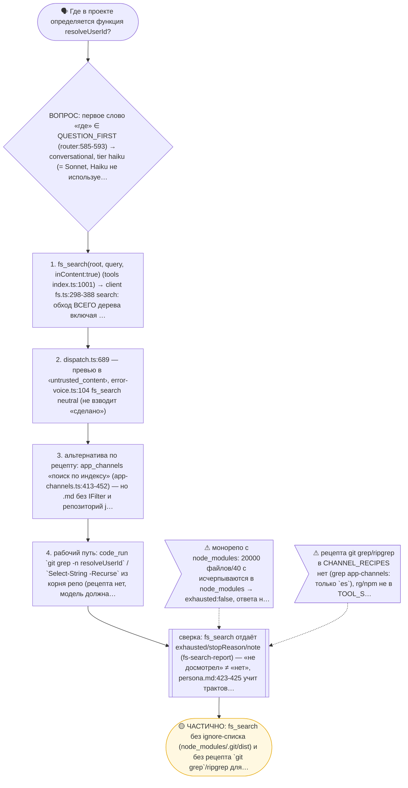
```mermaid
flowchart TD
  U(["🗣 Где в проекте определяется функция resolveUserId?"])
  R{"ВОПРОС: первое слово «где» ∈ QUESTION_FIRST (router:585-593) → conversational, tier haiku (= Sonnet, Haiku не используе…"}
  U --> R
  S1["1. fs_search(root, query, inContent:true) (tools index.ts:1001) → client fs.ts:298-388 search: обход ВСЕГО дерева включая …"]
  R --> S1
  S2["2. dispatch.ts:689 — превью в ‹untrusted_content›, error-voice.ts:104 fs_search neutral (не взводит «сделано»)"]
  S1 --> S2
  S3["3. альтернатива по рецепту: app_channels «поиск по индексу» (app-channels.ts:413-452) — но .md без IFilter и репозиторий j…"]
  S2 --> S3
  S4["4. рабочий путь: code_run `git grep -n resolveUserId` / `Select-String -Recurse` из корня репо (рецепта нет, модель должна…"]
  S3 --> S4
  V[["сверка: fs_search отдаёт exhausted/stopReason/note (fs-search-report) — «не досмотрел» ≠ «нет», persona.md:423-425 учит трактов…"]]
  S4 --> V
  OUT(["🟡 ЧАСТИЧНО: fs_search без ignore-списка (node_modules/.git/dist) и без рецепта `git grep`/ripgrep для…"])
  V --> OUT
  B1>"⚠ монорепо с node_modules: 20000 файлов/40 с исчерпываются в node_modules → exhausted:false, ответа н…"]
  B1 -.-> V
  B2>"⚠ рецепта git grep/ripgrep в CHANNEL_RECIPES нет (grep app-channels: только `es`), rg/npm не в TOOL_S…"]
  B2 -.-> V
  style OUT fill:#fff8e1,stroke:#e6a700
```

**Шаги по коду:**
1. fs_search{root, query, inContent:true} (tools index.ts:1001) → client fs.ts:298-388 search: обход ВСЕГО дерева включая node_modules/.git (исключений нет — grep fs.ts пусто), scanCap 20000 (fs-search-report.ts:71), бюджет 40 с (:77), maxResults ≤200 (fs.ts:109); серверный таймаут fs.search 60 с (protocol/constants.ts:65)
2. dispatch.ts:689 — превью в <untrusted_content>; error-voice.ts:104 fs_search neutral (не взводит «сделано»)
3. альтернатива по рецепту: app_channels «поиск по индексу» (app-channels.ts:413-452) — но .md без IFilter и репозиторий jarvis в индексе отсутствует (:440-444); Everything не установлен (:453-467)
4. рабочий путь: code_run `git grep -n resolveUserId` / `Select-String -Recurse` из корня репо (рецепта нет, модель должна догадаться)

**Сверка исхода:** fs_search отдаёт exhausted/stopReason/note (fs-search-report) — «не досмотрел» ≠ «нет»; persona.md:423-425 учит трактовать exhausted:false; code_run — stdout git grep.

**Где ломается / упирается:**
- монорепо с node_modules: 20000 файлов/40 с исчерпываются в node_modules → exhausted:false, ответа нет, лишние раунды
- рецепта git grep/ripgrep в CHANNEL_RECIPES нет (grep app-channels: только `es`), rg/npm не в TOOL_SPECS (system-profiler.ts:203-243)

**Вердикт:** 🟡 ЧАСТИЧНО — пробел (S): fs_search без ignore-списка (node_modules/.git/dist) и без рецепта `git grep`/ripgrep для репозиториев; на реальном монорепо честно «не досмотрел», но ответа не даёт с первого раза.

### 🟡 P4. «Закоммить всё с сообщением «фикс роутера» и запушь» — еженедельно

**Маршрут:** LLM: не вопрос → sonnet-задача (router:213-222), фон через 10 с. Рецепт Git (app-channels.ts:339-346) — cmd git на PATH матчится через TOOL_SPECS (system-profiler.ts:206, recipeMatches app-channels.ts:762-778).

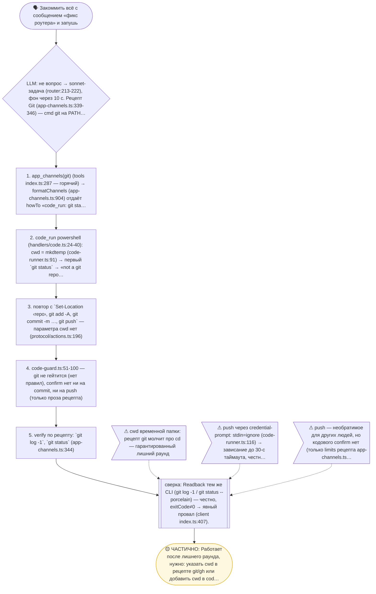
```mermaid
flowchart TD
  U(["🗣 Закоммить всё с сообщением «фикс роутера» и запушь"])
  R{"LLM: не вопрос → sonnet-задача (router:213-222), фон через 10 с. Рецепт Git (app-channels.ts:339-346) — cmd git на PATH…"}
  U --> R
  S1["1. app_channels(git) (tools index.ts:287 — горячий) → formatChannels (app-channels.ts:904) отдаёт howTo «code_run: git sta…"]
  R --> S1
  S2["2. code_run powershell (handlers/code.ts:24-40): cwd = mkdtemp (code-runner.ts:91) → первый `git status` → «not a git repo…"]
  S1 --> S2
  S3["3. повтор с `Set-Location ‹repo›, git add -A, git commit -m …, git push` — параметра cwd нет (protocol/actions.ts:196)"]
  S2 --> S3
  S4["4. code-guard.ts:51-100 — git не гейтится (нет правил), confirm нет ни на commit, ни на push (только проза рецепта)"]
  S3 --> S4
  S5["5. verify по рецепту: `git log -1`, `git status` (app-channels.ts:344)"]
  S4 --> S5
  V[["сверка: Readback тем же CLI (git log -1 / git status --porcelain) — честно, exitCode≠0 → явный провал (client index.ts:407)."]]
  S5 --> V
  OUT(["🟡 ЧАСТИЧНО: Работает после лишнего раунда, нужно: указать cwd в рецепте git/gh или добавить cwd в cod…"])
  V --> OUT
  B1>"⚠ cwd временной папки: рецепт git молчит про cd — гарантированный лишний раунд"]
  B1 -.-> V
  B2>"⚠ push через credential-prompt: stdin=ignore (code-runner.ts:116) → зависание до 30-с таймаута, честн…"]
  B2 -.-> V
  B3>"⚠ push — необратимое для других людей, но кодового confirm нет (только limits рецепта app-channels.ts…"]
  B3 -.-> V
  style OUT fill:#fff8e1,stroke:#e6a700
```

**Шаги по коду:**
1. app_channels{git} (tools index.ts:287 — горячий) → formatChannels (app-channels.ts:904) отдаёт howTo «code_run: git status/diff/log/commit», limits «пуш — только по явной просьбе»
2. code_run powershell (handlers/code.ts:24-40): cwd = mkdtemp (code-runner.ts:91) → первый `git status` → «not a git repository», exitCode 128 → errResult (client index.ts:407-419)
3. повтор с `Set-Location <repo>; git add -A; git commit -m …; git push` — параметра cwd нет (protocol/actions.ts:196)
4. code-guard.ts:51-100 — git не гейтится (нет правил), confirm нет ни на commit, ни на push (только проза рецепта)
5. verify по рецепту: `git log -1`, `git status` (app-channels.ts:344)

**Сверка исхода:** Readback тем же CLI (git log -1 / git status --porcelain) — честно; exitCode≠0 → явный провал (client index.ts:407).

**Где ломается / упирается:**
- cwd временной папки: рецепт git молчит про cd — гарантированный лишний раунд
- push через credential-prompt: stdin=ignore (code-runner.ts:116) → зависание до 30-с таймаута, честный -1
- push — необратимое для других людей, но кодового confirm нет (только limits рецепта app-channels.ts:345); GitHub MCP в mcp.json без `confirm` → push_files/merge через MCP тоже без §14 (dispatch.ts:507 гейтит только декларированное)

**Вердикт:** 🟡 ЧАСТИЧНО — пробел (S): Работает после лишнего раунда; нужно: указать cwd в рецепте git/gh или добавить cwd в code.run (S); confirm на push/merge — правило в code-guard (`git push`) + `confirm:[…]` для github в mcp.json (S).

### ✅ P5. «Посмотри, почему упал CI на моём последнем пулреквесте» — еженедельно

**Маршрут:** «почему» есть, но первое слово «посмотри» → looksLikeQuestion false (router:621-635); looksHardReasoning true («почему» router:583) И looksLikeAction? «посмотри» не в ACTION_VERB_RE → isHard → tier fable, conversational (router:191-198) — синхронный разговор на Opus, кап 12 раундов.

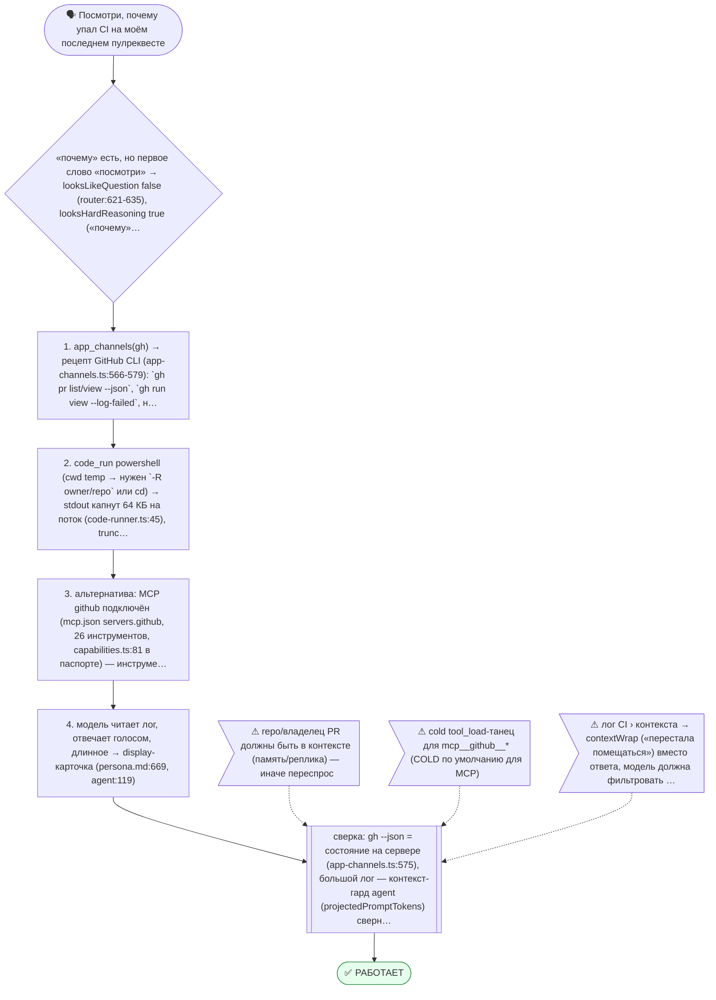
```mermaid
flowchart TD
  U(["🗣 Посмотри, почему упал CI на моём последнем пулреквесте"])
  R{"«почему» есть, но первое слово «посмотри» → looksLikeQuestion false (router:621-635), looksHardReasoning true («почему»…"}
  U --> R
  S1["1. app_channels(gh) → рецепт GitHub CLI (app-channels.ts:566-579): `gh pr list/view --json`, `gh run view --log-failed`, н…"]
  R --> S1
  S2["2. code_run powershell (cwd temp → нужен `-R owner/repo` или cd) → stdout капнут 64 КБ на поток (code-runner.ts:45), trunc…"]
  S1 --> S2
  S3["3. альтернатива: MCP github подключён (mcp.json servers.github, 26 инструментов, capabilities.ts:81 в паспорте) — инструме…"]
  S2 --> S3
  S4["4. модель читает лог, отвечает голосом, длинное → display-карточка (persona.md:669, agent:119)"]
  S3 --> S4
  V[["сверка: gh --json = состояние на сервере (app-channels.ts:575), большой лог — контекст-гард agent (projectedPromptTokens) сверн…"]]
  S4 --> V
  OUT(["✅ РАБОТАЕТ"])
  V --> OUT
  B1>"⚠ repo/владелец PR должны быть в контексте (память/реплика) — иначе переспрос"]
  B1 -.-> V
  B2>"⚠ cold tool_load-танец для mcp__github__* (COLD по умолчанию для MCP)"]
  B2 -.-> V
  B3>"⚠ лог CI › контекста → contextWrap («перестала помещаться») вместо ответа, модель должна фильтровать …"]
  B3 -.-> V
  style OUT fill:#e6ffed,stroke:#2b8a3e
```

**Шаги по коду:**
1. app_channels{gh} → рецепт GitHub CLI (app-channels.ts:566-579): `gh pr list/view --json`, `gh run view --log-failed`; нужна авторизация gh auth status
2. code_run powershell (cwd temp → нужен `-R owner/repo` или cd) → stdout капнут 64 КБ на поток (code-runner.ts:45), truncated:true
3. альтернатива: MCP github подключён (mcp.json servers.github, 26 инструментов; capabilities.ts:81 в паспорте) — инструменты COLD → tool_load (tools index.ts:1884) → +1 раунд; вывод в <untrusted_content source=mcp:github> (dispatch.ts:530-546)
4. модель читает лог, отвечает голосом; длинное → display-карточка (persona.md:669; agent:119)

**Сверка исхода:** gh --json = состояние на сервере (app-channels.ts:575); большой лог — контекст-гард agent (projectedPromptTokens) свернёт задачу честно.

**Где ломается / упирается:**
- repo/владелец PR должны быть в контексте (память/реплика) — иначе переспрос
- cold tool_load-танец для mcp__github__* (COLD по умолчанию для MCP)
- лог CI > контекста → contextWrap («перестала помещаться») вместо ответа; модель должна фильтровать --log-failed

**Вердикт:** ✅ РАБОТАЕТ

### 🟡 P6. «Покажи последние ошибки в логе сервера» — ежедневно

**Маршрут:** LLM: «покажи» — команда (router:213) → sonnet-задача, sync-first.

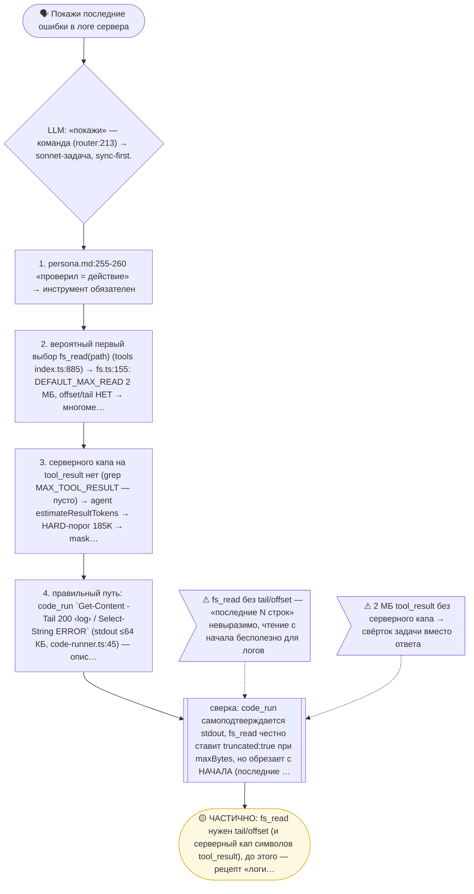
```mermaid
flowchart TD
  U(["🗣 Покажи последние ошибки в логе сервера"])
  R{"LLM: «покажи» — команда (router:213) → sonnet-задача, sync-first."}
  U --> R
  S1["1. persona.md:255-260 «проверил = действие» → инструмент обязателен"]
  R --> S1
  S2["2. вероятный первый выбор fs_read(path) (tools index.ts:885) → fs.ts:155: DEFAULT_MAX_READ 2 МБ, offset/tail НЕТ → многоме…"]
  S1 --> S2
  S3["3. серверного капа на tool_result нет (grep MAX_TOOL_RESULT — пусто) → agent estimateResultTokens → HARD-порог 185K → mask…"]
  S2 --> S3
  S4["4. правильный путь: code_run `Get-Content -Tail 200 ‹log› / Select-String ERROR` (stdout ≤64 КБ, code-runner.ts:45) — опис…"]
  S3 --> S4
  V[["сверка: code_run самоподтверждается stdout, fs_read честно ставит truncated:true при maxBytes, но обрезает с НАЧАЛА (последние …"]]
  S4 --> V
  OUT(["🟡 ЧАСТИЧНО: fs_read нужен tail/offset (и серверный кап символов tool_result), до этого — рецепт «логи…"])
  V --> OUT
  B1>"⚠ fs_read без tail/offset — «последние N строк» невыразимо, чтение с начала бесполезно для логов"]
  B1 -.-> V
  B2>"⚠ 2 МБ tool_result без серверного капа → свёрток задачи вместо ответа"]
  B2 -.-> V
  style OUT fill:#fff8e1,stroke:#e6a700
```

**Шаги по коду:**
1. persona.md:255-260 «проверил = действие» → инструмент обязателен
2. вероятный первый выбор fs_read{path} (tools index.ts:885) → fs.ts:155: DEFAULT_MAX_READ 2 МБ, offset/tail НЕТ → многомегабайтный лог возвращается целиком (2 МБ) в tool_result
3. серверного капа на tool_result нет (grep MAX_TOOL_RESULT — пусто) → agent estimateResultTokens → HARD-порог 185K → mask-observations не спасает (свежий раунд не сворачивается) → contextWrap «перестала помещаться в память»
4. правильный путь: code_run `Get-Content -Tail 200 <log> | Select-String ERROR` (stdout ≤64 КБ, code-runner.ts:45) — описание fs_read лишь советует maxBytes, размер файла заранее неизвестен (fs_list даёт size)

**Сверка исхода:** code_run самоподтверждается stdout; fs_read честно ставит truncated:true при maxBytes, но обрезает с НАЧАЛА (последние ошибки не попадают).

**Где ломается / упирается:**
- fs_read без tail/offset — «последние N строк» невыразимо; чтение с начала бесполезно для логов
- 2 МБ tool_result без серверного капа → свёрток задачи вместо ответа

**Вердикт:** 🟡 ЧАСТИЧНО — пробел (S): fs_read нужен tail/offset (и серверный кап символов tool_result); до этого — рецепт «логи читать code_run Get-Content -Tail».

### 🟡 P7. «Открой проект в VS Code» — ежедневно

**Маршрут:** LAUNCH_RE ловит, но looksLikeAppName(«проект в VS Code») — 4 слова и предлог «в» (LAUNCH_PREP_RE router:530) → false → LLM sonnet-задача. Короткое «открой вс код» → tier0 app.launch('вс код') → резолвер клиента.

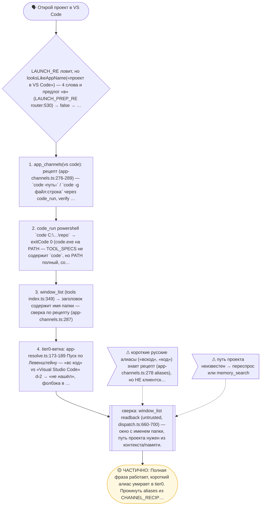
```mermaid
flowchart TD
  U(["🗣 Открой проект в VS Code"])
  R{"LAUNCH_RE ловит, но looksLikeAppName(«проект в VS Code») — 4 слова и предлог «в» (LAUNCH_PREP_RE router:530) → false → …"}
  U --> R
  S1["1. app_channels(vs code): рецепт (app-channels.ts:276-289) — `code ‹путь›` / `code -g файл:строка` через code_run, verify …"]
  R --> S1
  S2["2. code_run powershell `code C:\…\repo` → exitCode 0 (code.exe на PATH — TOOL_SPECS не содержит `code`, но PATH полный, co…"]
  S1 --> S2
  S3["3. window_list (tools index.ts:349) → заголовок содержит имя папки — сверка по рецепту (app-channels.ts:287)"]
  S2 --> S3
  S4["4. tier0-ветка: app-resolve.ts:173-189 Пуск по Левенштейну — «вс код» vs «Visual Studio Code» d›2 → «не нашёл», фолбэка в …"]
  S3 --> S4
  V[["сверка: window_list readback (untrusted, dispatch.ts:660-700) — окно с именем папки, путь проекта нужен из контекста/памяти."]]
  S4 --> V
  OUT(["🟡 ЧАСТИЧНО: Полная фраза работает, короткий алиас умирает в tier0. Прокинуть aliases из CHANNEL_RECIP…"])
  V --> OUT
  B1>"⚠ короткие русские алиасы («вскод», «код») знает рецепт (app-channels.ts:278 aliases), но НЕ клиентск…"]
  B1 -.-> V
  B2>"⚠ путь проекта неизвестен → переспрос или memory_search"]
  B2 -.-> V
  style OUT fill:#fff8e1,stroke:#e6a700
```

**Шаги по коду:**
1. app_channels{vs code}: рецепт (app-channels.ts:276-289) — `code <путь>` / `code -g файл:строка` через code_run, verify window_list по заголовку
2. code_run powershell `code C:\…\repo` → exitCode 0 (code.exe на PATH — TOOL_SPECS не содержит `code`, но PATH полный, code-runner.ts:65-73)
3. window_list (tools index.ts:349) → заголовок содержит имя папки — сверка по рецепту (app-channels.ts:287)
4. tier0-ветка: app-resolve.ts:173-189 Пуск по Левенштейну — «вс код» vs «Visual Studio Code» d>2 → «не нашёл», фолбэка в LLM нет (agent:3640)

**Сверка исхода:** window_list readback (untrusted, dispatch.ts:660-700) — окно с именем папки; путь проекта нужен из контекста/памяти.

**Где ломается / упирается:**
- короткие русские алиасы («вскод», «код») знает рецепт (app-channels.ts:278 aliases), но НЕ клиентский резолвер app-resolve.ts — tier0 отвечает «не нашёл» и не передаёт в LLM
- путь проекта неизвестен → переспрос или memory_search

**Вердикт:** 🟡 ЧАСТИЧНО — пробел (S): Полная фраза работает; короткий алиас умирает в tier0. Прокинуть aliases из CHANNEL_RECIPES/ClientEnv в резолвер клиента или фолбэк not_found → LLM.

### 🟡 P8. «Выполни запрос в базе: сколько строк в таблице users» — еженедельно

**Маршрут:** «сколько» в середине, первое слово «выполни» → не вопрос → sonnet-задача. TOOL_SPECS psql (system-profiler.ts:222) в каталоге «Программно доступно» (system-profiler.ts:483).

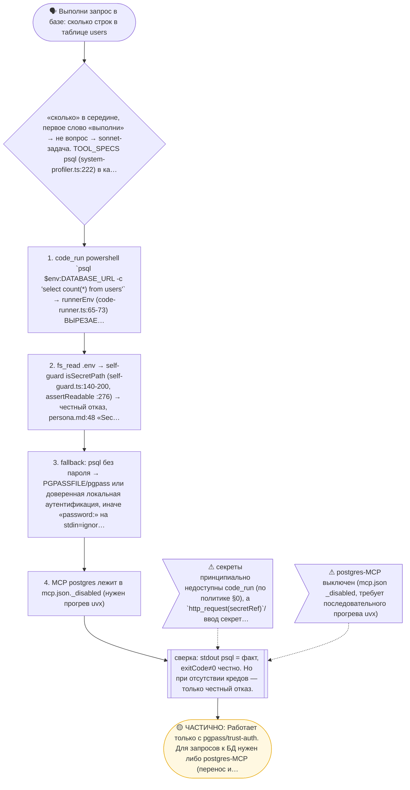
```mermaid
flowchart TD
  U(["🗣 Выполни запрос в базе: сколько строк в таблице users"])
  R{"«сколько» в середине, первое слово «выполни» → не вопрос → sonnet-задача. TOOL_SPECS psql (system-profiler.ts:222) в ка…"}
  U --> R
  S1["1. code_run powershell `psql $env:DATABASE_URL -c 'select count(*) from users'` → runnerEnv (code-runner.ts:65-73) ВЫРЕЗАЕ…"]
  R --> S1
  S2["2. fs_read .env → self-guard isSecretPath (self-guard.ts:140-200, assertReadable :276) → честный отказ, persona.md:48 «Sec…"]
  S1 --> S2
  S3["3. fallback: psql без пароля → PGPASSFILE/pgpass или доверенная локальная аутентификация, иначе «password:» на stdin=ignor…"]
  S2 --> S3
  S4["4. MCP postgres лежит в mcp.json._disabled (нужен прогрев uvx)"]
  S3 --> S4
  V[["сверка: stdout psql = факт, exitCode≠0 честно. Но при отсутствии кредов — только честный отказ."]]
  S4 --> V
  OUT(["🟡 ЧАСТИЧНО: Работает только с pgpass/trust-auth. Для запросов к БД нужен либо postgres-MCP (перенос и…"])
  V --> OUT
  B1>"⚠ секреты принципиально недоступны code_run (по политике §0), а `http_request(secretRef)`/ввод секрет…"]
  B1 -.-> V
  B2>"⚠ postgres-MCP выключен (mcp.json _disabled, требует последовательного прогрева uvx)"]
  B2 -.-> V
  style OUT fill:#fff8e1,stroke:#e6a700
```

**Шаги по коду:**
1. code_run powershell `psql $env:DATABASE_URL -c 'select count(*) from users'` → runnerEnv (code-runner.ts:65-73) ВЫРЕЗАЕТ переменные с кредами в URL (CREDS_IN_URL_RE :63) и *PASSWORD/*TOKEN → DATABASE_URL отсутствует
2. fs_read .env → self-guard isSecretPath (self-guard.ts:140-200, assertReadable :276) → честный отказ; persona.md:48 «Secrets stay secret»
3. fallback: psql без пароля → PGPASSFILE/pgpass или доверенная локальная аутентификация; иначе «password:» на stdin=ignore → зависание → таймаут 30 с → -1
4. MCP postgres лежит в mcp.json._disabled (нужен прогрев uvx)

**Сверка исхода:** stdout psql = факт; exitCode≠0 честно. Но при отсутствии кредов — только честный отказ.

**Где ломается / упирается:**
- секреты принципиально недоступны code_run (по политике §0), а `http_request{secretRef}`/ввод секретов в UI — «потом» (docs/CAPABILITY_GAPS §4)
- postgres-MCP выключен (mcp.json _disabled, требует последовательного прогрева uvx)

**Вердикт:** 🟡 ЧАСТИЧНО — пробел (M): Работает только с pgpass/trust-auth. Для запросов к БД нужен либо postgres-MCP (перенос из _disabled + прогрев — S), либо secretRef-механизм (M).

---

## DEVOPS/АДМИН (службы, сеть, планировщик, PowerShell, мониторинг, удалённый сервер)

**Итог по роли:** Девопс/админ получает честного оператора Windows: code_run открыт для реестра/служб/сети/COM (code-guard.ts:4), рецепты builtin-утилит (службы, netsh, powercfg, schtasks, буфер) подсеваются всегда и несут readback-сверку; nvidia-smi/gh/git/docker/psql детектятся на PATH. Чтение и диагностика — работают. Упирается в отсутствие повышения прав (любое управление службами/сетью/планировщиком с RunLevel → Access Denied без слов «нужен админ»), в контекст-слепые regex code-guard (self-kill блокирует Stop-Process любого node.exe, power блокирует `shutdown` в ssh-команде на удалённый хост), в 30-секундный потолок code_run без фонового исполнения и в отсутствие confirm на персистентность (планировщик/автозапуск ставятся молча). Вопросительные формулировки («что с сетью», «были ли ошибки») уходят в разговорный путь — работают, но без таск-чипа и с капом 12 раундов.

### 🟡 D1. «Проверь, запущена ли служба WSearch, и если нет — перезапусти её» — ежедневно

**Маршрут:** «проверь» — не вопросительное первое слово (router:585-635), conditional-lead нет → sonnet-задача (router:213-222), sync-first с промоушеном в фон через 10 с (agent:1010).

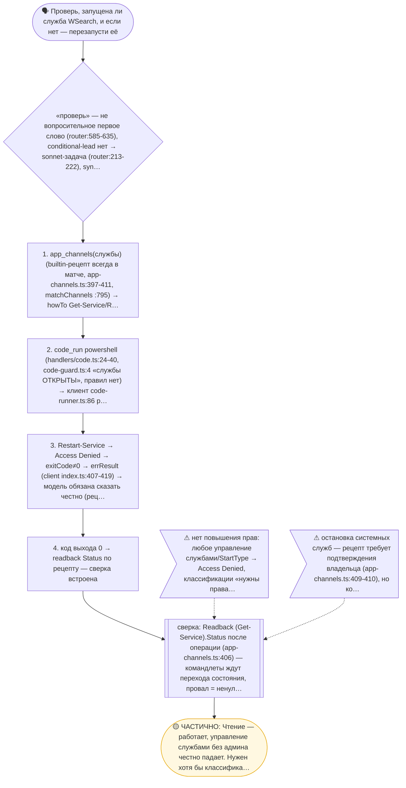
```mermaid
flowchart TD
  U(["🗣 Проверь, запущена ли служба WSearch, и если нет — перезапусти её"])
  R{"«проверь» — не вопросительное первое слово (router:585-635), conditional-lead нет → sonnet-задача (router:213-222), syn…"}
  U --> R
  S1["1. app_channels(службы) (builtin-рецепт всегда в матче, app-channels.ts:397-411, matchChannels :795) → howTo Get-Service/R…"]
  R --> S1
  S2["2. code_run powershell (handlers/code.ts:24-40, code-guard.ts:4 «службы ОТКРЫТЫ», правил нет) → клиент code-runner.ts:86 p…"]
  S1 --> S2
  S3["3. Restart-Service → Access Denied → exitCode≠0 → errResult (client index.ts:407-419) → модель обязана сказать честно (рец…"]
  S2 --> S3
  S4["4. код выхода 0 → readback Status по рецепту — сверка встроена"]
  S3 --> S4
  V[["сверка: Readback (Get-Service).Status после операции (app-channels.ts:406) — командлеты ждут перехода состояния, провал = ненул…"]]
  S4 --> V
  OUT(["🟡 ЧАСТИЧНО: Чтение — работает, управление службами без админа честно падает. Нужен хотя бы классифика…"])
  V --> OUT
  B1>"⚠ нет повышения прав: любое управление службами/StartType → Access Denied, классификации «нужны права…"]
  B1 -.-> V
  B2>"⚠ остановка системных служб — рецепт требует подтверждения владельца (app-channels.ts:409-410), но ко…"]
  B2 -.-> V
  style OUT fill:#fff8e1,stroke:#e6a700
```

**Шаги по коду:**
1. app_channels{службы} (builtin-рецепт всегда в матче, app-channels.ts:397-411, matchChannels :795) → howTo Get-Service/Restart-Service, verify (Get-Service X).Status, limits «почти всё требует АДМИНА»
2. code_run powershell (handlers/code.ts:24-40; code-guard.ts:4 «службы ОТКРЫТЫ», правил нет) → клиент code-runner.ts:86 powershell -NoProfile FullLanguage под правами Electron (не elevated)
3. Restart-Service → Access Denied → exitCode≠0 → errResult (client index.ts:407-419) → модель обязана сказать честно (рецепт limits :408)
4. код выхода 0 → readback Status по рецепту — сверка встроена

**Сверка исхода:** Readback (Get-Service).Status после операции (app-channels.ts:406) — командлеты ждут перехода состояния; провал = ненулевой exitCode, ложного «перезапустил» нет.

**Где ломается / упирается:**
- нет повышения прав: любое управление службами/StartType → Access Denied; классификации «нужны права администратора» нет (docs/CAPABILITY_GAPS §4 elevate_run шаг 1) — модель скажет «не получилось», а не «нужен ваш UAC-клик»
- остановка системных служб — рецепт требует подтверждения владельца (app-channels.ts:409-410), но кодового гейта нет (code-guard без правил на Stop-Service)

**Вердикт:** 🟡 ЧАСТИЧНО — пробел (M): Чтение — работает; управление службами без админа честно падает. Нужен хотя бы классификатор Access Denied → «нужны права администратора» (S), полноценный elevate — L.

### 🟡 D2. «Кто держит порт 3000? Убей его» — ежедневно

**Маршрут:** Первое слово «кто» → conversational (router:585-593, QUESTION_FIRST) на haiku=Sonnet — синхронно, без §20-чипа, кап 12 раундов (agent:1503); инструменты разрешены, masked-failure на разговоре не применяется (agent:3256).

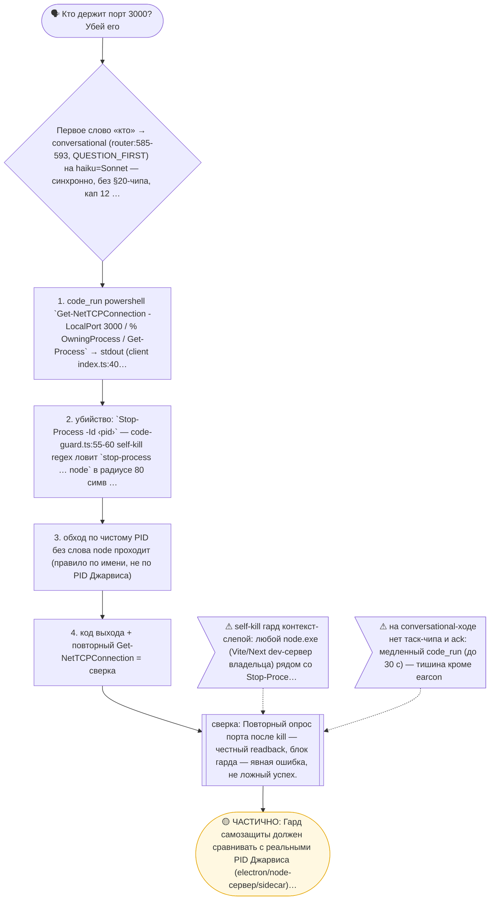
```mermaid
flowchart TD
  U(["🗣 Кто держит порт 3000? Убей его"])
  R{"Первое слово «кто» → conversational (router:585-593, QUESTION_FIRST) на haiku=Sonnet — синхронно, без §20-чипа, кап 12 …"}
  U --> R
  S1["1. code_run powershell `Get-NetTCPConnection -LocalPort 3000 / % OwningProcess / Get-Process` → stdout (client index.ts:40…"]
  R --> S1
  S2["2. убийство: `Stop-Process -Id ‹pid›` — code-guard.ts:55-60 self-kill regex ловит `stop-process … node` в радиусе 80 симв …"]
  S1 --> S2
  S3["3. обход по чистому PID без слова node проходит (правило по имени, не по PID Джарвиса)"]
  S2 --> S3
  S4["4. код выхода + повторный Get-NetTCPConnection = сверка"]
  S3 --> S4
  V[["сверка: Повторный опрос порта после kill — честный readback, блок гарда — явная ошибка, не ложный успех."]]
  S4 --> V
  OUT(["🟡 ЧАСТИЧНО: Гард самозащиты должен сравнивать с реальными PID Джарвиса (electron/node-сервер/sidecar)…"])
  V --> OUT
  B1>"⚠ self-kill гард контекст-слепой: любой node.exe (Vite/Next dev-сервер владельца) рядом со Stop-Proce…"]
  B1 -.-> V
  B2>"⚠ на conversational-ходе нет таск-чипа и ack: медленный code_run (до 30 с) — тишина кроме earcon"]
  B2 -.-> V
  style OUT fill:#fff8e1,stroke:#e6a700
```

**Шаги по коду:**
1. code_run powershell `Get-NetTCPConnection -LocalPort 3000 | % OwningProcess | Get-Process` → stdout (client index.ts:403-419)
2. убийство: `Stop-Process -Id <pid>` — code-guard.ts:55-60 self-kill regex ловит `stop-process … node` в радиусе 80 симв (оба порядка): если процесс — node.exe dev-сервера владельца и модель упомянет имя → БЛОК «нельзя завершать процессы самого Джарвиса»
3. обход по чистому PID без слова node проходит (правило по имени, не по PID Джарвиса)
4. код выхода + повторный Get-NetTCPConnection = сверка

**Сверка исхода:** Повторный опрос порта после kill — честный readback; блок гарда — явная ошибка, не ложный успех.

**Где ломается / упирается:**
- self-kill гард контекст-слепой: любой node.exe (Vite/Next dev-сервер владельца) рядом со Stop-Process блокируется — у программиста/девопса это основной случай
- на conversational-ходе нет таск-чипа и ack: медленный code_run (до 30 с) — тишина кроме earcon

**Вердикт:** 🟡 ЧАСТИЧНО — пробел (M): Гард самозащиты должен сравнивать с реальными PID Джарвиса (electron/node-сервер/sidecar), а не с именем `node` в тексте (code-guard.ts:55-60).

### ✅ D3. «Зайди по SSH на мой сервер и посмотри аптайм и место на диске» — еженедельно

**Маршрут:** «зайди» — команда → sonnet-задача; хост/ключ должны быть в памяти (memory_search/профиль) или в реплике.

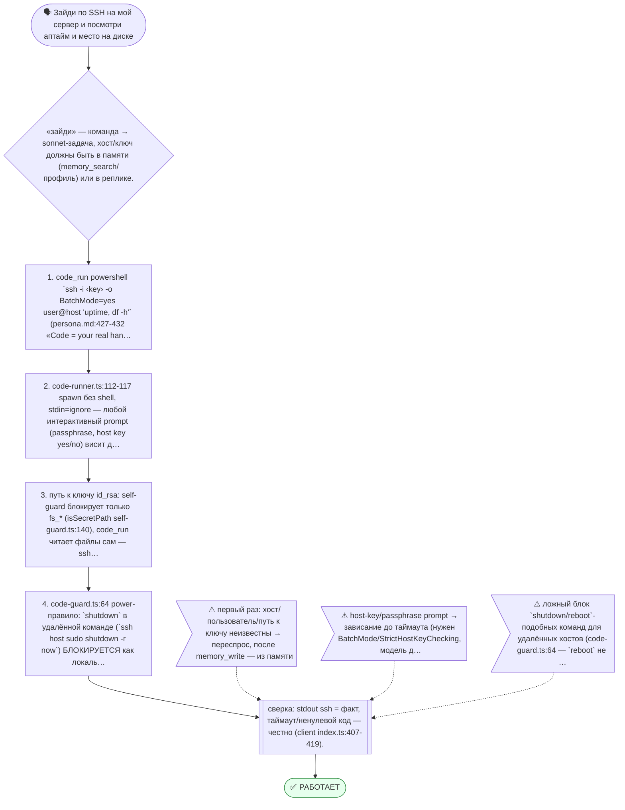
```mermaid
flowchart TD
  U(["🗣 Зайди по SSH на мой сервер и посмотри аптайм и место на диске"])
  R{"«зайди» — команда → sonnet-задача, хост/ключ должны быть в памяти (memory_search/профиль) или в реплике."}
  U --> R
  S1["1. code_run powershell `ssh -i ‹key› -o BatchMode=yes user@host 'uptime, df -h'` (persona.md:427-432 «Code = your real han…"]
  R --> S1
  S2["2. code-runner.ts:112-117 spawn без shell, stdin=ignore — любой интерактивный prompt (passphrase, host key yes/no) висит д…"]
  S1 --> S2
  S3["3. путь к ключу id_rsa: self-guard блокирует только fs_* (isSecretPath self-guard.ts:140), code_run читает файлы сам — ssh…"]
  S2 --> S3
  S4["4. code-guard.ts:64 power-правило: `shutdown` в удалённой команде (`ssh host sudo shutdown -r now`) БЛОКИРУЕТСЯ как локаль…"]
  S3 --> S4
  V[["сверка: stdout ssh = факт, таймаут/ненулевой код — честно (client index.ts:407-419)."]]
  S4 --> V
  OUT(["✅ РАБОТАЕТ"])
  V --> OUT
  B1>"⚠ первый раз: хост/пользователь/путь к ключу неизвестны → переспрос, после memory_write — из памяти"]
  B1 -.-> V
  B2>"⚠ host-key/passphrase prompt → зависание до таймаута (нужен BatchMode/StrictHostKeyChecking, модель д…"]
  B2 -.-> V
  B3>"⚠ ложный блок `shutdown/reboot`-подобных команд для удалённых хостов (code-guard.ts:64 — `reboot` не …"]
  B3 -.-> V
  style OUT fill:#e6ffed,stroke:#2b8a3e
```

**Шаги по коду:**
1. code_run powershell `ssh -i <key> -o BatchMode=yes user@host "uptime; df -h"` (persona.md:427-432 «Code = your real hands»)
2. code-runner.ts:112-117 spawn без shell, stdin=ignore — любой интерактивный prompt (passphrase, host key yes/no) висит до 30 с → -1 честно
3. путь к ключу id_rsa: self-guard блокирует только fs_* (isSecretPath self-guard.ts:140), code_run читает файлы сам — ssh работает; env *KEY* вырезан (code-runner.ts:68), но это env, не файл
4. code-guard.ts:64 power-правило: `shutdown` в удалённой команде (`ssh host sudo shutdown -r now`) БЛОКИРУЕТСЯ как локальное питание — «только через system_power», хотя тот удалённый хост перезагрузить не может

**Сверка исхода:** stdout ssh = факт; таймаут/ненулевой код — честно (client index.ts:407-419).

**Где ломается / упирается:**
- первый раз: хост/пользователь/путь к ключу неизвестны → переспрос; после memory_write — из памяти
- host-key/passphrase prompt → зависание до таймаута (нужен BatchMode/StrictHostKeyChecking, модель должна знать)
- ложный блок `shutdown|reboot`-подобных команд для удалённых хостов (code-guard.ts:64 — `reboot` не ловится, `shutdown` ловится)

**Вердикт:** ✅ РАБОТАЕТ

### ✅ D4. «Поставь в планировщик: каждый день в девять запускать бэкап-скрипт» — редко

**Маршрут:** «поставь» ∈ ACTION_VERB_RE; CONDITIONAL_LEAD нет («каждый день» не в начале) → sonnet-задача. Риск: persona.md:566-570 тянет к set_reminder; рецепт планировщика (app-channels.ts:119-132) limits явно разводит: «обычные напоминания — set_reminder».

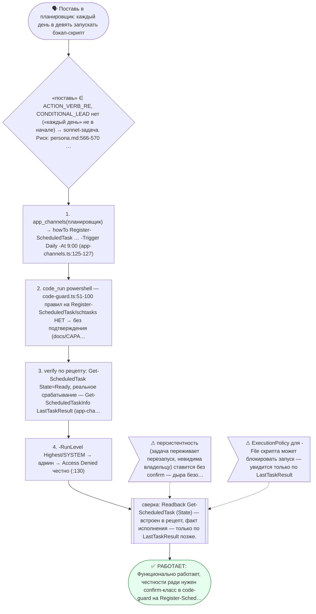
```mermaid
flowchart TD
  U(["🗣 Поставь в планировщик: каждый день в девять запускать бэкап-скрипт"])
  R{"«поставь» ∈ ACTION_VERB_RE, CONDITIONAL_LEAD нет («каждый день» не в начале) → sonnet-задача. Риск: persona.md:566-570 …"}
  U --> R
  S1["1. app_channels(планировщик) → howTo Register-ScheduledTask … -Trigger Daily -At 9:00 (app-channels.ts:125-127)"]
  R --> S1
  S2["2. code_run powershell — code-guard.ts:51-100 правил на Register-ScheduledTask/schtasks НЕТ → без подтверждения (docs/CAPA…"]
  S1 --> S2
  S3["3. verify по рецепту: Get-ScheduledTask State=Ready, реальное срабатывание — Get-ScheduledTaskInfo LastTaskResult (app-cha…"]
  S2 --> S3
  S4["4. -RunLevel Highest/SYSTEM → админ → Access Denied честно (:130)"]
  S3 --> S4
  V[["сверка: Readback Get-ScheduledTask (State) — встроен в рецепт, факт исполнения — только по LastTaskResult позже."]]
  S4 --> V
  OUT(["✅ РАБОТАЕТ: Функционально работает, честности ради нужен confirm-класс в code-guard на Register-Sched…"])
  V --> OUT
  B1>"⚠ персистентность (задача переживает перезапуск, невидима владельцу) ставится без confirm — дыра безо…"]
  B1 -.-> V
  B2>"⚠ ExecutionPolicy для -File скрипта может блокировать запуск — увидится только по LastTaskResult"]
  B2 -.-> V
  style OUT fill:#e6ffed,stroke:#2b8a3e
```

**Шаги по коду:**
1. app_channels{планировщик} → howTo Register-ScheduledTask … -Trigger Daily -At 9:00 (app-channels.ts:125-127)
2. code_run powershell — code-guard.ts:51-100 правил на Register-ScheduledTask/schtasks НЕТ → без подтверждения (docs/CAPABILITY_GAPS 2.4 открыт)
3. verify по рецепту: Get-ScheduledTask State=Ready; реальное срабатывание — Get-ScheduledTaskInfo LastTaskResult (app-channels.ts:128)
4. -RunLevel Highest/SYSTEM → админ → Access Denied честно (:130)

**Сверка исхода:** Readback Get-ScheduledTask (State) — встроен в рецепт; факт исполнения — только по LastTaskResult позже.

**Где ломается / упирается:**
- персистентность (задача переживает перезапуск, невидима владельцу) ставится без confirm — дыра безопасности при prompt-injection (CAPABILITY_GAPS 2.4)
- ExecutionPolicy для -File скрипта может блокировать запуск — увидится только по LastTaskResult

**Вердикт:** ✅ РАБОТАЕТ — пробел (S): Функционально работает; честности ради нужен confirm-класс в code-guard на Register-ScheduledTask/schtasks /create/HKCU\…\Run + журнал data/persistence.jsonl (безопасность, не возможность).

### ✅ D5. «Что с сетью? Какой у меня внешний IP и работает ли VPN» — ежедневно

**Маршрут:** Первое слово «что» + «?» → conversational, haiku=Sonnet, синхронный стрим (router:585-635; agent:974-985), кап 12 раундов.

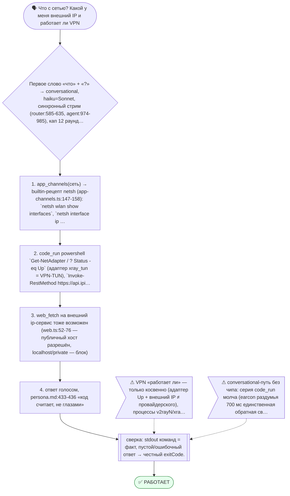
```mermaid
flowchart TD
  U(["🗣 Что с сетью? Какой у меня внешний IP и работает ли VPN"])
  R{"Первое слово «что» + «?» → conversational, haiku=Sonnet, синхронный стрим (router:585-635, agent:974-985), кап 12 раунд…"}
  U --> R
  S1["1. app_channels(сеть) → builtin-рецепт netsh (app-channels.ts:147-158): `netsh wlan show interfaces`, `netsh interface ip …"]
  R --> S1
  S2["2. code_run powershell `Get-NetAdapter / ? Status -eq Up` (адаптер xray_tun = VPN-TUN), `Invoke-RestMethod https://api.ipi…"]
  S1 --> S2
  S3["3. web_fetch на внешний ip-сервис тоже возможен (web.ts:52-76 — публичный хост разрешён, localhost/private — блок)"]
  S2 --> S3
  S4["4. ответ голосом, persona.md:433-436 «код считает, не глазами»"]
  S3 --> S4
  V[["сверка: stdout команд = факт, пустой/ошибочный ответ → честный exitCode."]]
  S4 --> V
  OUT(["✅ РАБОТАЕТ"])
  V --> OUT
  B1>"⚠ VPN «работает ли» — только косвенно (адаптер Up + внешний IP ≠ провайдерского), процессы v2rayN/xra…"]
  B1 -.-> V
  B2>"⚠ conversational-путь без чипа: серия code_run молча (earcon раздумья 700 мс единственная обратная св…"]
  B2 -.-> V
  style OUT fill:#e6ffed,stroke:#2b8a3e
```

**Шаги по коду:**
1. app_channels{сеть} → builtin-рецепт netsh (app-channels.ts:147-158): `netsh wlan show interfaces`, `netsh interface ip show config`; limits: VPN-клиенты со своим протоколом netsh не видит
2. code_run powershell `Get-NetAdapter | ? Status -eq Up` (адаптер xray_tun = VPN-TUN), `Invoke-RestMethod https://api.ipify.org` — сеть открыта code_run (code-guard.ts:4), SSRF-гард на code_run не распространяется
3. web_fetch на внешний ip-сервис тоже возможен (web.ts:52-76 — публичный хост разрешён; localhost/private — блок)
4. ответ голосом; persona.md:433-436 «код считает, не глазами»

**Сверка исхода:** stdout команд = факт; пустой/ошибочный ответ → честный exitCode.

**Где ломается / упирается:**
- VPN «работает ли» — только косвенно (адаптер Up + внешний IP ≠ провайдерского); процессы v2rayN/xray модель должна знать (память)
- conversational-путь без чипа: серия code_run молча (earcon раздумья 700 мс единственная обратная связь)

**Вердикт:** ✅ РАБОТАЕТ

### ✅ D6. «Сколько свободно на дисках и что сейчас жрёт память и видеокарту?» — ежедневно

**Маршрут:** «сколько» → conversational (router:585-593) на haiku=Sonnet, синхронно; несколько независимых code_run? — code_run НЕ в PARALLEL_READONLY_TOOLS (agent:172), значит последовательно.

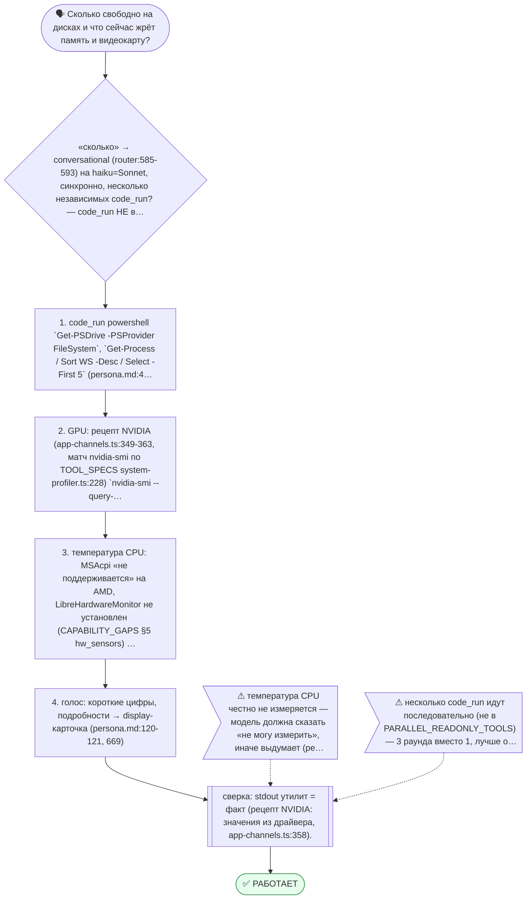
```mermaid
flowchart TD
  U(["🗣 Сколько свободно на дисках и что сейчас жрёт память и видеокарту?"])
  R{"«сколько» → conversational (router:585-593) на haiku=Sonnet, синхронно, несколько независимых code_run? — code_run НЕ в…"}
  U --> R
  S1["1. code_run powershell `Get-PSDrive -PSProvider FileSystem`, `Get-Process / Sort WS -Desc / Select -First 5` (persona.md:4…"]
  R --> S1
  S2["2. GPU: рецепт NVIDIA (app-channels.ts:349-363, матч nvidia-smi по TOOL_SPECS system-profiler.ts:228) `nvidia-smi --query-…"]
  S1 --> S2
  S3["3. температура CPU: MSAcpi «не поддерживается» на AMD, LibreHardwareMonitor не установлен (CAPABILITY_GAPS §5 hw_sensors) …"]
  S2 --> S3
  S4["4. голос: короткие цифры, подробности → display-карточка (persona.md:120-121, 669)"]
  S3 --> S4
  V[["сверка: stdout утилит = факт (рецепт NVIDIA: значения из драйвера, app-channels.ts:358)."]]
  S4 --> V
  OUT(["✅ РАБОТАЕТ"])
  V --> OUT
  B1>"⚠ температура CPU честно не измеряется — модель должна сказать «не могу измерить», иначе выдумает (ре…"]
  B1 -.-> V
  B2>"⚠ несколько code_run идут последовательно (не в PARALLEL_READONLY_TOOLS) — 3 раунда вместо 1, лучше о…"]
  B2 -.-> V
  style OUT fill:#e6ffed,stroke:#2b8a3e
```

**Шаги по коду:**
1. code_run powershell `Get-PSDrive -PSProvider FileSystem`, `Get-Process | Sort WS -Desc | Select -First 5` (persona.md:433-436 «код считает»)
2. GPU: рецепт NVIDIA (app-channels.ts:349-363, матч nvidia-smi по TOOL_SPECS system-profiler.ts:228) `nvidia-smi --query-gpu=… --format=csv`
3. температура CPU: MSAcpi «не поддерживается» на AMD, LibreHardwareMonitor не установлен (CAPABILITY_GAPS §5 hw_sensors) — рецепт LHM требует запущенного приложения (app-channels.ts:364-378)
4. голос: короткие цифры; подробности → display-карточка (persona.md:120-121, 669)

**Сверка исхода:** stdout утилит = факт (рецепт NVIDIA: значения из драйвера, app-channels.ts:358).

**Где ломается / упирается:**
- температура CPU честно не измеряется — модель должна сказать «не могу измерить», иначе выдумает (рецепта с явным запретом нет)
- несколько code_run идут последовательно (не в PARALLEL_READONLY_TOOLS) — 3 раунда вместо 1; лучше один скрипт

**Вердикт:** ✅ РАБОТАЕТ

### ✅ D7. «Посмотри журнал событий Windows за последний час — были ли ошибки» — еженедельно

**Маршрут:** «посмотри» → sonnet-задача (не вопрос, т.к. первое слово — императив; «были ли» — частица «ли» — QUESTION_LI_RE router:614 ловит где угодно → на самом деле conversational haiku). Итог: разговорный ход с инструментами, кап 12.

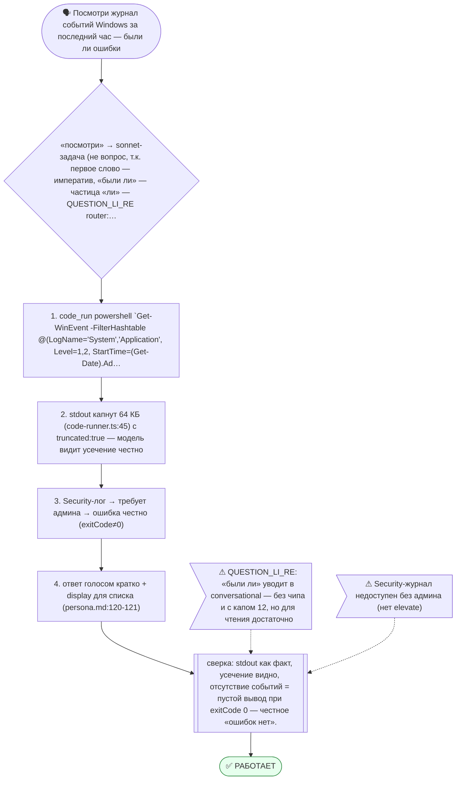
```mermaid
flowchart TD
  U(["🗣 Посмотри журнал событий Windows за последний час — были ли ошибки"])
  R{"«посмотри» → sonnet-задача (не вопрос, т.к. первое слово — императив, «были ли» — частица «ли» — QUESTION_LI_RE router:…"}
  U --> R
  S1["1. code_run powershell `Get-WinEvent -FilterHashtable @(LogName='System','Application', Level=1,2, StartTime=(Get-Date).Ad…"]
  R --> S1
  S2["2. stdout капнут 64 КБ (code-runner.ts:45) с truncated:true — модель видит усечение честно"]
  S1 --> S2
  S3["3. Security-лог → требует админа → ошибка честно (exitCode≠0)"]
  S2 --> S3
  S4["4. ответ голосом кратко + display для списка (persona.md:120-121)"]
  S3 --> S4
  V[["сверка: stdout как факт, усечение видно, отсутствие событий = пустой вывод при exitCode 0 — честное «ошибок нет»."]]
  S4 --> V
  OUT(["✅ РАБОТАЕТ"])
  V --> OUT
  B1>"⚠ QUESTION_LI_RE: «были ли» уводит в conversational — без чипа и с капом 12, но для чтения достаточно"]
  B1 -.-> V
  B2>"⚠ Security-журнал недоступен без админа (нет elevate)"]
  B2 -.-> V
  style OUT fill:#e6ffed,stroke:#2b8a3e
```

**Шаги по коду:**
1. code_run powershell `Get-WinEvent -FilterHashtable @{LogName='System','Application'; Level=1,2; StartTime=(Get-Date).AddHours(-1)} | Select TimeCreated,ProviderName,Message`
2. stdout капнут 64 КБ (code-runner.ts:45) с truncated:true — модель видит усечение честно
3. Security-лог → требует админа → ошибка честно (exitCode≠0)
4. ответ голосом кратко + display для списка (persona.md:120-121)

**Сверка исхода:** stdout как факт; усечение видно; отсутствие событий = пустой вывод при exitCode 0 — честное «ошибок нет».

**Где ломается / упирается:**
- QUESTION_LI_RE: «были ли» уводит в conversational — без чипа и с капом 12, но для чтения достаточно
- Security-журнал недоступен без админа (нет elevate)

**Вердикт:** ✅ РАБОТАЕТ

### 🟡 D8. «Запусти скрипт deploy.ps1 с рабочего стола» — еженедельно

**Маршрут:** tier0-ПЕРЕХВАТ: LAUNCH_RE (router:100) app=«скрипт deploy.ps1 с рабочего стола» → looksLikeAppName: 5 слов → false → LLM (повезло). Но «запусти deploy.ps1» / «запусти скрипт деплоя» (≤3 слов, без предлога) → app.launch → резолвер клиента → «не нашёл» без LLM (agent:3634-3641).

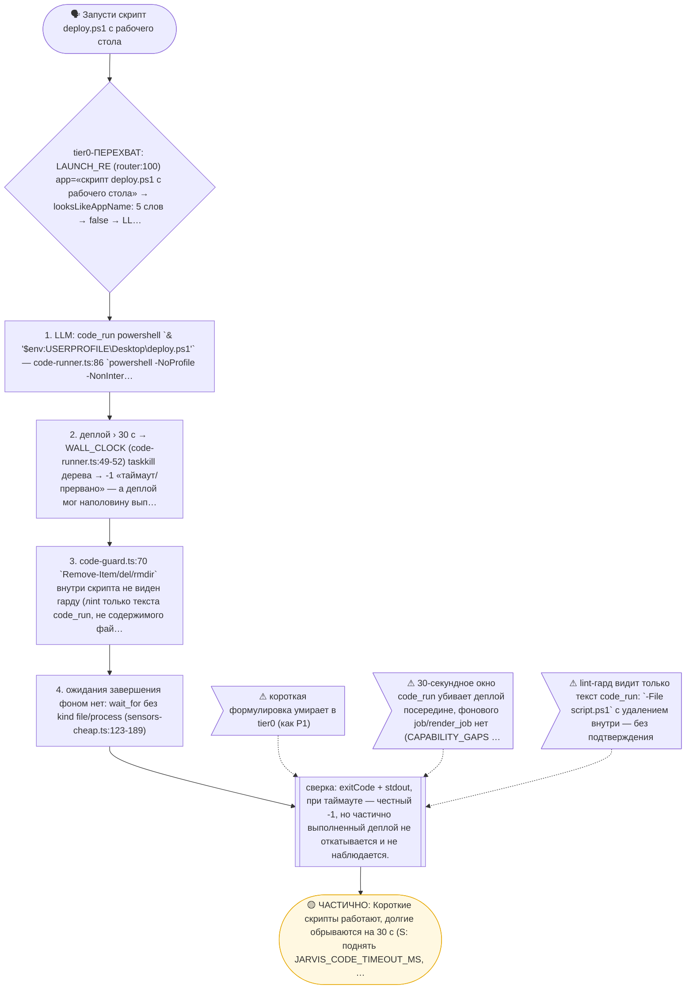
```mermaid
flowchart TD
  U(["🗣 Запусти скрипт deploy.ps1 с рабочего стола"])
  R{"tier0-ПЕРЕХВАТ: LAUNCH_RE (router:100) app=«скрипт deploy.ps1 с рабочего стола» → looksLikeAppName: 5 слов → false → LL…"}
  U --> R
  S1["1. LLM: code_run powershell `& '$env:USERPROFILE\Desktop\deploy.ps1'` — code-runner.ts:86 `powershell -NoProfile -NonInter…"]
  R --> S1
  S2["2. деплой › 30 с → WALL_CLOCK (code-runner.ts:49-52) taskkill дерева → -1 «таймаут/прервано» — а деплой мог наполовину вып…"]
  S1 --> S2
  S3["3. code-guard.ts:70 `Remove-Item/del/rmdir` внутри скрипта не виден гарду (лint только текста code_run, не содержимого фай…"]
  S2 --> S3
  S4["4. ожидания завершения фоном нет: wait_for без kind file/process (sensors-cheap.ts:123-189)"]
  S3 --> S4
  V[["сверка: exitCode + stdout, при таймауте — честный -1, но частично выполненный деплой не откатывается и не наблюдается."]]
  S4 --> V
  OUT(["🟡 ЧАСТИЧНО: Короткие скрипты работают, долгие обрываются на 30 с (S: поднять JARVIS_CODE_TIMEOUT_MS, …"])
  V --> OUT
  B1>"⚠ короткая формулировка умирает в tier0 (как P1)"]
  B1 -.-> V
  B2>"⚠ 30-секундное окно code_run убивает деплой посередине, фонового job/render_job нет (CAPABILITY_GAPS …"]
  B2 -.-> V
  B3>"⚠ lint-гард видит только текст code_run: `-File script.ps1` с удалением внутри — без подтверждения"]
  B3 -.-> V
  style OUT fill:#fff8e1,stroke:#e6a700
```

**Шаги по коду:**
1. LLM: code_run powershell `& "$env:USERPROFILE\Desktop\deploy.ps1"` — code-runner.ts:86 `powershell -NoProfile -NonInteractive -Command` → ExecutionPolicy Restricted блокирует .ps1 → честный exitCode 1 → модель заходит `powershell -ExecutionPolicy Bypass -File …` вложенно (разрешено, гарда нет)
2. деплой > 30 с → WALL_CLOCK (code-runner.ts:49-52) taskkill дерева → -1 «таймаут/прервано» — а деплой мог наполовину выполниться (побочки уже случились)
3. code-guard.ts:70 `Remove-Item/del/rmdir` внутри скрипта не виден гарду (лint только текста code_run, не содержимого файла) — confirm на необратимое обходится косвенно
4. ожидания завершения фоном нет: wait_for без kind file/process (sensors-cheap.ts:123-189)

**Сверка исхода:** exitCode + stdout; при таймауте — честный -1, но частично выполненный деплой не откатывается и не наблюдается.

**Где ломается / упирается:**
- короткая формулировка умирает в tier0 (как P1)
- 30-секундное окно code_run убивает деплой посередине; фонового job/render_job нет (CAPABILITY_GAPS §4)
- lint-гард видит только текст code_run: `-File script.ps1` с удалением внутри — без подтверждения

**Вердикт:** 🟡 ЧАСТИЧНО — пробел (M): Короткие скрипты работают; долгие обрываются на 30 с (S: поднять JARVIS_CODE_TIMEOUT_MS; M: фоновый запуск Start-Process + wait_for{process/file}). tier0-перехват «запусти <скрипт>» — тот же фикс, что P1.

---

## ОФИСНЫЙ РАБОТНИК (письма, календарь, встречи, Word-документы, презентации, Telegram/мессенджеры, поиск файлов)

**Итог по роли:** Счастлив там, где есть ГОТОВЫЙ серверный инструмент с честным исходом: календарь и почта из залогиненной вкладки (calendar_read/mail_read), Telegram (telegram_send/telegram_read с §14-подтверждением и сверкой доставки), поиск файлов (fs_search + рецепт индекса Windows), напоминания, простые Word-документы через COM. Упрётся в три вещи: (1) ИСХОДЯЩЕЙ ПОЧТЫ НЕТ вовсе — рецепт «Почта: отправка письма» kind:none прямо велит отказать, а GUI-путь через browser_act не имеет ни одного §14-гейта; (2) ЗАПИСЬ В КАЛЕНДАРЬ — только ручной GUI-цикл в браузере без ref-режима (флаг JARVIS_BROWSER_REF выкл) и без сверки, приглашение участнику уходит без подтверждения; (3) Office-инструменты office_word/office_excel лежат в COLD (tool_load-танец, задокументированный класс промаха), office_word пишет только plain-text — любое форматирование уезжает в code_run+python-docx, а презентации живут исключительно в code_run (python-pptx/officecli) и визуально не сверяются (file_view рендерит только PDF/картинки). Плюс общий предел: путь к файлу владелец обязан продиктовать (вложений в чат нет), а календарь/почта работают только для Google/Яндекс/Mail.ru/Outlook-web из паттернов расширения — корпоративный OWA/Bitrix24 невидимы.

### ✅ O1. «Джарвис, что у меня сегодня по встречам? И напомни за десять минут до первой.» — ежедневно

**Маршрут:** handleUserText (agent/index.ts:631) → перехваты имя/режим/эмоция не срабатывают → hasCommitmentMarker (index.ts:798): «напомн» исключён lookahead'ом D2 → classifyTier (router/index.ts:155): первое слово «что» ∈ QUESTION_FIRST (router:589) → conversational=true, tier haiku(=Sonnet) → responseCache.lookup (index.ts:943; денилист «сегодня» response-cache.ts:41 → мимо кэша) → СИНХРОННЫЙ runAgentLoop conversational (index.ts:977), HARD_STEP_CAP=12 (index.ts:1503)

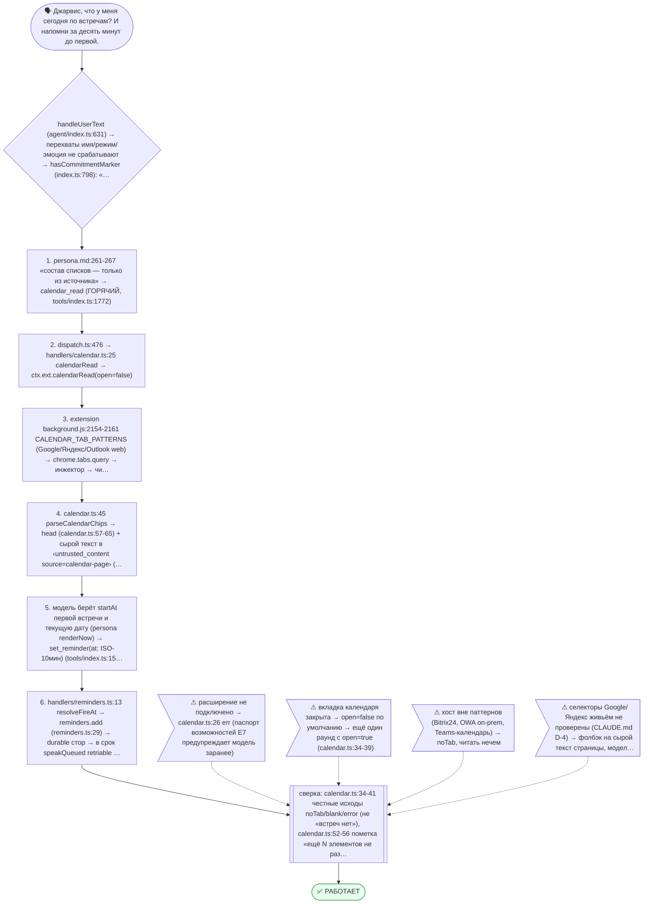
```mermaid
flowchart TD
  U(["🗣 Джарвис, что у меня сегодня по встречам? И напомни за десять минут до первой."])
  R{"handleUserText (agent/index.ts:631) → перехваты имя/режим/эмоция не срабатывают → hasCommitmentMarker (index.ts:798): «…"}
  U --> R
  S1["1. persona.md:261-267 «состав списков — только из источника» → calendar_read (ГОРЯЧИЙ, tools/index.ts:1772)"]
  R --> S1
  S2["2. dispatch.ts:476 → handlers/calendar.ts:25 calendarRead → ctx.ext.calendarRead(open=false)"]
  S1 --> S2
  S3["3. extension background.js:2154-2161 CALENDAR_TAB_PATTERNS (Google/Яндекс/Outlook web) → chrome.tabs.query → инжектор → чи…"]
  S2 --> S3
  S4["4. calendar.ts:45 parseCalendarChips → head (calendar.ts:57-65) + сырой текст в ‹untrusted_content source=calendar-page› (…"]
  S3 --> S4
  S5["5. модель берёт startAt первой встречи и текущую дату (persona renderNow) → set_reminder(at: ISO-10мин) (tools/index.ts:15…"]
  S4 --> S5
  S6["6. handlers/reminders.ts:13 resolveFireAt → reminders.add (reminders.ts:29) → durable стор → в срок speakQueued retriable …"]
  S5 --> S6
  V[["сверка: calendar.ts:34-41 честные исходы noTab/blank/error (не «встреч нет»), calendar.ts:52-56 пометка «ещё N элементов не раз…"]]
  S6 --> V
  OUT(["✅ РАБОТАЕТ"])
  V --> OUT
  B1>"⚠ расширение не подключено → calendar.ts:26 err (паспорт возможностей E7 предупреждает модель заранее)"]
  B1 -.-> V
  B2>"⚠ вкладка календаря закрыта → open=false по умолчанию → ещё один раунд с open=true (calendar.ts:34-39)"]
  B2 -.-> V
  B3>"⚠ хост вне паттернов (Bitrix24, OWA on-prem, Teams-календарь) → noTab, читать нечем"]
  B3 -.-> V
  B4>"⚠ селекторы Google/Яндекс живьём не проверены (CLAUDE.md D-4) → фолбэк на сырой текст страницы, модел…"]
  B4 -.-> V
  style OUT fill:#e6ffed,stroke:#2b8a3e
```

**Шаги по коду:**
1. persona.md:261-267 «состав списков — только из источника» → calendar_read (ГОРЯЧИЙ, tools/index.ts:1772)
2. dispatch.ts:476 → handlers/calendar.ts:25 calendarRead → ctx.ext.calendarRead(open=false)
3. extension background.js:2154-2161 CALENDAR_TAB_PATTERNS (Google/Яндекс/Outlook web) → chrome.tabs.query → инжектор → чипы + текст страницы
4. calendar.ts:45 parseCalendarChips → head (calendar.ts:57-65) + сырой текст в <untrusted_content source=calendar-page> (calendar.ts:67)
5. модель берёт startAt первой встречи и текущую дату (persona renderNow) → set_reminder{at: ISO-10мин} (tools/index.ts:1579)
6. handlers/reminders.ts:13 resolveFireAt → reminders.add (reminders.ts:29) → durable стор → в срок speakQueued retriable (волна D)

**Сверка исхода:** calendar.ts:34-41 честные исходы noTab/blank/error (не «встреч нет»); calendar.ts:52-56 пометка «ещё N элементов не разобрано»; calendar.ts:63 chips==0 → «похоже, встреч нет, сверься с текстом»; set_reminder цитирует ЗАПИСЬ стора (reminders.ts:33-38, created:false = дубль не поставлен); list_reminders для сверки

**Где ломается / упирается:**
- расширение не подключено → calendar.ts:26 err (паспорт возможностей E7 предупреждает модель заранее)
- вкладка календаря закрыта → open=false по умолчанию → ещё один раунд с open=true (calendar.ts:34-39)
- хост вне паттернов (Bitrix24, OWA on-prem, Teams-календарь) → noTab, читать нечем
- селекторы Google/Яндекс живьём не проверены (CLAUDE.md D-4) → фолбэк на сырой текст страницы, модель читает сама
- «сегодня» без даты у события → extractDate берёт ближайшую (calendar-parse), напоминание может встать не на тот день

**Вердикт:** ✅ РАБОТАЕТ

### ✅ O2. «Напиши Кате в телеграм, что задержусь на пятнадцать минут.» — ежедневно

**Маршрут:** classifyTier: не tier0 (LAUNCH_RE router:100 не матчит), «напиши» ∈ COMPLEX_MARKERS (router:558) и ACTION_VERB_RE (router:605) → не вопрос → tier sonnet, задача-действие → isActionTask (index.ts:958) → runActionSyncFirst (голос: итог сразу, >10с — «Берусь» и фон). При активной другой задаче — дубль-гейт/steer (index.ts:738-776): «напиши» не EDIT_STEM, relatedToActiveGoal (scope.ts:246) → new

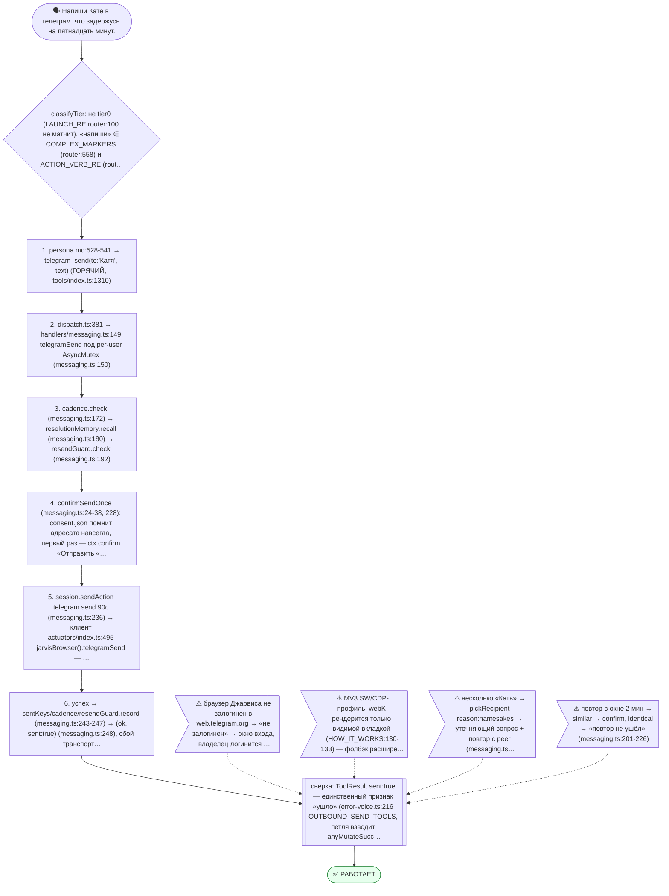
```mermaid
flowchart TD
  U(["🗣 Напиши Кате в телеграм, что задержусь на пятнадцать минут."])
  R{"classifyTier: не tier0 (LAUNCH_RE router:100 не матчит), «напиши» ∈ COMPLEX_MARKERS (router:558) и ACTION_VERB_RE (rout…"}
  U --> R
  S1["1. persona.md:528-541 → telegram_send(to:'Катя', text) (ГОРЯЧИЙ, tools/index.ts:1310)"]
  R --> S1
  S2["2. dispatch.ts:381 → handlers/messaging.ts:149 telegramSend под per-user AsyncMutex (messaging.ts:150)"]
  S1 --> S2
  S3["3. cadence.check (messaging.ts:172) → resolutionMemory.recall (messaging.ts:180) → resendGuard.check (messaging.ts:192)"]
  S2 --> S3
  S4["4. confirmSendOnce (messaging.ts:24-38, 228): consent.json помнит адресата навсегда, первый раз — ctx.confirm «Отправить «…"]
  S3 --> S4
  S5["5. session.sendAction telegram.send 90с (messaging.ts:236) → клиент actuators/index.ts:495 jarvisBrowser().telegramSend — …"]
  S4 --> S5
  S6["6. успех → sentKeys/cadence/resendGuard.record (messaging.ts:243-247) → (ok, sent:true) (messaging.ts:248), сбой транспорт…"]
  S5 --> S6
  V[["сверка: ToolResult.sent:true — единственный признак «ушло» (error-voice.ts:216 OUTBOUND_SEND_TOOLS, петля взводит anyMutateSucc…"]]
  S6 --> V
  OUT(["✅ РАБОТАЕТ"])
  V --> OUT
  B1>"⚠ браузер Джарвиса не залогинен в web.telegram.org → «не залогинен» → окно входа, владелец логинится …"]
  B1 -.-> V
  B2>"⚠ MV3 SW/CDP-профиль: webK рендерится только видимой вкладкой (HOW_IT_WORKS:130-133) — фолбэк расшире…"]
  B2 -.-> V
  B3>"⚠ несколько «Кать» → pickRecipient reason:namesakes → уточняющий вопрос + повтор с peer (messaging.ts…"]
  B3 -.-> V
  B4>"⚠ повтор в окне 2 мин → similar → confirm, identical → «повтор не ушёл» (messaging.ts:201-226)"]
  B4 -.-> V
  style OUT fill:#e6ffed,stroke:#2b8a3e
```

**Шаги по коду:**
1. persona.md:528-541 → telegram_send{to:"Катя", text} (ГОРЯЧИЙ, tools/index.ts:1310)
2. dispatch.ts:381 → handlers/messaging.ts:149 telegramSend под per-user AsyncMutex (messaging.ts:150)
3. cadence.check (messaging.ts:172) → resolutionMemory.recall (messaging.ts:180) → resendGuard.check (messaging.ts:192)
4. confirmSendOnce (messaging.ts:24-38, 228): consent.json помнит адресата навсегда; первый раз — ctx.confirm «Отправить «Катя» в Telegram?» (§14)
5. session.sendAction telegram.send 90с (messaging.ts:236) → клиент actuators/index.ts:495 jarvisBrowser().telegramSend — off-screen Chrome+CDP, реальный webK
6. успех → sentKeys/cadence/resendGuard.record (messaging.ts:243-247) → {ok, sent:true} (messaging.ts:248); сбой транспорта → probeTelegramDelivery чтением чата (messaging.ts:110-122) → фолбэк расширение только при absent

**Сверка исхода:** ToolResult.sent:true — единственный признак «ушло» (error-voice.ts:216 OUTBOUND_SEND_TOOLS; петля взводит anyMutateSucceeded только по нему); сверка доставки чтением хвоста ленты (messaging/delivery-check.ts, TAIL_WINDOW); тёзки → список кандидатов, модель обязана переспросить (persona:538-541); резолв-память self-heal (messaging.ts:257)

**Где ломается / упирается:**
- браузер Джарвиса не залогинен в web.telegram.org → «не залогинен» → окно входа, владелец логинится сам (HOW_IT_WORKS §7)
- MV3 SW/CDP-профиль: webK рендерится только видимой вкладкой (HOW_IT_WORKS:130-133) — фолбэк расширения активирует вкладку владельца на время отправки
- несколько «Кать» → pickRecipient reason:namesakes → уточняющий вопрос + повтор с peer (messaging.ts:166,191)
- повтор в окне 2 мин → similar → confirm, identical → «повтор не ушёл» (messaging.ts:201-226)
- только ТЕКСТ: файл/документ в Telegram отправить нечем (есть лишь telegram_send_voice для аудио, messaging.ts:372-373)

**Вердикт:** ✅ РАБОТАЕТ

### 🟡 O3. «Что нового в почте? Есть что-нибудь от Иванова?» — ежедневно

**Маршрут:** первое слово «что» → looksLikeQuestion (router:621-630) → conversational, синхронно; «почта» в WEB_SERVICES убрана намеренно (router:127-129), tier0 не ловит; смолток-гейт не срабатывает (нет соц-паттернов)

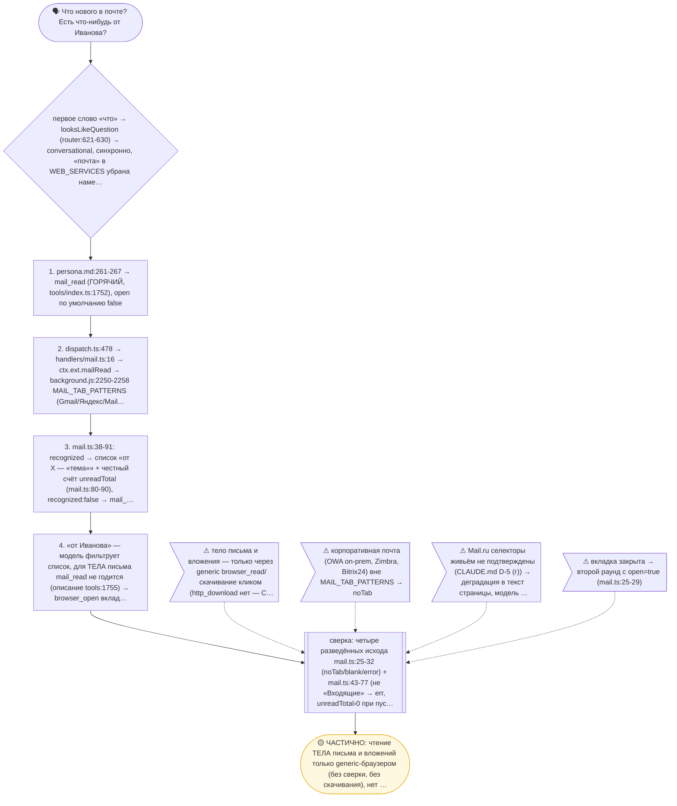
```mermaid
flowchart TD
  U(["🗣 Что нового в почте? Есть что-нибудь от Иванова?"])
  R{"первое слово «что» → looksLikeQuestion (router:621-630) → conversational, синхронно, «почта» в WEB_SERVICES убрана наме…"}
  U --> R
  S1["1. persona.md:261-267 → mail_read (ГОРЯЧИЙ, tools/index.ts:1752), open по умолчанию false"]
  R --> S1
  S2["2. dispatch.ts:478 → handlers/mail.ts:16 → ctx.ext.mailRead → background.js:2250-2258 MAIL_TAB_PATTERNS (Gmail/Яндекс/Mail…"]
  S1 --> S2
  S3["3. mail.ts:38-91: recognized → список «от X — «тема»» + честный счёт unreadTotal (mail.ts:80-90), recognized:false → mail_…"]
  S2 --> S3
  S4["4. «от Иванова» — модель фильтрует список, для ТЕЛА письма mail_read не годится (описание tools:1755) → browser_open вклад…"]
  S3 --> S4
  V[["сверка: четыре разведённых исхода mail.ts:25-32 (noTab/blank/error) + mail.ts:43-77 (не «Входящие» → err, unreadTotal›0 при пус…"]]
  S4 --> V
  OUT(["🟡 ЧАСТИЧНО: чтение ТЕЛА письма и вложений только generic-браузером (без сверки, без скачивания), нет …"])
  V --> OUT
  B1>"⚠ тело письма и вложения — только через generic browser_read/скачивание кликом (http_download нет — C…"]
  B1 -.-> V
  B2>"⚠ корпоративная почта (OWA on-prem, Zimbra, Bitrix24) вне MAIL_TAB_PATTERNS → noTab"]
  B2 -.-> V
  B3>"⚠ Mail.ru селекторы живьём не подтверждены (CLAUDE.md D-5 (г)) → деградация в текст страницы, модель …"]
  B3 -.-> V
  B4>"⚠ вкладка закрыта → второй раунд с open=true (mail.ts:25-29)"]
  B4 -.-> V
  style OUT fill:#fff8e1,stroke:#e6a700
```

**Шаги по коду:**
1. persona.md:261-267 → mail_read (ГОРЯЧИЙ, tools/index.ts:1752), open по умолчанию false
2. dispatch.ts:478 → handlers/mail.ts:16 → ctx.ext.mailRead → background.js:2250-2258 MAIL_TAB_PATTERNS (Gmail/Яндекс/Mail.ru/Outlook web), вкладка выбирается ПО ФАКТУ РАЗБОРА (background.js:2287-2293)
3. mail.ts:38-91: recognized → список «от X — «тема»» + честный счёт unreadTotal (mail.ts:80-90); recognized:false → mail_layout_unknown + ТЕКСТ ВСЕЙ СТРАНИЦЫ с предупреждением (mail.ts:95-106)
4. «от Иванова» — модель фильтрует список; для ТЕЛА письма mail_read не годится (описание tools:1755) → browser_open вкладки почты (ext.openOrFocus) → browser_act click по строке → browser_read (generic путь handlers/browser.ts)

**Сверка исхода:** четыре разведённых исхода mail.ts:25-32 (noTab/blank/error) + mail.ts:43-77 (не «Входящие» → err; unreadTotal>0 при пустом списке → «вижу N, прочитать не смог»; markerConfident:false → осторожная формулировка); всё в <untrusted_content source=mail-page>

**Где ломается / упирается:**
- тело письма и вложения — только через generic browser_read/скачивание кликом (http_download нет — CAPABILITY_GAPS §4 L188); IMAP нет
- корпоративная почта (OWA on-prem, Zimbra, Bitrix24) вне MAIL_TAB_PATTERNS → noTab
- Mail.ru селекторы живьём не подтверждены (CLAUDE.md D-5 (г)) → деградация в текст страницы, модель пересказывает сама
- вкладка закрыта → второй раунд с open=true (mail.ts:25-29)
- ambient-уведомления о письмах гейтятся looksLikeBulk (mail-source.ts:73,122) — уведомления no-reply о заказах теперь transactional 0.6, но важных отправителей владельцу задать негде (importantSenders mail-source.ts:60,140 — нет UI)

**Вердикт:** 🟡 ЧАСТИЧНО — пробел (M): чтение ТЕЛА письма и вложений только generic-браузером (без сверки, без скачивания); нет mail_imap; нет настройки важных отправителей

### ❌ O4. «Ответь Петрову на его письмо, что я согласен, и отправь.» — ежедневно

**Маршрут:** «ответь»/«отправь» → IMPERATIVE/ACTION_VERB_RE (router:605-610, «отправ») → sonnet задача-действие → sync-first/фон

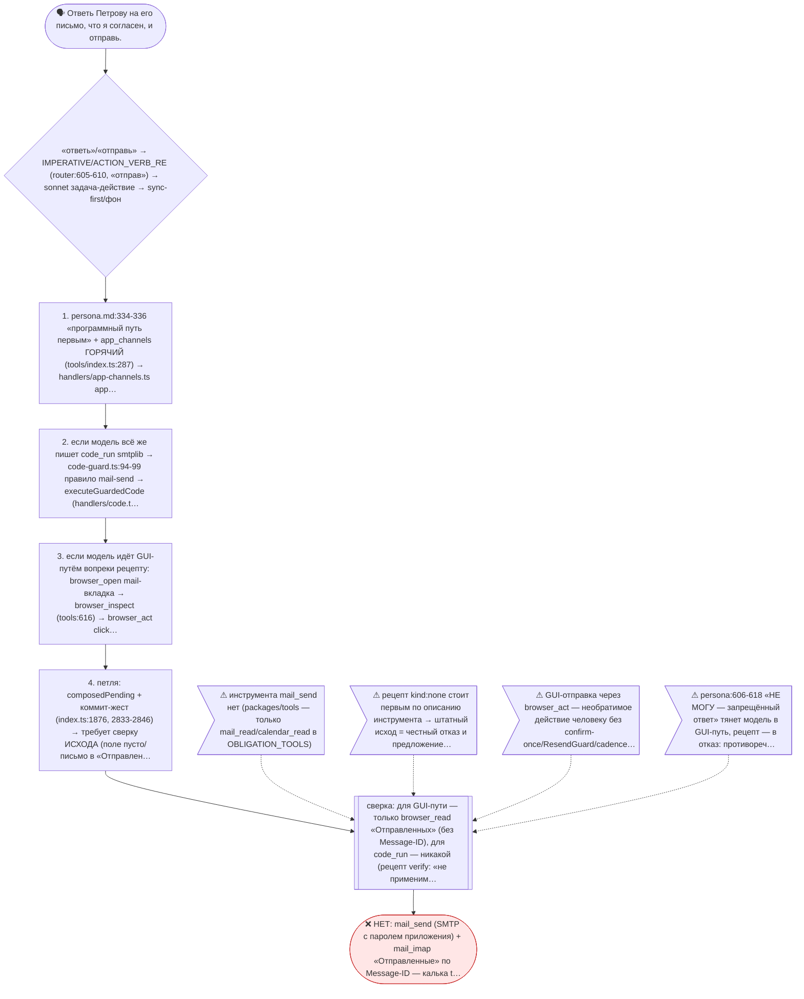
```mermaid
flowchart TD
  U(["🗣 Ответь Петрову на его письмо, что я согласен, и отправь."])
  R{"«ответь»/«отправь» → IMPERATIVE/ACTION_VERB_RE (router:605-610, «отправ») → sonnet задача-действие → sync-first/фон"}
  U --> R
  S1["1. persona.md:334-336 «программный путь первым» + app_channels ГОРЯЧИЙ (tools/index.ts:287) → handlers/app-channels.ts app…"]
  R --> S1
  S2["2. если модель всё же пишет code_run smtplib → code-guard.ts:94-99 правило mail-send → executeGuardedCode (handlers/code.t…"]
  S1 --> S2
  S3["3. если модель идёт GUI-путём вопреки рецепту: browser_open mail-вкладка → browser_inspect (tools:616) → browser_act click…"]
  S2 --> S3
  S4["4. петля: composedPending + коммит-жест (index.ts:1876, 2833-2846) → требует сверку ИСХОДА (поле пусто/письмо в «Отправлен…"]
  S3 --> S4
  V[["сверка: для GUI-пути — только browser_read «Отправленных» (без Message-ID), для code_run — никакой (рецепт verify: «не применим…"]]
  S4 --> V
  OUT(["❌ НЕТ: mail_send (SMTP с паролем приложения) + mail_imap «Отправленные» по Message-ID — калька t…"])
  V --> OUT
  B1>"⚠ инструмента mail_send нет (packages/tools — только mail_read/calendar_read в OBLIGATION_TOOLS)"]
  B1 -.-> V
  B2>"⚠ рецепт kind:none стоит первым по описанию инструмента → штатный исход = честный отказ и предложение…"]
  B2 -.-> V
  B3>"⚠ GUI-отправка через browser_act — необратимое действие человеку без confirm-once/ResendGuard/cadence…"]
  B3 -.-> V
  B4>"⚠ persona:606-618 «НЕ МОГУ — запрещённый ответ» тянет модель в GUI-путь, рецепт — в отказ: противореч…"]
  B4 -.-> V
  style OUT fill:#ffe6e6,stroke:#c92a2a
```

**Шаги по коду:**
1. persona.md:334-336 «программный путь первым» + app_channels ГОРЯЧИЙ (tools/index.ts:287) → handlers/app-channels.ts appChannelsList → formatChannels (app-channels.ts:904) → рецепт «Почта: отправка письма» kind:none (app-channels.ts:701-721): «ОТПРАВЛЯТЬ ПОЧТУ СЕЙЧАС НЕЧЕМ … скажи владельцу честно, предложи мессенджер или открыть почту, чтобы отправил сам»
2. если модель всё же пишет code_run smtplib → code-guard.ts:94-99 правило mail-send → executeGuardedCode (handlers/code.ts:29-38) требует ctx.confirm «Выполнить код?» с причиной; без анти-дубля и признака «ушло»
3. если модель идёт GUI-путём вопреки рецепту: browser_open mail-вкладка → browser_inspect (tools:616) → browser_act click «Ответить» / type текст / click «Отправить» (tools:541) — эти вызовы НЕ входят в dispatch-гейты подтверждения (dispatch.ts:573-587 гейтят только fs_delete/system_power/app_close force) и не в OUTBOUND_SEND_TOOLS (error-voice.ts:216)
4. петля: composedPending + коммит-жест (index.ts:1876, 2833-2846) → требует сверку ИСХОДА (поле пусто/письмо в «Отправленных») до терминала

**Сверка исхода:** для GUI-пути — только browser_read «Отправленных» (без Message-ID); для code_run — никакой (рецепт verify: «не применимо: канала нет», app-channels.ts:715-717)

**Где ломается / упирается:**
- инструмента mail_send нет (packages/tools — только mail_read/calendar_read в OBLIGATION_TOOLS)
- рецепт kind:none стоит первым по описанию инструмента → штатный исход = честный отказ и предложение мессенджера
- GUI-отправка через browser_act — необратимое действие человеку без confirm-once/ResendGuard/cadence/сверки доставки (то, что есть у telegram_send)
- persona:606-618 «НЕ МОГУ — запрещённый ответ» тянет модель в GUI-путь, рецепт — в отказ: противоречие решает модель

**Вердикт:** ❌ НЕТ — пробел (M): mail_send (SMTP с паролем приложения) + mail_imap «Отправленные» по Message-ID — калька telegramSendLocked с channel:"email" (CAPABILITY_GAPS §4 L177); гейты consent/resendGuard/cadence/idempotency уже принимают channel:string

### ✅ O5. «Найди договор с Ромашкой, он где-то на рабочем столе или в загрузках.» — еженедельно

**Маршрут:** «найди» ∈ COMPLEX_MARKERS (router:558) → sonnet задача; не вопрос (первое слово не в QUESTION_FIRST)

```mermaid
flowchart TD
  U(["🗣 Найди договор с Ромашкой, он где-то на рабочем столе или в загрузках."])
  R{"«найди» ∈ COMPLEX_MARKERS (router:558) → sonnet задача, не вопрос (первое слово не в QUESTION_FIRST)"}
  U --> R
  S1["1. persona.md:421-426 → fs_search(root:Desktop, query:'Ромашк') (ГОРЯЧИЙ, tools/index.ts:1001)"]
  R --> S1
  S2["2. dispatch.ts:606-612 generic → клиент actuators/fs.ts:298 search: кап 20 000 файлов / 40с (fs.ts:309-323) → stopReason/e…"]
  S1 --> S2
  S3["3. exhausted:false → описание инструмента (tools:1003) велит: сузить root ИЛИ рецепт индекса Windows → app_channels(app:'н…"]
  S2 --> S3
  S4["4. рецепт verify (app-channels.ts:431-444): каждый путь Test-Path, проба покрытия SCOPE, сбой WSearch = ошибка канала"]
  S3 --> S4
  S5["5. подтверждение содержимого: fs_read на .docx → честная ошибка «бинарный, читай office_word» (fs.ts:160-163) → office_wor…"]
  S4 --> S5
  V[["сверка: fs_search: exhausted/stopReason/scannedFiles + русская note (fs-search-report.ts), рецепт: Test-Path на каждый путь + п…"]]
  S5 --> V
  OUT(["✅ РАБОТАЕТ"])
  V --> OUT
  B1>"⚠ рабочий стол владельца 588 213 файлов → fs_search покрывает 3,4% за 32с (CAPABILITY_GAPS §3.3) → об…"]
  B1 -.-> V
  B2>"⚠ папка вне индекса (D:, Program Files, отдельные каталоги профиля) → 0 строк → нужна проба покрытия,…"]
  B2 -.-> V
  B3>"⚠ CONTAINS работает только у типов с IFilter (.md — нет), .docx/.pdf обычно да"]
  B3 -.-> V
  B4>"⚠ Everything (es.exe) не установлен → рецепт es мёртв, остаётся индекс"]
  B4 -.-> V
  style OUT fill:#e6ffed,stroke:#2b8a3e
```

**Шаги по коду:**
1. persona.md:421-426 → fs_search{root:Desktop, query:"Ромашк"} (ГОРЯЧИЙ, tools/index.ts:1001)
2. dispatch.ts:606-612 generic → клиент actuators/fs.ts:298 search: кап 20 000 файлов / 40с (fs.ts:309-323) → stopReason/exhausted/note (fs.ts:385-388) → сервер оборачивает untrusted fs-search (dispatch.ts:689-693)
3. exhausted:false → описание инструмента (tools:1003) велит: сузить root ИЛИ рецепт индекса Windows → app_channels{app:"найди файл"} → app-channels.ts:413-452 (ADODB Search.CollatorDSO, CONTAINS по содержимому) → code_run powershell (handlers/code.ts:24 → клиент code-runner.ts:90, 30с окно)
4. рецепт verify (app-channels.ts:431-444): каждый путь Test-Path, проба покрытия SCOPE, сбой WSearch = ошибка канала
5. подтверждение содержимого: fs_read на .docx → честная ошибка «бинарный, читай office_word» (fs.ts:160-163) → office_word op=read (COLD → tool_load) или file_view для PDF

**Сверка исхода:** fs_search: exhausted/stopReason/scannedFiles + русская note (fs-search-report.ts); рецепт: Test-Path на каждый путь + проба покрытия; office_word read перечитывает файл

**Где ломается / упирается:**
- рабочий стол владельца 588 213 файлов → fs_search покрывает 3,4% за 32с (CAPABILITY_GAPS §3.3) → обязательный второй хоп через рецепт (+2 раунда)
- папка вне индекса (D:, Program Files, отдельные каталоги профиля) → 0 строк → нужна проба покрытия, иначе ложное «не найдено» (app-channels.ts:433-437)
- CONTAINS работает только у типов с IFilter (.md — нет), .docx/.pdf обычно да
- Everything (es.exe) не установлен → рецепт es мёртв, остаётся индекс
- имя может быть в падеже/латинице — модель обязана дать стем («Ромашк»), иначе LIKE промахнётся

**Вердикт:** ✅ РАБОТАЕТ

### 🟡 O6. «Открой ворд и создай служебную записку на имя директора о переносе отпуска с пятого по девятнадцатое.» — еженедельно

**Маршрут:** LAUNCH_RE (router:100) матчит «открой …», но app «ворд и создай служебную…» >3 слов → looksLikeAppName false (router:537-539) → в LLM; «создай» ∈ COMPLEX_MARKERS (router:562) → sonnet задача → sync-first

```mermaid
flowchart TD
  U(["🗣 Открой ворд и создай служебную записку на имя директора о переносе отпуска с пя…"])
  R{"LAUNCH_RE (router:100) матчит «открой …», но app «ворд и создай служебную…» ›3 слов → looksLikeAppName false (router:53…"}
  U --> R
  S1["1. app_channels → рецепт «Microsoft Word» (app-channels.ts:256-265): office_word (COM headless) или officecli через code_r…"]
  R --> S1
  S2["2. office_word — COLD (tools/index.ts:2018) → tool_load(names:('office_word')) (tools:1884) → схема появится СО СЛЕДУЮЩЕГО…"]
  S1 --> S2
  S3["3. office_word(op:'write', path, text) (tools:1815) → dispatch generic (dispatch.ts:606) → клиент actuators/index.ts:572 o…"]
  S2 --> S3
  S4["4. форматирование (шапка справа, подпись, таблица) — только code_run python-docx (рецепт app-channels.ts:519-537) или offi…"]
  S3 --> S4
  S5["5. показать владельцу: app_launch «ворд»/путь → резолвер app-resolve.ts (App Paths реестр app-resolve.ts:149) → окно, свер…"]
  S4 --> S5
  V[["сверка: office_word read перечитывает текст (office.ts:107), рецепт verify «перечитать файл, не смотреть на окно» (app-channels…"]]
  S5 --> V
  OUT(["🟡 ЧАСТИЧНО: office_word без форматирования (нужны op=insert_heading/table или шаблон docx), office_* …"])
  V --> OUT
  B1>"⚠ office_word умеет ТОЛЬКО plain-text write/append (office.ts:106-110) — без заголовков/таблиц/шрифтов"]
  B1 -.-> V
  B2>"⚠ COLD-схема → tool_load-танец, документированный класс промаха (tools:2013-2015 прецедент watch_*)"]
  B2 -.-> V
  B3>"⚠ Word не установлен → «Office COM не вернул результат» (office.ts:183) → code_run+python-docx, нужен…"]
  B3 -.-> V
  B4>"⚠ документ уже открыт в видимом Word → файл залочен → Save падает (рецепт limits app-channels.ts:264)"]
  B4 -.-> V
  style OUT fill:#fff8e1,stroke:#e6a700
```

**Шаги по коду:**
1. app_channels → рецепт «Microsoft Word» (app-channels.ts:256-265): office_word (COM headless) или officecli через code_run
2. office_word — COLD (tools/index.ts:2018) → tool_load{names:["office_word"]} (tools:1884) → схема появится СО СЛЕДУЮЩЕГО хода (+1 раунд)
3. office_word{op:"write", path, text} (tools:1815) → dispatch generic (dispatch.ts:606) → клиент actuators/index.ts:572 office.runWord → assertWritable (office.ts:138-141) → WORD_SCRIPT (office.ts:93-122): Documents.Add → Content.Text=text → SaveAs (office.ts:111), таймаут 30с (office.ts:35), withPathLock (office.ts:150)
4. форматирование (шапка справа, подпись, таблица) — только code_run python-docx (рецепт app-channels.ts:519-537) или officecli (system-profiler TOOL_SPECS:243)
5. показать владельцу: app_launch «ворд»/путь → резолвер app-resolve.ts (App Paths реестр app-resolve.ts:149) → окно; сверка window_list

**Сверка исхода:** office_word read перечитывает текст (office.ts:107); рецепт verify «перечитать файл, не смотреть на окно» (app-channels.ts:263); fs_read на .docx честно отсылает к office_word (fs.ts:160-163); file_view .docx НЕ рендерит (file-view.ts:180) — визуальной сверки вёрстки нет

**Где ломается / упирается:**
- office_word умеет ТОЛЬКО plain-text write/append (office.ts:106-110) — без заголовков/таблиц/шрифтов
- COLD-схема → tool_load-танец, документированный класс промаха (tools:2013-2015 прецедент watch_*)
- Word не установлен → «Office COM не вернул результат» (office.ts:183) → code_run+python-docx, нужен python на машине
- документ уже открыт в видимом Word → файл залочен → Save падает (рецепт limits app-channels.ts:264)
- модель сама выбирает путь файла — владелец не диктовал; лучше Desktop, но это догадка

**Вердикт:** 🟡 ЧАСТИЧНО — пробел (S): office_word без форматирования (нужны op=insert_heading/table или шаблон docx), office_* в COLD

### 🟡 O7. «Сделай презентацию на пять слайдов про итоги квартала по этому отчёту.» — еженедельно

**Маршрут:** «сделай» ∈ ACTION_VERB_RE (router:606) → не вопрос → sonnet задача; при активной задаче «сделай» не EDIT_STEM → new

```mermaid
flowchart TD
  U(["🗣 Сделай презентацию на пять слайдов про итоги квартала по этому отчёту."])
  R{"«сделай» ∈ ACTION_VERB_RE (router:606) → не вопрос → sonnet задача, при активной задаче «сделай» не EDIT_STEM → new"}
  U --> R
  S1["1. дейксис «этот отчёт» → live-контекст окон/вкладок (persona:454-465) или fs_search, чтение исходника: office_word read /…"]
  R --> S1
  S2["2. app_channels → рецепт «Документы без Office (Python)» (app-channels.ts:519-537): python-pptx — «единственный программны…"]
  S1 --> S2
  S3["3. code_run python (tools:659) → executeGuardedCode (handlers/code.ts:24): lint без нарушений → sendAction code.run 185с (…"]
  S2 --> S3
  S4["4. ненулевой exitCode = провал (клиент actuators/index.ts:403-406) → модель видит ImportError честно"]
  S3 --> S4
  S5["5. сверка: повторное открытие python-pptx (число слайдов/заголовки) — рецепт verify app-channels.ts:529-531, показать: app…"]
  S4 --> S5
  V[["сверка: reopen файла вторым чтением, exitCode/stdout, персона «let CODE compute» (persona:433-436), визуально — только запустив…"]]
  S5 --> V
  OUT(["🟡 ЧАСТИЧНО: нет визуальной сверки слайдов (рендер pptx→png через PowerPoint COM Export или officecli …"])
  V --> OUT
  B1>"⚠ дедик-актуатора нет, python + python-pptx (или officecli) обязательны — на чужой машине честный Imp…"]
  B1 -.-> V
  B2>"⚠ вёрстку слайдов модель НЕ ВИДИТ: pptx→png рендера нет (нет LibreOffice/officecli view в цепочке), п…"]
  B2 -.-> V
  B3>"⚠ длинный контент → max_tokens continuation (CLAUDE.md), 30с окна code_run хватает"]
  B3 -.-> V
  B4>"⚠ «по этому отчёту» — если отчёт в PDF на 20 страниц, file_view постранично по 1.5-2К токенов"]
  B4 -.-> V
  style OUT fill:#fff8e1,stroke:#e6a700
```

**Шаги по коду:**
1. дейксис «этот отчёт» → live-контекст окон/вкладок (persona:454-465) или fs_search; чтение исходника: office_word read / office_excel read / file_view PDF (handlers/file-view.ts:42) / pdftotext
2. app_channels → рецепт «Документы без Office (Python)» (app-channels.ts:519-537): python-pptx — «единственный программный путь к презентациям, дедик-актуатора нет»; альтернатива officecli (system-profiler TOOL_SPECS:243)
3. code_run python (tools:659) → executeGuardedCode (handlers/code.ts:24): lint без нарушений → sendAction code.run 185с (code.ts:40) → клиент code-runner.ts:90 spawn python -c, WALL_CLOCK 30с деф/макс 180с (code-runner.ts:49-52), env без секретов (code-runner.ts:65-73)
4. ненулевой exitCode = провал (клиент actuators/index.ts:403-406) → модель видит ImportError честно
5. сверка: повторное открытие python-pptx (число слайдов/заголовки) — рецепт verify app-channels.ts:529-531; показать: app_launch powerpnt + screen_capture

**Сверка исхода:** reopen файла вторым чтением; exitCode/stdout; персона «let CODE compute» (persona:433-436); визуально — только запустив PowerPoint и сняв screen_capture (file_view для .pptx честно отказывает, file-view.ts:182)

**Где ломается / упирается:**
- дедик-актуатора нет; python + python-pptx (или officecli) обязательны — на чужой машине честный ImportError и тупик
- вёрстку слайдов модель НЕ ВИДИТ: pptx→png рендера нет (нет LibreOffice/officecli view в цепочке), поэтому «красиво ли» сверить нечем
- длинный контент → max_tokens continuation (CLAUDE.md), 30с окна code_run хватает
- «по этому отчёту» — если отчёт в PDF на 20 страниц, file_view постранично по 1.5-2К токенов
- officecli-шим без бинаря (офлайн npm) детектится, но падает на первом запуске (CLAUDE.md OfficeCLI)

**Вердикт:** 🟡 ЧАСТИЧНО — пробел (M): нет визуальной сверки слайдов (рендер pptx→png через PowerPoint COM Export или officecli view + file_view) и нет актуатора презентаций

### 🟡 O8. «Поставь встречу с Ивановым на четверг в три часа дня.» — еженедельно

**Маршрут:** «поставь» ∈ ACTION_VERB_RE (router:609) и IMPERATIVE_RE; не вопрос → sonnet задача-действие. hasCommitmentMarker (index.ts:798) может параллельно взвести рефлекс-напоминание (D2: маркер дела + срока) — второй канал

```mermaid
flowchart TD
  U(["🗣 Поставь встречу с Ивановым на четверг в три часа дня."])
  R{"«поставь» ∈ ACTION_VERB_RE (router:609) и IMPERATIVE_RE, не вопрос → sonnet задача-действие. hasCommitmentMarker (index…"}
  U --> R
  S1["1. packages/tools: календарных инструментов записи НЕТ (только calendar_read tools:1772), рецепт «Google Календарь: чтение…"]
  R --> S1
  S2["2. persona:309-314 «до конца сам» → browser_open calendar.google.com (handlers/browser.ts, ext.openOrFocus) → browser_insp…"]
  S1 --> S2
  S3["3. ref-режим выключен (JARVIS_BROWSER_REF нет в .env, CAPABILITY_GAPS §3.12) → адресация по text/selector, browser_batch о…"]
  S2 --> S3
  S4["4. browser_act — BLIND_MUTATE (error-voice.ts:166-176) → verify-нудж после каждого клика без observed, changed:false не за…"]
  S3 --> S4
  S5["5. сверка: calendar_read после сохранения (handlers/calendar.ts:25)"]
  S4 --> S5
  V[["сверка: calendar_read перечитывает вкладку — единственная честная сверка, navigated/changed из browser_act — слабые"]]
  S5 --> V
  OUT(["🟡 ЧАСТИЧНО: calendar_create/update с честной сверкой (CalDAV If-Match/ETag либо site-recipe Google Ca…"])
  V --> OUT
  B1>"⚠ нет calendar_create/update, CalDAV/ICS-запись не реализованы (CAPABILITY_GAPS §4 L182-183 «потом», …"]
  B1 -.-> V
  B2>"⚠ GUI-цикл в пикере даты/времени: 8-15 раундов против потолка 240с (index.ts:1511) и без ref — хрупко"]
  B2 -.-> V
  B3>"⚠ добавление участника «Иванов» = приглашение письмом — уходит без единого §14-гейта (browser_act не …"]
  B3 -.-> V
  B4>"⚠ Outlook desktop → app_focus + ui_snapshot/ui_invoke (UIA), USER_BUSY при активном владельце (actuat…"]
  B4 -.-> V
  style OUT fill:#fff8e1,stroke:#e6a700
```

**Шаги по коду:**
1. packages/tools: календарных инструментов записи НЕТ (только calendar_read tools:1772); рецепт «Google Календарь: чтение (секретный iCal)» app-channels.ts:722-740 — «ТОЛЬКО чтение: создать или сдвинуть встречу нельзя»
2. persona:309-314 «до конца сам» → browser_open calendar.google.com (handlers/browser.ts, ext.openOrFocus) → browser_inspect (tools:616) → browser_act click «Создать» → type название → выбор даты/времени в пикере → click «Сохранить»
3. ref-режим выключен (JARVIS_BROWSER_REF нет в .env, CAPABILITY_GAPS §3.12) → адресация по text/selector, browser_batch отказывает → каждый шаг отдельный раунд
4. browser_act — BLIND_MUTATE (error-voice.ts:166-176) → verify-нудж после каждого клика без observed; changed:false не засчитывается (handlers/browser.ts ранжированный observed)
5. сверка: calendar_read после сохранения (handlers/calendar.ts:25)

**Сверка исхода:** calendar_read перечитывает вкладку — единственная честная сверка; navigated/changed из browser_act — слабые

**Где ломается / упирается:**
- нет calendar_create/update; CalDAV/ICS-запись не реализованы (CAPABILITY_GAPS §4 L182-183 «потом», Google требует OAuth — владелец отказался)
- GUI-цикл в пикере даты/времени: 8-15 раундов против потолка 240с (index.ts:1511) и без ref — хрупко
- добавление участника «Иванов» = приглашение письмом — уходит без единого §14-гейта (browser_act не гейтится, dispatch.ts:573-587)
- Outlook desktop → app_focus + ui_snapshot/ui_invoke (UIA), USER_BUSY при активном владельце (actuators/index.ts:181)
- параллельно рефлекс D2 может поставить ЕЩЁ и напоминание «встреча с Ивановым» — дубль каналов, sameReminderSubject ловит только напоминания

**Вердикт:** 🟡 ЧАСТИЧНО — пробел (L): calendar_create/update с честной сверкой (CalDAV If-Match/ETag либо site-recipe Google Calendar под включённым ref-режимом) + confirm-гейт на приглашение участников

---

## БУХГАЛТЕР (Excel/таблицы, счета и сроки оплаты, PDF-документы, сканы, курсы валют, 1С/банк-клиент, КЭП)

**Итог по роли:** Сильные места: чтение и дозапись Excel через COM (office_excel) с честными ошибками, обязательства/счета с проактивным напоминанием (obligation_add + ambient + брифинг), курс ЦБ через web_fetch с уже починенной cp1251-декодировкой, PDF/сканы через file_view (vision) и рецепты pdftotext/tesseract. Упрётся: (1) office_excel — три примитивных op (read/write_cell/append_row), append_row не знает про строку «Итого» и залоченный открытый файл; (2) 1С — программного канала в реестре НЕТ (ни COM-коннектора, ни OData, ни web-клиента), остаётся слепой GUI по UIA-неполным формам под USER_BUSY и потолком 240с, а «Провести» не гейтится; (3) банк-клиент — вход и СМС-коды вводит владелец (credential-guard блокирует по лейблу поля), чтение остатка работает, но клики «Отправить платёж» не имеют confirm-гейта (finance_guard в §4 «потом»); (4) КЭП — code-guard блокирует cryptcp/csptest/X509Certificate2 в code_run (осознанно, §5 sign_pdf), но GUI-кнопка «Подписать» в Диадоке/Контуре через browser_act ничем не закрыта. Отдельный риск профессии: цифры из PDF/скана извлекаются vision-моделью без второго источника сверки — ошибка в одной цифре суммы невидима.

### ✅ A1. «Открой таблицу «Зарплата» на рабочем столе и скажи сумму по колонке «Итого».» — ежедневно

**Маршрут:** LAUNCH_RE ловит «открой …», но арг >3 слов → looksLikeAppName false (router:537-545) → LLM; не вопрос (первое слово «открой») → sonnet задача-действие → sync-first (index.ts:958-963)

```mermaid
flowchart TD
  U(["🗣 Открой таблицу «Зарплата» на рабочем столе и скажи сумму по колонке «Итого»."])
  R{"LAUNCH_RE ловит «открой …», но арг ›3 слов → looksLikeAppName false (router:537-545) → LLM, не вопрос (первое слово «от…"}
  U --> R
  S1["1. fs_search(root:Desktop, query:'Зарплата') (tools:1001 → fs.ts:298) — найти путь"]
  R --> S1
  S2["2. app_channels → рецепт «Microsoft Excel» (app-channels.ts:266-275): office_excel COM headless, fallback openpyxl/officec…"]
  S1 --> S2
  S3["3. office_excel — COLD (tools/index.ts:2017) → tool_load → следующий раунд office_excel(op:'read', path) (tools:1796)"]
  S2 --> S3
  S4["4. dispatch generic (dispatch.ts:606) → клиент actuators/index.ts:570 office.runExcel → assertReadable (office.ts:139) → E…"]
  S3 --> S4
  S5["5. persona:433-436 «let CODE compute» → code_run python (сумма по индексу колонки «Итого») ИЛИ сразу openpyxl по файлу, от…"]
  S4 --> S5
  V[["сверка: значения из COM (Value2 = вычисленные, формулы уже посчитаны Excel), сумма — из кода, не на глаз, exitCode code_run ≠ 0…"]]
  S5 --> V
  OUT(["✅ РАБОТАЕТ"])
  V --> OUT
  B1>"⚠ office_* в COLD → tool_load-танец (+1 раунд, класс промаха tools:2013-2015)"]
  B1 -.-> V
  B2>"⚠ Excel не установлен → office.ts:183 «Office COM не вернул результат» → openpyxl, там data_only на н…"]
  B2 -.-> V
  B3>"⚠ большой лист → read целиком UsedRange → 4 МБ кап stdout (office.ts:202) и ~десятки К токенов в tool…"]
  B3 -.-> V
  B4>"⚠ файл открыт в видимом Excel → чтение ок (Open даёт копию), но любая запись упрётся в лок"]
  B4 -.-> V
  style OUT fill:#e6ffed,stroke:#2b8a3e
```

**Шаги по коду:**
1. fs_search{root:Desktop, query:"Зарплата"} (tools:1001 → fs.ts:298) — найти путь
2. app_channels → рецепт «Microsoft Excel» (app-channels.ts:266-275): office_excel COM headless; fallback openpyxl/officecli
3. office_excel — COLD (tools/index.ts:2017) → tool_load → следующий раунд office_excel{op:"read", path} (tools:1796)
4. dispatch generic (dispatch.ts:606) → клиент actuators/index.ts:570 office.runExcel → assertReadable (office.ts:139) → EXCEL_SCRIPT read UsedRange, Value2 строками (office.ts:60-69), 30с таймаут (office.ts:35) → JSON values
5. persona:433-436 «let CODE compute» → code_run python (сумма по индексу колонки «Итого») ИЛИ сразу openpyxl по файлу; ответ числом из stdout

**Сверка исхода:** значения из COM (Value2 = вычисленные, формулы уже посчитаны Excel); сумма — из кода, не на глаз; exitCode code_run ≠ 0 = провал (actuators/index.ts:403-406)

**Где ломается / упирается:**
- office_* в COLD → tool_load-танец (+1 раунд, класс промаха tools:2013-2015)
- Excel не установлен → office.ts:183 «Office COM не вернул результат» → openpyxl; там data_only на непересчитанном файле даёт None (рецепт app-channels.ts:533-534)
- большой лист → read целиком UsedRange → 4 МБ кап stdout (office.ts:202) и ~десятки К токенов в tool_result; range-фильтра модель может не задать
- файл открыт в видимом Excel → чтение ок (Open даёт копию), но любая запись упрётся в лок
- «колонка Итого» — модель ищет заголовок по первой строке; объединённые ячейки/двухстрочные шапки → неверный индекс без предупреждения

**Вердикт:** ✅ РАБОТАЕТ

### 🟡 A2. «Добавь в реестр счетов строку: ООО Ромашка, счёт пятнадцать, сорок тысяч, срок двадцать пятого сентября.» — ежедневно

**Маршрут:** классификатор: не вопрос, «добавь» не в COMPLEX_MARKERS, но и не smalltalk → fallback sonnet «запрос-действие» (router:216-219) → sync-first; при активной задаче «добавь» ∈ EDIT_STEMS (scope.ts:29) — edit только при relatedToActiveGoal (scope.ts:246-268), иначе new

```mermaid
flowchart TD
  U(["🗣 Добавь в реестр счетов строку: ООО Ромашка, счёт пятнадцать, сорок тысяч, срок …"])
  R{"классификатор: не вопрос, «добавь» не в COMPLEX_MARKERS, но и не smalltalk → fallback sonnet «запрос-действие» (router:…"}
  U --> R
  S1["1. fs_search/индекс → путь к реестру, office_excel COLD → tool_load"]
  R --> S1
  S2["2. office_excel(op:'append_row', path, row:(…)) (tools:1799,1809) → office.ts:71-77: $used.Rows.Count+1 → Cells.Value2 = с…"]
  S1 --> S2
  S3["3. дата/сумма кладутся СТРОКАМИ (row: string()) — Excel сам приведёт «40000» к числу, «25.09.2026» к дате по локали"]
  S2 --> S3
  S4["4. сверка: office_excel(op:'read', range:'A‹row›:F‹row›') (office.ts:60-69)"]
  S3 --> S4
  V[["сверка: result.row из COM (office.ts:76) + перечитывание диапазона тем же инструментом (рецепт verify app-channels.ts:273), не …"]]
  S4 --> V
  OUT(["🟡 ЧАСТИЧНО: office_excel: insert_row/write_range с учётом таблицы (ListObject) и строки итогов, честн…"])
  V --> OUT
  B1>"⚠ append_row = UsedRange+1: при строке «Итого» внизу запишет ПОД итогами, при таблице Excel (ListObje…"]
  B1 -.-> V
  B2>"⚠ файл открыт в видимом Excel → Save падает → рецепт: xlwings/COM через code_run (app-channels.ts:535…"]
  B2 -.-> V
  B3>"⚠ суммы/даты строками: «сорок тысяч» модель обязана превратить в 40000, иначе текст в числовой колонк…"]
  B3 -.-> V
  B4>"⚠ нет op для записи ДИАПАЗОНА/вставки строки в середину/формул диапазоном — только write_cell по одно…"]
  B4 -.-> V
  style OUT fill:#fff8e1,stroke:#e6a700
```

**Шаги по коду:**
1. fs_search/индекс → путь к реестру; office_excel COLD → tool_load
2. office_excel{op:"append_row", path, row:[…]} (tools:1799,1809) → office.ts:71-77: $used.Rows.Count+1 → Cells.Value2 = строки → Save (office.ts:79) под withPathLock (office.ts:150) против гонки двух append
3. дата/сумма кладутся СТРОКАМИ (row: string[]) — Excel сам приведёт «40000» к числу, «25.09.2026» к дате по локали
4. сверка: office_excel{op:"read", range:"A<row>:F<row>"} (office.ts:60-69)

**Сверка исхода:** result.row из COM (office.ts:76) + перечитывание диапазона тем же инструментом (рецепт verify app-channels.ts:273); не «команда не ругнулась»

**Где ломается / упирается:**
- append_row = UsedRange+1: при строке «Итого» внизу запишет ПОД итогами, при таблице Excel (ListObject) — мимо неё; предупреждения нет (аудит-2 [12] append_row затирает B1 — открыт)
- файл открыт в видимом Excel → Save падает → рецепт: xlwings/COM через code_run (app-channels.ts:535-536) — второй заход
- суммы/даты строками: «сорок тысяч» модель обязана превратить в 40000, иначе текст в числовой колонке ломает формулы
- нет op для записи ДИАПАЗОНА/вставки строки в середину/формул диапазоном — только write_cell по одной ячейке (office.ts:70)

**Вердикт:** 🟡 ЧАСТИЧНО — пробел (S): office_excel: insert_row/write_range с учётом таблицы (ListObject) и строки итогов, честная ошибка на залоченном файле с подсказкой xlwings

### ✅ A3. «Какой сегодня курс доллара и евро по ЦБ?» — ежедневно

**Маршрут:** первое слово «какой» ∈ QUESTION_FIRST → conversational (router:194-200), tier haiku(=Sonnet), синхронно; responseCache.lookup (index.ts:943): «сегодня» в денилисте (response-cache.ts:41) → кэш мимо; БЕЗ «сегодня» («какой курс доллара») вопрос кэшируемый — если модель однажды ответила без инструментов, ответ повторится $0 со вчерашним курсом

```mermaid
flowchart TD
  U(["🗣 Какой сегодня курс доллара и евро по ЦБ?"])
  R{"первое слово «какой» ∈ QUESTION_FIRST → conversational (router:194-200), tier haiku(=Sonnet), синхронно, responseCache.…"}
  U --> R
  S1["1. persona:293-302 «вопрос со свежими данными → коротко добери факт» → app_channels(app:'цб') → рецепт «ЦБ РФ: курсы валют…"]
  R --> S1
  S2["2. web_fetch(url: cbr.ru/scripts/XML_daily.asp) (tools:1152 → handlers/info.ts:24) → integrations/web.ts readCappedBody: c…"]
  S1 --> S2
  S3["3. альтернатива, которую персона тоже допускает: code_run python (urllib + xml.etree, decode cp1251) — точнее, число счита…"]
  S2 --> S3
  S4["4. ответ: CharCode/Nominal/Value с датой ИЗ ОТВЕТА (рецепт verify app-channels.ts:609-612)"]
  S3 --> S4
  V[["сверка: атрибут Date в ответе ЦБ vs запрошенная дата (выходные = предыдущий рабочий день), Nominal учитывать, web_search_empty/…"]]
  S4 --> V
  OUT(["✅ РАБОТАЕТ"])
  V --> OUT
  B1>"⚠ web_fetch пропускает XML через HTML-стриппер: строки «USD 1 Доллар США 82,1234» остаются, но Nomina…"]
  B1 -.-> V
  B2>"⚠ семантический кэш ответов на разговорном ходе: «какой курс евро» без «сегодня» → при первом ответе …"]
  B2 -.-> V
  B3>"⚠ watch_create для «скажи когда евро выше 100» — LLM-чекер через web_search (не по ЦБ XML напрямую), …"]
  B3 -.-> V
  style OUT fill:#e6ffed,stroke:#2b8a3e
```

**Шаги по коду:**
1. persona:293-302 «вопрос со свежими данными → коротко добери факт» → app_channels{app:"цб"} → рецепт «ЦБ РФ: курсы валют» (app-channels.ts:600-616, service:true подсевается всегда, alias «курс доллара»)
2. web_fetch{url: cbr.ru/scripts/XML_daily.asp} (tools:1152 → handlers/info.ts:24) → integrations/web.ts readCappedBody: charset из XML-пролога windows-1251 → TextDecoder (web.ts:124-157, закрыто §3.10) → extractReadable плющит XML в текст → untrusted
3. альтернатива, которую персона тоже допускает: code_run python (urllib + xml.etree, decode cp1251) — точнее, число считает код
4. ответ: CharCode/Nominal/Value с датой ИЗ ОТВЕТА (рецепт verify app-channels.ts:609-612)

**Сверка исхода:** атрибут Date в ответе ЦБ vs запрошенная дата (выходные = предыдущий рабочий день); Nominal учитывать; web_search_empty/пустой fetch → честное «не получил»; ответ в <untrusted_content>

**Где ломается / упирается:**
- web_fetch пропускает XML через HTML-стриппер: строки «USD 1 Доллар США 82,1234» остаются, но Nominal и Value идут подряд без имён тегов — модель может перепутать (маленького серверного cbr_rates нет — CAPABILITY_GAPS §3.10 L133)
- семантический кэш ответов на разговорном ходе: «какой курс евро» без «сегодня» → при первом ответе без tool-вызовов кэшируется и потом отдаётся устаревшим (index.ts:943-949, store index.ts:3536)
- watch_create для «скажи когда евро выше 100» — LLM-чекер через web_search (не по ЦБ XML напрямую), троттл 120/ч (E6)

**Вердикт:** ✅ РАБОТАЕТ

### 🟡 A4. «Напомни оплатить НДС двадцать пятого и аренду офиса каждое первое число.» — еженедельно

**Маршрут:** «напомни» ∈ ACTION_VERB_RE (router:609) → не вопрос → sonnet задача; hasCommitmentMarker (index.ts:798) НЕ срабатывает — негативный lookahead на «напомн» (D2); looksLikeConditionalAction нет (нет условного зачина)

```mermaid
flowchart TD
  U(["🗣 Напомни оплатить НДС двадцать пятого и аренду офиса каждое первое число."])
  R{"«напомни» ∈ ACTION_VERB_RE (router:609) → не вопрос → sonnet задача, hasCommitmentMarker (index.ts:798) НЕ срабатывает …"}
  U --> R
  S1["1. persona:571-581 «ПРОАКТИВНЫЙ КОНТУР — правильный инструмент»: счета с датой → obligation_add (ГОРЯЧИЙ, tools:1724), не …"]
  R --> S1
  S2["2. obligation_add(what:'НДС', due:'2026-09-25') + obligation_add(what:'аренда офиса', day_of_month:1) → dispatch.ts:470 → …"]
  S1 --> S2
  S3["3. проактив: ambient/obligations.ts источник → AmbientEngine tick → speakQueued retriable (волна D) заранее и в день оплат…"]
  S2 --> S3
  S4["4. сверка списка: obligation_list (obligations.ts:45-55)"]
  S3 --> S4
  V[["сверка: ok-строка с id и датой из upcomingDue (obligations.ts:33-34), obligation_list — состав из стора (persona:261-267), ambi…"]]
  S4 --> V
  OUT(["🟡 ЧАСТИЧНО: day_of_month 29-31/«последний рабочий день», repeat=monthly у set_reminder"])
  V --> OUT
  B1>"⚠ day_of_month ограничен 1..28 (tools:1736, obligations.ts:22) — «31-го»/«последний день месяца»/«20-…"]
  B1 -.-> V
  B2>"⚠ модель может выбрать set_reminder вместо obligation_add → разовое напоминание без упреждения и без …"]
  B2 -.-> V
  B3>"⚠ amount — свободная строка, суммы не считаются и не суммируются в брифинге"]
  B3 -.-> V
  B4>"⚠ killswitch/тихие часы/занятость владельца держат несрочный ambient (E3/E5) — напоминание может уеха…"]
  B4 -.-> V
  style OUT fill:#fff8e1,stroke:#e6a700
```

**Шаги по коду:**
1. persona:571-581 «ПРОАКТИВНЫЙ КОНТУР — правильный инструмент»: счета с датой → obligation_add (ГОРЯЧИЙ, tools:1724), не set_reminder
2. obligation_add{what:"НДС", due:"2026-09-25"} + obligation_add{what:"аренда офиса", day_of_month:1} → dispatch.ts:470 → handlers/obligations.ts:14-35 makeObligation → store
3. проактив: ambient/obligations.ts источник → AmbientEngine tick → speakQueued retriable (волна D) заранее и в день оплаты; брифинг дня (proactive/briefing.ts) включает срок «сегодня/прошёл/завтра»
4. сверка списка: obligation_list (obligations.ts:45-55)

**Сверка исхода:** ok-строка с id и датой из upcomingDue (obligations.ts:33-34); obligation_list — состав из стора (persona:261-267); ambient помечает seen только по факту приёма очередью (контроль-7…10 волны D)

**Где ломается / упирается:**
- day_of_month ограничен 1..28 (tools:1736, obligations.ts:22) — «31-го»/«последний день месяца»/«20-го» ок, но конец месяца невыразим; set_reminder repeat умеет только daily/weekdays/weekly (reminder.ts:52-55), monthly нет
- модель может выбрать set_reminder вместо obligation_add → разовое напоминание без упреждения и без брифинга
- amount — свободная строка, суммы не считаются и не суммируются в брифинге
- killswitch/тихие часы/занятость владельца держат несрочный ambient (E3/E5) — напоминание может уехать на следующий тик

**Вердикт:** 🟡 ЧАСТИЧНО — пробел (S): day_of_month 29-31/«последний рабочий день», repeat=monthly у set_reminder

### 🟡 A5. «Открой счёт от Ромашки в загрузках — это скан в PDF — и скажи сумму и срок оплаты.» — ежедневно

**Маршрут:** «открой … в загрузках …» — LAUNCH_RE арг >3 слов → LLM; не вопрос → sonnet задача-действие

```mermaid
flowchart TD
  U(["🗣 Открой счёт от Ромашки в загрузках — это скан в PDF — и скажи сумму и срок опла…"])
  R{"«открой … в загрузках …» — LAUNCH_RE арг ›3 слов → LLM, не вопрос → sonnet задача-действие"}
  U --> R
  S1["1. fs_search(root:Downloads, query:'Ромашк') (fs.ts:298) → путь"]
  R --> S1
  S2["2. fs_read на PDF → клиент fs.ts:160-163 честная ошибка «бинарный (pdf), текстом не читается» + канал (описание tools:887)"]
  S1 --> S2
  S3["3. дешёвый путь: app_channels → рецепт PDF (app-channels.ts:484-501) → code_run pdftotext -layout, ПУСТОЙ вывод = диагноз …"]
  S2 --> S3
  S4["4. зрение: file_view(path, page:1) (tools:897) → dispatch.ts:485 → handlers/file-view.ts:42 → клиент actuators/index.ts:45…"]
  S3 --> S4
  S5["5. срок → obligation_add(due) (см. A4), сумма → ответ голосом"]
  S4 --> S5
  V[["сверка: pdftotext: непустой текст, OCR: conf из TSV, file_view: честные ошибки (нет python/fitz file-view-pdf.ts:88, пароль :91…"]]
  S5 --> V
  OUT(["🟡 ЧАСТИЧНО: кросс-сверка извлечённых сумм/дат двумя источниками (pdftotext/OCR-текст ↔ vision) как пр…"])
  V --> OUT
  B1>"⚠ python + PyMuPDF обязательны для PDF в file_view (file-view-pdf.ts:80-88) — на машине без них зрени…"]
  B1 -.-> V
  B2>"⚠ путь к файлу владелец обязан назвать/описать — вложения в чат нет (CAPABILITY_GAPS §6 L236)"]
  B2 -.-> V
  B3>"⚠ многостраничный счёт → по 1.5-2К токенов на страницу (tools:899), pruneStaleImages помечает страниц…"]
  B3 -.-> V
  B4>"⚠ цифра суммы из vision без второго источника: ни tesseract-конф, ни кросс-чек pdftotext↔vision не тр…"]
  B4 -.-> V
  style OUT fill:#fff8e1,stroke:#e6a700
```

**Шаги по коду:**
1. fs_search{root:Downloads, query:"Ромашк"} (fs.ts:298) → путь
2. fs_read на PDF → клиент fs.ts:160-163 честная ошибка «бинарный (pdf), текстом не читается» + канал (описание tools:887)
3. дешёвый путь: app_channels → рецепт PDF (app-channels.ts:484-501) → code_run pdftotext -layout; ПУСТОЙ вывод = диагноз «скан» (app-channels.ts:498) → OCR-рецепт tesseract/ocrmypdf (app-channels.ts:502-518, conf<60 не выдавать)
4. зрение: file_view{path, page:1} (tools:897) → dispatch.ts:485 → handlers/file-view.ts:42 → клиент actuators/index.ts:451 viewFile (file-view.ts:65: assertReadable, sniff по сигнатуре) → renderPdfPage python+PyMuPDF (file-view-pdf.ts:56) → image-блок с FILE_VIEW_MARK — модель читает сумму/срок глазами
5. срок → obligation_add{due} (см. A4); сумма → ответ голосом

**Сверка исхода:** pdftotext: непустой текст; OCR: conf из TSV; file_view: честные ошибки (нет python/fitz file-view-pdf.ts:88, пароль :91, страница вне диапазона :99-101), но сама ЦИФРА, прочитанная моделью с картинки, ничем не перепроверяется

**Где ломается / упирается:**
- python + PyMuPDF обязательны для PDF в file_view (file-view-pdf.ts:80-88) — на машине без них зрение на PDF мертво; pdftotext/tesseract/ocrmypdf — отдельные установки (system-profiler TOOL_SPECS:204,232-234)
- путь к файлу владелец обязан назвать/описать — вложения в чат нет (CAPABILITY_GAPS §6 L236)
- многостраничный счёт → по 1.5-2К токенов на страницу (tools:899), pruneStaleImages помечает страницу как «устаревший скриншот»? — нет, FILE_VIEW_MARK разводит (image-marks.ts), ок
- цифра суммы из vision без второго источника: ни tesseract-конф, ни кросс-чек pdftotext↔vision не требуются кодом — ошибка в разряде невидима
- защищённый паролем PDF → честный отказ, пароль через инструменты не передаётся (file-view-pdf.ts:91-92)

**Вердикт:** 🟡 ЧАСТИЧНО — пробел (S): кросс-сверка извлечённых сумм/дат двумя источниками (pdftotext/OCR-текст ↔ vision) как правило рецепта; бандл PDF-рендера без зависимости от python

### 🟡 A6. «Зайди в банк-клиент и скажи остаток на расчётном счёте.» — ежедневно

**Маршрут:** «зайди» — не вопрос, не tier0 (LAUNCH_RE не матчит) → sonnet задача → sync-first

```mermaid
flowchart TD
  U(["🗣 Зайди в банк-клиент и скажи остаток на расчётном счёте."])
  R{"«зайди» — не вопрос, не tier0 (LAUNCH_RE не матчит) → sonnet задача → sync-first"}
  U --> R
  S1["1. persona:467-474 «браузер через расширение, не мышь» → browser_open(url банка) (handlers/browser.ts browserOpen → ext.op…"]
  R --> S1
  S2["2. browser_read(selectorIntent:'остаток счёт') (tools:598) → текст вкладки в untrusted → ответ"]
  S1 --> S2
  S3["3. стена логина: browser_inspect (tools:616) → browser_act type логин ок, поле пароля → dispatchTool credential-guard (dis…"]
  S2 --> S3
  S4["4. СМС-код → OTP_FIELD_RE (credential-guard.ts:53-54) блок, голый ввод цифр через input_type без признака поля — только пр…"]
  S3 --> S4
  V[["сверка: browser_read/inspect — текст страницы (untrusted), credential-guard возвращает isError:true → anyMutateSucceeded не взв…"]]
  S4 --> V
  OUT(["🟡 ЧАСТИЧНО: finance_guard: серверная классификация «банковская/платёжная вкладка» (хост из целевой вк…"])
  V --> OUT
  B1>"⚠ каждый вход с 2FA → владелец печатает пароль и код руками, Джарвис только ждёт"]
  B1 -.-> V
  B2>"⚠ антибот банков и детект расширений, часть банк-клиентов — толстые клиенты (UIA/ui_snapshot, USER_BU…"]
  B2 -.-> V
  B3>"⚠ НЕТ finance_guard: клик browser_act по «Подписать»/«Отправить платёж» в кабинете — mutate без confi…"]
  B3 -.-> V
  B4>"⚠ prompt-инъекция со страницы банка/письма → persona §Security, кода-рубежа на банковский хост нет (b…"]
  B4 -.-> V
  style OUT fill:#fff8e1,stroke:#e6a700
```

**Шаги по коду:**
1. persona:467-474 «браузер через расширение, не мышь» → browser_open{url банка} (handlers/browser.ts browserOpen → ext.openOrFocus — вкладка владельца, его сессия) ИЛИ web_open в невидимом браузере Джарвиса (tools:1460; там логина нет → web_login)
2. browser_read{selectorIntent:"остаток счёт"} (tools:598) → текст вкладки в untrusted → ответ
3. стена логина: browser_inspect (tools:616) → browser_act type логин ок; поле пароля → dispatchTool credential-guard (dispatch.ts:320-321 → credential-guard.ts:50,201-206) блокирует по лейблу «парол» → «введите сами» → модель просит владельца → wait_for/повтор browser_read
4. СМС-код → OTP_FIELD_RE (credential-guard.ts:53-54) блок; голый ввод цифр через input_type без признака поля — только предупреждение (credential-guard.ts:123,208-213)

**Сверка исхода:** browser_read/inspect — текст страницы (untrusted); credential-guard возвращает isError:true → anyMutateSucceeded не взводится, «Готово» без входа невозможно

**Где ломается / упирается:**
- каждый вход с 2FA → владелец печатает пароль и код руками; Джарвис только ждёт
- антибот банков и детект расширений; часть банк-клиентов — толстые клиенты (UIA/ui_snapshot, USER_BUSY при активном владельце actuators/index.ts:181)
- НЕТ finance_guard: клик browser_act по «Подписать»/«Отправить платёж» в кабинете — mutate без confirm (dispatch.ts:573-587 гейтят только fs_delete/system_power/app_close force; order_place не при чём); держится лишь persona:316-318
- prompt-инъекция со страницы банка/письма → persona §Security; кода-рубежа на банковский хост нет (browserUrlBlocked пропускает любой публичный хост)
- остаток читается из текста: строка «Остаток» с несколькими счетами — модель выбирает сама

**Вердикт:** 🟡 ЧАСТИЧНО — пробел (M): finance_guard: серверная классификация «банковская/платёжная вкладка» (хост из целевой вкладки, не из аргумента) + обязательный ctx.confirm на mutate-действия в ней (CAPABILITY_GAPS §4 L189)

### ❌ A7. «Открой 1С и проведи поступление от Ромашки по счёту пятнадцать.» — ежедневно

**Маршрут:** LAUNCH_RE «открой 1с и проведи…» → арг >3 слов → LLM; «проведи» не в списках → fallback sonnet «запрос-действие» (router:216-219)

```mermaid
flowchart TD
  U(["🗣 Открой 1С и проведи поступление от Ромашки по счёту пятнадцать."])
  R{"LAUNCH_RE «открой 1с и проведи…» → арг ›3 слов → LLM, «проведи» не в списках → fallback sonnet «запрос-действие» (route…"}
  U --> R
  S1["1. app_channels(app:'1С') (tools:287) → handlers/app-channels.ts → formatChannels (app-channels.ts:904-911): рецепта нет (…"]
  R --> S1
  S2["2. app_launch(app:'1С') (tools:202) → клиент app-resolve.ts (App Paths :149, StartMenu ярлыки :189) → процесс, аренда ввод…"]
  S1 --> S2
  S3["3. window_list/ui_snapshot (tools:349,260) — формы 1С (управляемые, собственный рендер) дают неполное UIA-дерево → items:(…"]
  S2 --> S3
  S4["4. физический ввод при активном владельце → USER_BUSY (actuators/index.ts:181, user-presence.ts) — отказ, «сделаю, как осв…"]
  S3 --> S4
  S5["5. «Провести» — mutate через input_click/ui_invoke: BLIND_MUTATE (error-voice.ts:166) → verify-нудж, но §14-confirm на про…"]
  S4 --> S5
  S6["6. сверка: screen_read_text/screen_capture — «документ проведён» глазами"]
  S5 --> S6
  V[["сверка: только визуальная (OCR/скрин), честные пустые сенсоры (dispatch.ts:681-683), кап 50 раундов (index.ts:1503) и потолок 2…"]]
  S6 --> V
  OUT(["❌ НЕТ: рецепт CHANNEL_RECIPES для 1С (COMConnector/OData/веб-клиент через browser_inspect+act с …"])
  V --> OUT
  B1>"⚠ нет рецепта 1С: COM-коннектор V83.COMConnector / OData / веб-клиент (browser_*) не описаны — модель…"]
  B1 -.-> V
  B2>"⚠ UIA-покрытие форм 1С неполное → screen_capture ~2К токенов на взгляд, десятки раундов"]
  B2 -.-> V
  B3>"⚠ USER_BUSY: бухгалтер за компом весь день → физический ввод отклоняется, остаётся ui_invoke по handl…"]
  B3 -.-> V
  B4>"⚠ «Провести» необратимо для учёта, гейта подтверждения в коде нет — только persona:316-318"]
  B4 -.-> V
  style OUT fill:#ffe6e6,stroke:#c92a2a
```

**Шаги по коду:**
1. app_channels{app:"1С"} (tools:287) → handlers/app-channels.ts → formatChannels (app-channels.ts:904-911): рецепта нет (CHANNEL_RECIPES не содержат 1С — grep пуст) → «программного канала в реестре нет — остаётся GUI: ui_snapshot → действие → сверка»
2. app_launch{app:"1С"} (tools:202) → клиент app-resolve.ts (App Paths :149, StartMenu ярлыки :189) → процесс; аренда ввода (input-kinds.ts:20-34)
3. window_list/ui_snapshot (tools:349,260) — формы 1С (управляемые, собственный рендер) дают неполное UIA-дерево → items:[] помечается empty + деградация ui_snapshot_empty (dispatch.ts:663-672) → screen_capture (dispatch.ts:792) → input_click{coords, method:physical}
4. физический ввод при активном владельце → USER_BUSY (actuators/index.ts:181, user-presence.ts) — отказ, «сделаю, как освободитесь»
5. «Провести» — mutate через input_click/ui_invoke: BLIND_MUTATE (error-voice.ts:166) → verify-нудж, но §14-confirm на проведение документа нет
6. сверка: screen_read_text/screen_capture — «документ проведён» глазами

**Сверка исхода:** только визуальная (OCR/скрин); честные пустые сенсоры (dispatch.ts:681-683); кап 50 раундов (index.ts:1503) и потолок 240с (index.ts:1511) режут длинную GUI-сессию → чекпойнт «доделай»

**Где ломается / упирается:**
- нет рецепта 1С: COM-коннектор V83.COMConnector / OData / веб-клиент (browser_*) не описаны — модель идёт слепым GUI
- UIA-покрытие форм 1С неполное → screen_capture ~2К токенов на взгляд, десятки раундов
- USER_BUSY: бухгалтер за компом весь день → физический ввод отклоняется, остаётся ui_invoke по handle (если элемент найден)
- «Провести» необратимо для учёта, гейта подтверждения в коде нет — только persona:316-318
- ввод реквизитов (сумма/контрагент) через input_type вслепую (credential-guard.ts:123: про поле ничего не известно)

**Вердикт:** ❌ НЕТ — пробел (M): рецепт CHANNEL_RECIPES для 1С (COMConnector/OData/веб-клиент через browser_inspect+act с readback документа) + confirm-гейт на «Провести/Провести и закрыть»

### ❌ A8. «Подпиши акт электронной подписью и отправь в налоговую.» — еженедельно

**Маршрут:** «подпиши»/«отправь» → ACTION_VERB_RE («отправ», router:607) → sonnet задача-действие

```mermaid
flowchart TD
  U(["🗣 Подпиши акт электронной подписью и отправь в налоговую."])
  R{"«подпиши»/«отправь» → ACTION_VERB_RE («отправ», router:607) → sonnet задача-действие"}
  U --> R
  S1["1. code_run powershell/python с cryptcp/csptest/Set-AuthenticodeSignature/X509Certificate2 → executeGuardedCode (handlers/…"]
  R --> S1
  S2["2. persona:606-618 «НЕ МОГУ — запрещённый ответ» + «Refusal is the LAST word» → модель ищет другой путь: browser_open Диад…"]
  S1 --> S2
  S3["3. ПИН КриптоПро в нативном окне: ui_invoke setValue по имени «Пароль/ПИН» → credential-guard блок (credential-guard.ts:50…"]
  S2 --> S3
  S4["4. «отправить в налоговую» — через тот же веб-кабинет кликом, сверка — browser_read статуса"]
  S3 --> S4
  V[["сверка: для code_run — блок с честной причиной (code-guard.ts:86), для GUI — сверки ЮРИДИЧЕСКОГО исхода нет (CAPABILITY_GAPS §5…"]]
  S4 --> V
  OUT(["❌ НЕТ: по замыслу — не открывать канал, закрыть ОСТАТОК: гейт/блок на клики «Подписать» в вкладк…"])
  V --> OUT
  B1>"⚠ осознанное «НЕ ДЕЛАТЬ» (CAPABILITY_GAPS §2.5, §5 sign_pdf): 63-ФЗ, необратимо, при закешированном P…"]
  B1 -.-> V
  B2>"⚠ закрыт только code_run-путь, GUI-кнопка «Подписать» в веб-кабинете (browser_act) и в нативном Крипт…"]
  B2 -.-> V
  B3>"⚠ денилист секретов self-guard (isSecretPathNorm self-guard.ts:140) НЕ содержит контейнеров КриптоПро…"]
  B3 -.-> V
  B4>"⚠ персона тянет «зайти иначе», код запрещает — модель балансирует между ними, штатный итог: честный о…"]
  B4 -.-> V
  style OUT fill:#ffe6e6,stroke:#c92a2a
```

**Шаги по коду:**
1. code_run powershell/python с cryptcp/csptest/Set-AuthenticodeSignature/X509Certificate2 → executeGuardedCode (handlers/code.ts:24-28) → code-guard.ts:82-87 правило sign = БЛОК (не confirm) → err «Джарвис подпись не ставит — подпишите сами»
2. persona:606-618 «НЕ МОГУ — запрещённый ответ» + «Refusal is the LAST word» → модель ищет другой путь: browser_open Диадок/Контур/nalog.ru → browser_inspect → browser_act click «Подписать» — НЕ гейтится (dispatch.ts:573-587), OUTBOUND_SEND_TOOLS не включает (error-voice.ts:216)
3. ПИН КриптоПро в нативном окне: ui_invoke setValue по имени «Пароль/ПИН» → credential-guard блок (credential-guard.ts:50-54,201-206); input_type вслепую — только note (credential-guard.ts:208-213)
4. «отправить в налоговую» — через тот же веб-кабинет кликом; сверка — browser_read статуса

**Сверка исхода:** для code_run — блок с честной причиной (code-guard.ts:86); для GUI — сверки ЮРИДИЧЕСКОГО исхода нет (CAPABILITY_GAPS §5 L206: «канал по построению даёт ложное „подписал“»)

**Где ломается / упирается:**
- осознанное «НЕ ДЕЛАТЬ» (CAPABILITY_GAPS §2.5, §5 sign_pdf): 63-ФЗ, необратимо, при закешированном PIN подпись ставится без диалога
- закрыт только code_run-путь; GUI-кнопка «Подписать» в веб-кабинете (browser_act) и в нативном КриптоПро/1С-Отчётности (ui_invoke по handle без имени поля) кодом не закрыта
- денилист секретов self-guard (isSecretPathNorm self-guard.ts:140) НЕ содержит контейнеров КриптоПро (grep «крипто» пуст) — §2.5 «внести контейнеры в денилист» не сделано
- персона тянет «зайти иначе», код запрещает — модель балансирует между ними; штатный итог: честный отказ + «подпишите сами»

**Вердикт:** ❌ НЕТ — пробел (S): по замыслу — не открывать канал; закрыть ОСТАТОК: гейт/блок на клики «Подписать» в вкладках операторов ЭДО и в окнах КриптоПро (список хостов/процессов данными, как античит-гард 2.7) + контейнеры КриптоПро в денилист секретов

---

## СТРИМЕР (Twitch/YouTube: OBS, сцены, донаты, чат, Discord с модерами)

**Итог по роли:** Стример счастлив там, где есть obs-websocket: сцены, старт/стоп стрима и записи, буфер повтора — программно с readback, плюс точечный мьют приложений (audio_set) и чтение чата из открытой вкладки. Упирается в три вещи: (1) tier0 LAUNCH_RE молча съедает «включи стрим/запись/сцену» в app.launch и честно проваливается без отката в LLM — самая частая фраза стримера не работает; (2) obs_request холодный, а пароль OBS настраивается только env клиента; (3) всё, что за пределами OBS — зрители, донаты, Discord модерам — идёт через DOM залогиненных вкладок и GUI без API, без кодового confirm-гейта и без сверки доставки. Отдельная боль: любая озвучка (в т.ч. urgent-напоминания) уходит в колонки во время эфира — режима «стрим/запись = только текст» нет.

### 🟡 S1. «Джарвис, включи стрим / запусти трансляцию» — ежедневно

**Маршрут:** tier0-ЛОВУШКА: matchLocalIntent → LAUNCH_RE «включи/запусти X» (router/index.ts:100, :350-371) → «стрим» проходит looksLikeAppName (:543-551, LAUNCH_CONTENT_RE :540 его не знает) → app.launch{app:'стрим'} без LLM. Только формулировка вне LAUNCH_RE («начни стрим», «стартуй трансляцию в обс») уходит в sonnet-задачу §20 (classifyTier :215-220 → agent/index.ts:958-968).

```mermaid
flowchart TD
  U(["🗣 Джарвис, включи стрим / запусти трансляцию"])
  R{"tier0-ЛОВУШКА: matchLocalIntent → LAUNCH_RE «включи/запусти X» (router/index.ts:100, :350-371) → «стрим» проходит looks…"}
  U --> R
  S1["1. tier0-ветка: runTier0 sync-first (agent/index.ts:995-1035) → runLocalIntent → sendAction app.launch (:3630-3639)"]
  R --> S1
  S2["2. клиент apps.launchApp (actuators/apps.ts:131-160) → resolveAppTarget/smartLaunch не находит «стрим» → LaunchError"]
  S1 --> S2
  S3["3. failurePhrase «Не вышло открыть стрим: не нашёл» (verbalize/action-phrases.ts:72-99) — отката в LLM НЕТ (agent/index.ts…"]
  S2 --> S3
  S4["4. LLM-ветка (при удачной формулировке): app_channels(obs) HOT → рецепт OBS (brain/app-channels.ts:247-255)"]
  S3 --> S4
  S5["5. tool_load(obs_request) — инструмент ХОЛОДНЫЙ (packages/tools/src/index.ts:2016, agent/index.ts:1409-1425, пересборка на…"]
  S4 --> S5
  S6["6. obs_request(StartStream) (tools :1830-1846) → dispatch generic → client obs.request (actuators/obs.ts:37-101: Hello→Ide…"]
  S5 --> S6
  S7["7. верификация: obs_request(GetStreamStatus) → outputActive:true (рецепт verify :253)"]
  S6 --> S7
  V[["сверка: obs_request — mutate, не blind (error-voice.ts:168-178), самоподтверждается ответом obs-websocket, рецепт требует readb…"]]
  S7 --> V
  OUT(["🟡 ЧАСТИЧНО: (1) LAUNCH_CONTENT_RE (router:540) не знает стрим/трансляц/запис/сцен/микрофон → tier0 ap…"])
  V --> OUT
  B1>"⚠ tier0 съедает «включи стрим/трансляцию/запись/сцену» в app.launch и честно проваливается без LLM — …"]
  B1 -.-> V
  B2>"⚠ obs_request в COLD → каждый OBS-вызов начинается с tool_load"]
  B2 -.-> V
  B3>"⚠ OBS_WEBSOCKET_PASSWORD читается из env КЛИЕНТА (obs.ts:38-40), в настройках клиента полей только an…"]
  B3 -.-> V
  B4>"⚠ в персоне про OBS/стрим ни слова — знание только в рецепте app_channels и TOOL_SPECS (system-profil…"]
  B4 -.-> V
  style OUT fill:#fff8e1,stroke:#e6a700
```

**Шаги по коду:**
1. tier0-ветка: runTier0 sync-first (agent/index.ts:995-1035) → runLocalIntent → sendAction app.launch (:3630-3639)
2. клиент apps.launchApp (actuators/apps.ts:131-160) → resolveAppTarget/smartLaunch не находит «стрим» → LaunchError
3. failurePhrase «Не вышло открыть стрим: не нашёл» (verbalize/action-phrases.ts:72-99) — отката в LLM НЕТ (agent/index.ts:3639)
4. LLM-ветка (при удачной формулировке): app_channels{obs} HOT → рецепт OBS (brain/app-channels.ts:247-255)
5. tool_load{obs_request} — инструмент ХОЛОДНЫЙ (packages/tools/src/index.ts:2016; agent/index.ts:1409-1425, пересборка набора :2802) = лишний раунд + перезапись префикса кеша
6. obs_request{StartStream} (tools :1830-1846) → dispatch generic → client obs.request (actuators/obs.ts:37-101: Hello→Identify(auth :72-79)→Request)
7. верификация: obs_request{GetStreamStatus} → outputActive:true (рецепт verify :253)

**Сверка исхода:** obs_request — mutate, не blind (error-voice.ts:168-178), самоподтверждается ответом obs-websocket; рецепт требует readback Get*. OBS не запущен/WS выключен → честная ошибка через 10с (obs.ts:14-16, :60-63); пароль нужен, но не задан → честная ошибка (:74-77).

**Где ломается / упирается:**
- tier0 съедает «включи стрим/трансляцию/запись/сцену» в app.launch и честно проваливается без LLM — владелец должен переформулировать
- obs_request в COLD → каждый OBS-вызов начинается с tool_load
- OBS_WEBSOCKET_PASSWORD читается из env КЛИЕНТА (obs.ts:38-40), в настройках клиента полей только anthropic/eleven/deepgram (settings-store.ts:20); паспорт проверяет env СЕРВЕРА (router-ws.ts:425) — расходятся
- в персоне про OBS/стрим ни слова — знание только в рецепте app_channels и TOOL_SPECS (system-profiler.ts:236)

**Вердикт:** 🟡 ЧАСТИЧНО — пробел (S): (1) LAUNCH_CONTENT_RE (router:540) не знает стрим/трансляц/запис/сцен/микрофон → tier0 app.launch вместо LLM, без отката; (2) obs_request держать HOT при детекте obs64.exe; (3) поле пароля OBS в настройках клиента + единый источник для паспорта.

### ✅ S2. «Переключи сцену на игру / поставь сцену «Перерыв»» — ежедневно

**Маршрут:** «переключи/поставь» не в LAUNCH_RE; matchMediaIntent матчит только «переключи на следующ…» (router:283-286) → фолбэк classifyTier «запрос-действие» sonnet (:215-220) → фоновая §20-задача sync-first (agent/index.ts:958-968). ⚠️ «включи сцену игра» → LAUNCH_RE → app.launch{'сцену игра'} → провал без LLM (как S1).

```mermaid
flowchart TD
  U(["🗣 Переключи сцену на игру / поставь сцену «Перерыв»"])
  R{"«переключи/поставь» не в LAUNCH_RE, matchMediaIntent матчит только «переключи на следующ…» (router:283-286) → фолбэк cl…"}
  U --> R
  S1["1. app_channels(obs) (HOT, tools :287) → рецепт (app-channels.ts:247-255)"]
  R --> S1
  S2["2. tool_load(obs_request) (COLD, tools :2016) → следующий раунд"]
  S1 --> S2
  S3["3. obs_request(GetSceneList) — имя сцены владелец произносит по-русски, в OBS может быть «Gameplay»"]
  S2 --> S3
  S4["4. obs_request(SetCurrentProgramScene, (sceneName)) → client obs.ts:37-101"]
  S3 --> S4
  S5["5. obs_request(GetCurrentProgramScene) — readback = сверка (рецепт verify :253)"]
  S4 --> S5
  V[["сверка: Ответ obs-websocket (requestStatus.result, obs.ts:85-92), отклонённый запрос → «OBS отклонил … code=…» честно. Readback…"]]
  S5 --> V
  OUT(["✅ РАБОТАЕТ"])
  V --> OUT
  B1>"⚠ cold-танец tool_load"]
  B1 -.-> V
  B2>"⚠ имя сцены ≠ произнесённому (нужен GetSceneList → выбор по смыслу)"]
  B2 -.-> V
  B3>"⚠ OBS не запущен → 10с таймаут → честная ошибка (obs.ts:60-63)"]
  B3 -.-> V
  style OUT fill:#e6ffed,stroke:#2b8a3e
```

**Шаги по коду:**
1. app_channels{obs} (HOT, tools :287) → рецепт (app-channels.ts:247-255)
2. tool_load{obs_request} (COLD, tools :2016) → следующий раунд
3. obs_request{GetSceneList} — имя сцены владелец произносит по-русски, в OBS может быть «Gameplay»
4. obs_request{SetCurrentProgramScene, {sceneName}} → client obs.ts:37-101
5. obs_request{GetCurrentProgramScene} — readback = сверка (рецепт verify :253)

**Сверка исхода:** Ответ obs-websocket (requestStatus.result, obs.ts:85-92); отклонённый запрос → «OBS отклонил … code=…» честно. Readback Get* закрывает verify по рецепту; verify-нудж не взводится (obs_request не blind).

**Где ломается / упирается:**
- cold-танец tool_load
- имя сцены ≠ произнесённому (нужен GetSceneList → выбор по смыслу)
- OBS не запущен → 10с таймаут → честная ошибка (obs.ts:60-63)

**Вердикт:** ✅ РАБОТАЕТ

### ✅ S3. «Начни запись / останови запись / сохрани клип последних 30 секунд» — еженедельно

**Маршрут:** «начни/останови запись» → не медиа (MEDIA_OBJ_REQ :271 не содержит «запись»), не LAUNCH_RE → sonnet-задача. «включи запись» → tier0-ловушка (S1). «сохрани» ∈ COMPLEX_MARKERS (:569) → sonnet.

```mermaid
flowchart TD
  U(["🗣 Начни запись / останови запись / сохрани клип последних 30 секунд"])
  R{"«начни/останови запись» → не медиа (MEDIA_OBJ_REQ :271 не содержит «запись»), не LAUNCH_RE → sonnet-задача. «включи зап…"}
  U --> R
  S1["1. app_channels(obs) → tool_load(obs_request)"]
  R --> S1
  S2["2. StartRecord / StopRecord (StopRecord отдаёт outputPath) → client obs.ts"]
  S1 --> S2
  S3["3. клип: obs_request(SaveReplayBuffer) → если буфер повтора выключен — OBS отвечает ошибкой (obs.ts:87-90) честно, GetLast…"]
  S2 --> S3
  S4["4. сверка файла: fs_list/fs_read размера (dispatch generic, self-guard клиента) или GetRecordStatus"]
  S3 --> S4
  V[["сверка: Readback GetRecordStatus/GetReplayBufferStatus + существование файла (fs_list). Ошибка OBS = честный isError."]]
  S4 --> V
  OUT(["✅ РАБОТАЕТ"])
  V --> OUT
  B1>"⚠ cold obs_request"]
  B1 -.-> V
  B2>"⚠ буфер повтора должен быть включён в OBS заранее"]
  B2 -.-> V
  B3>"⚠ персона/рецепт не называют SaveReplayBuffer — модель должна знать протокол obs-websocket сама"]
  B3 -.-> V
  style OUT fill:#e6ffed,stroke:#2b8a3e
```

**Шаги по коду:**
1. app_channels{obs} → tool_load{obs_request}
2. StartRecord / StopRecord (StopRecord отдаёт outputPath) → client obs.ts
3. клип: obs_request{SaveReplayBuffer} → если буфер повтора выключен — OBS отвечает ошибкой (obs.ts:87-90) честно; GetLastReplayBufferReplay даёт путь
4. сверка файла: fs_list/fs_read размера (dispatch generic; self-guard клиента) или GetRecordStatus

**Сверка исхода:** Readback GetRecordStatus/GetReplayBufferStatus + существование файла (fs_list). Ошибка OBS = честный isError.

**Где ломается / упирается:**
- cold obs_request
- буфер повтора должен быть включён в OBS заранее
- персона/рецепт не называют SaveReplayBuffer — модель должна знать протокол obs-websocket сама

**Вердикт:** ✅ РАБОТАЕТ

### ✅ S4. «Что пишут в чате? / прочитай последние сообщения в чате стрима» — ежедневно

**Маршрут:** Первое слово «что» ∈ QUESTION_FIRST (router:594-600) → looksLikeQuestion → conversational haiku (classifyTier :189-200) → runAgentLoop разговором с инструментами, HARD_STEP_CAP 12 (agent/index.ts:1503), без чипа/ack.

```mermaid
flowchart TD
  U(["🗣 Что пишут в чате? / прочитай последние сообщения в чате стрима"])
  R{"Первое слово «что» ∈ QUESTION_FIRST (router:594-600) → looksLikeQuestion → conversational haiku (classifyTier :189-200)…"}
  U --> R
  S1["1. browser_tabs (HOT, handlers/browser.ts:183-215, только через расширение) → вкладка twitch.tv/‹канал› или youtube.com/li…"]
  R --> S1
  S2["2. browser_read(tabId, selectorIntent:'чат') (handlers/browser.ts:259-320) → ext tabRead allFrames (background.js:136-149)…"]
  S1 --> S2
  S3["3. YouTube live-чат — iframe: читается allFrames, Twitch-чат в том же документе"]
  S2 --> S3
  S4["4. ответ модели по ‹untrusted_content› (кап 8000, cutText :313)"]
  S3 --> S4
  V[["сверка: browser_read — verify-класс (error-voice.ts:75-78), текст страницы недоверенный (persona.md:39). Нет вкладки → «сначала…"]]
  S4 --> V
  OUT(["✅ РАБОТАЕТ"])
  V --> OUT
  B1>"⚠ нужна открытая вкладка чата и подключённое расширение"]
  B1 -.-> V
  B2>"⚠ видно только то, что в DOM (виртуализированный список — последние N сообщений), API Twitch/YouTube …"]
  B2 -.-> V
  B3>"⚠ длинный чат режется капом 8000 и фильтром по ключевым словам"]
  B3 -.-> V
  style OUT fill:#e6ffed,stroke:#2b8a3e
```

**Шаги по коду:**
1. browser_tabs (HOT; handlers/browser.ts:183-215, только через расширение) → вкладка twitch.tv/<канал> или youtube.com/live_chat
2. browser_read{tabId, selectorIntent:'чат'} (handlers/browser.ts:259-320) → ext tabRead allFrames (background.js:136-149) → readPageInPage innerText (:1492-1500)
3. YouTube live-чат — iframe: читается allFrames; Twitch-чат в том же документе
4. ответ модели по <untrusted_content> (кап 8000, cutText :313)

**Сверка исхода:** browser_read — verify-класс (error-voice.ts:75-78); текст страницы недоверенный (persona.md:39). Нет вкладки → «сначала открой» (:262); расширение отключено → честный отказ (capabilities.ts:104-108).

**Где ломается / упирается:**
- нужна открытая вкладка чата и подключённое расширение
- видно только то, что в DOM (виртуализированный список — последние N сообщений), API Twitch/YouTube нет
- длинный чат режется капом 8000 и фильтром по ключевым словам

**Вердикт:** ✅ РАБОТАЕТ

### 🟡 S5. «Напиши модерам в дискорде, что стрим начнётся через десять минут» — ежедневно

**Маршрут:** «напиши» ∈ COMPLEX_MARKERS (router:567) → sonnet фоновая задача; recall → сид-навык learned__discord-message (seed/shared-skills.ts:58-72, platform-boost «дискорд»); app_channels{discord} → kind 'none' — программного канала от лица владельца НЕТ, self-bot = бан (app-channels.ts:306-325).

```mermaid
flowchart TD
  U(["🗣 Напиши модерам в дискорде, что стрим начнётся через десять минут"])
  R{"«напиши» ∈ COMPLEX_MARKERS (router:567) → sonnet фоновая задача, recall → сид-навык learned__discord-message (seed/shar…"}
  U --> R
  S1["1. window_focus/app_focus Discord (actuators/index.ts:202-215, :322-352) — аренда ввода (input-kinds.ts:23-37)"]
  R --> S1
  S2["2. ui_snapshot → элементы (dispatch.ts:640-660, untrusted) → клик по каналу/чату ui_invoke или input_click"]
  S1 --> S2
  S3["3. input_type текста → composedPending (agent/index.ts:2896-2901)"]
  S2 --> S3
  S4["4. input_key Enter = коммит отправки → sendCommitDebt (agent/index.ts:2838-2852): снимается ТОЛЬКО реальным взглядом"]
  S3 --> S4
  S5["5. ui_snapshot / screen_read_text — сообщение появилось в ленте (persona verify-LAW :351-357)"]
  S4 --> S5
  S6["6. альтернатива по навыку: один code_run python `import jarvis` через act-bridge (act-bridge.ts:36-48 разрешает input.*) —…"]
  S5 --> S6
  V[["сверка: Слепой ввод → verify-долг + долг сверки отправки, fused-observe после Enter долг отправки не гасит (agent/index.ts:2848…"]]
  S6 --> V
  OUT(["🟡 ЧАСТИЧНО: Честный канал Discord: либо discord_rpc-зонд (CAPABILITY_GAPS §4), либо GUI-обёртка disco…"])
  V --> OUT
  B1>"⚠ нет кодового §14-гейта на отправку через GUI: ctx.confirm есть только у telegram_send/message_send/…"]
  B1 -.-> V
  B2>"⚠ нет сверки доставки/анти-дубля как у telegram_send (resend-guard, probeDelivery messaging.ts:182-18…"]
  B2 -.-> V
  B3>"⚠ Discord UIA-слепой на части экранов → OCR-путь, хрупко"]
  B3 -.-> V
  B4>"⚠ вебхук (рецепт) пишет от имени вебхука, не владельца — для модеров не то"]
  B4 -.-> V
  style OUT fill:#fff8e1,stroke:#e6a700
```

**Шаги по коду:**
1. window_focus/app_focus Discord (actuators/index.ts:202-215, :322-352) — аренда ввода (input-kinds.ts:23-37)
2. ui_snapshot → элементы (dispatch.ts:640-660, untrusted) → клик по каналу/чату ui_invoke или input_click
3. input_type текста → composedPending (agent/index.ts:2896-2901)
4. input_key Enter = коммит отправки → sendCommitDebt (agent/index.ts:2838-2852): снимается ТОЛЬКО реальным взглядом
5. ui_snapshot / screen_read_text — сообщение появилось в ленте (persona verify-LAW :351-357)
6. альтернатива по навыку: один code_run python `import jarvis` через act-bridge (act-bridge.ts:36-48 разрешает input.*) — тогда учёт коммита отправки петлёй НЕ ведётся (code_run самоподтверждающийся, error-voice.ts:161-166)

**Сверка исхода:** Слепой ввод → verify-долг + долг сверки отправки; fused-observe после Enter долг отправки не гасит (agent/index.ts:2848-2852). Успех = сообщение видно в снапшоте/OCR. USER_BUSY не мешает: гейт только для proactive (actuators/index.ts:170-190).

**Где ломается / упирается:**
- нет кодового §14-гейта на отправку через GUI: ctx.confirm есть только у telegram_send/message_send/order_place/fs_delete/system_power/app_close force (dispatch.ts:577-591, messaging.ts:228) — подтверждение держится персоной (persona.md:316-318) и текстом навыка
- нет сверки доставки/анти-дубля как у telegram_send (resend-guard, probeDelivery messaging.ts:182-184, :262)
- Discord UIA-слепой на части экранов → OCR-путь, хрупко
- вебхук (рецепт) пишет от имени вебхука, не владельца — для модеров не то

**Вердикт:** 🟡 ЧАСТИЧНО — пробел (M): Честный канал Discord: либо discord_rpc-зонд (CAPABILITY_GAPS §4), либо GUI-обёртка discord_send с §14 confirm-once + сверкой хвоста ленты + ресенд-гардом (как telegram_send).

### ✅ S6. «Заглуши дискорд / сделай браузер потише, стрим слушает» — ежедневно

**Маршрут:** «заглуши дискорд» — MEDIA_PATTERNS требуют ВСЮ фразу (^…$, router:296) → не tier0 → sonnet-задача. ⚠️ Голое «выключи звук/без звука/заглуши» → tier0 volume mute (router:296) = СИСТЕМНЫЙ мьют (system.ts VK.mute :35), на стриме глушит весь desktop-звук.

```mermaid
flowchart TD
  U(["🗣 Заглуши дискорд / сделай браузер потише, стрим слушает"])
  R{"«заглуши дискорд» — MEDIA_PATTERNS требуют ВСЮ фразу (^…$, router:296) → не tier0 → sonnet-задача. ⚠️ Голое «выключи зв…"}
  U --> R
  S1["1. audio_sessions (HOT, neutral) → ((pid, process, peak)) (actuators/audio-sessions.ts:285-287)"]
  R --> S1
  S2["2. audio_set(process:'discord', mute:true) или (level:0.3) (tools :335-347) → setAudioSession (audio-sessions.ts:293-316)"]
  S1 --> S2
  S3["3. ответ = перечитанные сессии (touched, sessions) — сверка встроена, нет сессии → честная ошибка (:311-314)"]
  S2 --> S3
  S4["4. OBS-микс отдельно: obs_request(SetInputMute) — если нужно глушить только в эфире, а не у себя"]
  S3 --> S4
  V[["сверка: Readback сессий Core Audio в том же результате (audio_set не в BLIND_MUTATE, error-voice.ts комментарий у audio_session…"]]
  S4 --> V
  OUT(["✅ РАБОТАЕТ: Развести «выключи звук/микрофон» (система vs приложение vs OBS-микс) — сейчас голая фраза…"])
  V --> OUT
  B1>"⚠ tier0 «выключи звук» = глобальный мьют с честным readback, но не тот scope (CAPABILITY_GAPS 2.7 cal…"]
  B1 -.-> V
  B2>"⚠ audio_set глушит приложение и для владельца, и для OBS (desktop capture) — «только в эфире» требует…"]
  B2 -.-> V
  style OUT fill:#e6ffed,stroke:#2b8a3e
```

**Шаги по коду:**
1. audio_sessions (HOT, neutral) → [{pid, process, peak}] (actuators/audio-sessions.ts:285-287)
2. audio_set{process:'discord', mute:true} или {level:0.3} (tools :335-347) → setAudioSession (audio-sessions.ts:293-316)
3. ответ = перечитанные сессии {touched, sessions} — сверка встроена; нет сессии → честная ошибка (:311-314)
4. OBS-микс отдельно: obs_request{SetInputMute} — если нужно глушить только в эфире, а не у себя

**Сверка исхода:** Readback сессий Core Audio в том же результате (audio_set не в BLIND_MUTATE, error-voice.ts комментарий у audio_sessions). Ошибка «глушить нечего» честная.

**Где ломается / упирается:**
- tier0 «выключи звук» = глобальный мьют с честным readback, но не тот scope (CAPABILITY_GAPS 2.7 call_mute)
- audio_set глушит приложение и для владельца, и для OBS (desktop capture) — «только в эфире» требует OBS SetInputMute

**Вердикт:** ✅ РАБОТАЕТ — пробел (S): Развести «выключи звук/микрофон» (система vs приложение vs OBS-микс) — сейчас голая фраза уходит в системный мьют.

### 🟡 S7. «Сколько у меня сейчас зрителей? / сколько народу на стриме» — ежедневно

**Маршрут:** «сколько» → вопрос → conversational (router:189-200) → синхронный ответ с инструментами (cap 12).

```mermaid
flowchart TD
  U(["🗣 Сколько у меня сейчас зрителей? / сколько народу на стриме"])
  R{"«сколько» → вопрос → conversational (router:189-200) → синхронный ответ с инструментами (cap 12)."}
  U --> R
  S1["1. Инструмента статистики платформ НЕТ (в packages/tools ни twitch, ни youtube api, только сайт-рецепт twitch.tv для плеер…"]
  R --> S1
  S2["2. obs_request(GetStreamStatus) — только outputActive/duration/bytes, зрителей не даёт"]
  S1 --> S2
  S3["3. browser_tabs → вкладка dashboard.twitch.tv/…/stream-manager или studio.youtube.com live → browser_read(selectorIntent:'…"]
  S2 --> S3
  S4["4. YouTube Studio = Polymer shadow DOM: readPageInPage берёт innerText (background.js:1494-1496), shadowRoot обходится тол…"]
  S3 --> S4
  V[["сверка: Прочитанное со страницы — untrusted, persona «не выдумывай живое состояние» (persona.md:325-329) требует взгляда в ЭТОМ…"]]
  S4 --> V
  OUT(["🟡 ЧАСТИЧНО: (S) пробивать shadowRoot в readPageInPage, как уже делает inspect, (M) канал статистики п…"])
  V --> OUT
  B1>"⚠ нет API-канала (Twitch Helix/YouTube Data требуют OAuth/регистрации — владелец отказался, CAPABILIT…"]
  B1 -.-> V
  B2>"⚠ browser_read слеп на shadow DOM (YouTube Studio), Twitch dashboard (React light DOM) читается"]
  B2 -.-> V
  B3>"⚠ нужна заранее открытая вкладка дашборда, имя канала модель должна знать (память/профиль)"]
  B3 -.-> V
  style OUT fill:#fff8e1,stroke:#e6a700
```

**Шаги по коду:**
1. Инструмента статистики платформ НЕТ (в packages/tools ни twitch, ни youtube api; только сайт-рецепт twitch.tv для плеера — memory/site-recipes.ts:166-174)
2. obs_request{GetStreamStatus} — только outputActive/duration/bytes, зрителей не даёт
3. browser_tabs → вкладка dashboard.twitch.tv/…/stream-manager или studio.youtube.com live → browser_read{selectorIntent:'зрител viewers'} (handlers/browser.ts:259-320)
4. YouTube Studio = Polymer shadow DOM: readPageInPage берёт innerText (background.js:1494-1496), shadowRoot обходится только в inspect/act (:1016, :1233) → текст пустой → browser_inspect (интерактивные элементы, чисел карточек нет) → screen_read_text/screen_capture (dispatch.ts:792-836, ~2K ток.)

**Сверка исхода:** Прочитанное со страницы — untrusted; persona «не выдумывай живое состояние» (persona.md:325-329) требует взгляда в ЭТОМ ходе. Нет вкладки дашборда → честное «открой/не вижу».

**Где ломается / упирается:**
- нет API-канала (Twitch Helix/YouTube Data требуют OAuth/регистрации — владелец отказался; CAPABILITY_GAPS §4 http_request{secretRef})
- browser_read слеп на shadow DOM (YouTube Studio), Twitch dashboard (React light DOM) читается
- нужна заранее открытая вкладка дашборда; имя канала модель должна знать (память/профиль)

**Вердикт:** 🟡 ЧАСТИЧНО — пробел (S): (S) пробивать shadowRoot в readPageInPage, как уже делает inspect; (M) канал статистики платформы без OAuth невозможен — остаётся DOM залогиненной вкладки.

### 🟡 S8. «Скажи, когда придёт донат / следи за донатами и озвучивай их» — еженедельно

**Маршрут:** «скажи, когда …» → looksLikeConditionalAction (router:661-667) → не разговор → sonnet-задача → watch_create (HOT, tools :1640-1706).

```mermaid
flowchart TD
  U(["🗣 Скажи, когда придёт донат / следи за донатами и озвучивай их"])
  R{"«скажи, когда …» → looksLikeConditionalAction (router:661-667) → не разговор → sonnet-задача → watch_create (HOT, tools…"}
  U --> R
  S1["1. browser_tabs → вкладка DonationAlerts/StreamElements dashboard (tabId, url)"]
  R --> S1
  S2["2. watch_create(what, condition, predicate:(kind:'browser', tabId, url, selector, op:'contains', value:'…')) — валидация (…"]
  S1 --> S2
  S3["3. service.checkPredicate → evalBrowserCondition (tools/browser-condition.ts:96-170): contains считается НА странице через…"]
  S2 --> S3
  S4["4. срабатывание → speakQueued(urgent, retriable) (gateway/router-ws.ts:737-741) — звучит даже при fullscreen (voice/pipeli…"]
  S3 --> S4
  S5["5. с action («озвучивай сумму») — §14 confirm на постановке (handlers/watch.ts:119-128) → реэнтри handleUserText origin wa…"]
  S4 --> S5
  V[["сверка: met считается по фактическому тексту DOM, пустая страница по широкому селектору = BlankPageError → dead-watch и честное…"]]
  S5 --> V
  OUT(["🟡 ЧАСТИЧНО: Чекер/предикат, умеющий читать залогиненную вкладку (browser_read в checker или op 'chang…"])
  V --> OUT
  B1>"⚠ предикат = фиксированная подстрока/сравнение, «кто и сколько» предикат не извлекает"]
  B1 -.-> V
  B2>"⚠ LLM-чекер наблюдения умеет ТОЛЬКО web_search/web_fetch (proactive/watch/checker.ts:20-25) — залогин…"]
  B2 -.-> V
  B3>"⚠ API DonationAlerts (OAuth/токен) — вне политики владельца"]
  B3 -.-> V
  B4>"⚠ вкладка должна жить, выгруженную чинит self-heal только по url/tabId"]
  B4 -.-> V
  style OUT fill:#fff8e1,stroke:#e6a700
```

**Шаги по коду:**
1. browser_tabs → вкладка DonationAlerts/StreamElements dashboard (tabId, url)
2. watch_create{what, condition, predicate:{kind:'browser', tabId, url, selector, op:'contains', value:'…'}} — валидация (handlers/watch.ts:64-84: value обязателен, op из белого списка, SSRF на url)
3. service.checkPredicate → evalBrowserCondition (tools/browser-condition.ts:96-170): contains считается НА странице через ext getValue; интервал ≥5с; edge-триггер metStreak
4. срабатывание → speakQueued(urgent, retriable) (gateway/router-ws.ts:737-741) — звучит даже при fullscreen (voice/pipeline.ts:693-694)
5. с action («озвучивай сумму») — §14 confirm на постановке (handlers/watch.ts:119-128) → реэнтри handleUserText origin watch-action

**Сверка исхода:** met считается по фактическому тексту DOM; пустая страница по широкому селектору = BlankPageError → dead-watch и честное «не смог наблюдать» (browser-condition.ts:35-45). watch_list показывает давность удачной проверки (:150-160).

**Где ломается / упирается:**
- предикат = фиксированная подстрока/сравнение; «кто и сколько» предикат не извлекает
- LLM-чекер наблюдения умеет ТОЛЬКО web_search/web_fetch (proactive/watch/checker.ts:20-25) — залогиненный дашборд ему недоступен
- API DonationAlerts (OAuth/токен) — вне политики владельца
- вкладка должна жить; выгруженную чинит self-heal только по url/tabId

**Вердикт:** 🟡 ЧАСТИЧНО — пробел (M): Чекер/предикат, умеющий читать залогиненную вкладку (browser_read в checker или op 'changed' + сниппет в уведомлении), чтобы озвучивать ник и сумму, а не факт «что-то появилось».

---

## БЛОГЕР / ЮТУБЕР (съёмка, превью, публикация, описание, комментарии, статистика, Telegram-канал)

**Итог по роли:** Блогер получает надёжное там, где результат — файл, буфер или таймер: описание в буфер/файл, ffmpeg-нарезка с ffprobe-сверкой, напоминания о выпуске. Упирается в две структурные дыры: (1) нет загрузки файлов ни в браузер, ни в Telegram — «выложи видео», «опубликуй с превью», «скинь скрин» либо идут хрупкой GUI-цепочкой через нативный диалог, либо невозможны; (2) YouTube Studio — shadow DOM, а browser_read читает innerText → статистика и комментарии в Студии видны только через inspect/OCR/скриншот, API нет по политике владельца. Плюс два дешёвых ложных успеха: «открой ютуб студию» открывает youtube.com по токену, а telegram_send по конструкции не шлёт в каналы (только людям) — пост в свой канал штатно не уходит. Публичные действия в браузере (ответ на комментарий, публикация) не имеют кодового confirm-гейта — только персона.

### 🟡 B1. «Джарвис, открой ютуб студию» — ежедневно

**Маршрут:** tier0-ЛОВУШКА: LAUNCH_RE (router:100) → arg «ютуб студию» → findWebService сканирует ТОКЕНЫ (router:470-478): «ютуб» ∈ WEB_SERVICES (:109) → browser.open youtube.com inDefault — НЕ studio.youtube.com; LLM не участвует.

```mermaid
flowchart TD
  U(["🗣 Джарвис, открой ютуб студию"])
  R{"tier0-ЛОВУШКА: LAUNCH_RE (router:100) → arg «ютуб студию» → findWebService сканирует ТОКЕНЫ (router:470-478): «ютуб» ∈ …"}
  U --> R
  S1["1. matchLocalIntent (router:350-371) → ( kind:'browser.open', url:'https://youtube.com', inDefault:true )"]
  R --> S1
  S2["2. runTier0 sync-first (agent/index.ts:995-1035) → runLocalIntent openOrFocus через расширение (:3622-3628, background.js:…"]
  S1 --> S2
  S3["3. successPhrase «Открыл.»/«Уже было открыто — переключился» (action-phrases.ts) — успех при неверном адресе"]
  S2 --> S3
  V[["сверка: Никакой: tier0 не сверяет, что открылась именно Студия, фраза успеха звучит по факту openOrFocus."]]
  S3 --> V
  OUT(["🟡 ЧАСТИЧНО: findWebService должен матчить сервис ТОЛЬКО когда токен = вся фраза или добавить «ютуб ст…"])
  V --> OUT
  B1>"⚠ ложный успех: открывается youtube.com (или фокус на старую вкладку ютуба) вместо studio.youtube.com"]
  B1 -.-> V
  B2>"⚠ «студия/studio/студио» ничем не учтены ни в WEB_SERVICES, ни в LAUNCH_CONTENT_RE"]
  B2 -.-> V
  style OUT fill:#fff8e1,stroke:#e6a700
```

**Шаги по коду:**
1. matchLocalIntent (router:350-371) → { kind:'browser.open', url:'https://youtube.com', inDefault:true }
2. runTier0 sync-first (agent/index.ts:995-1035) → runLocalIntent openOrFocus через расширение (:3622-3628; background.js:1927) → есть вкладка ютуба → ФОКУС на неё
3. successPhrase «Открыл.»/«Уже было открыто — переключился» (action-phrases.ts) — успех при неверном адресе

**Сверка исхода:** Никакой: tier0 не сверяет, что открылась именно Студия; фраза успеха звучит по факту openOrFocus.

**Где ломается / упирается:**
- ложный успех: открывается youtube.com (или фокус на старую вкладку ютуба) вместо studio.youtube.com
- «студия/studio/студио» ничем не учтены ни в WEB_SERVICES, ни в LAUNCH_CONTENT_RE

**Вердикт:** 🟡 ЧАСТИЧНО — пробел (S): findWebService должен матчить сервис ТОЛЬКО когда токен = вся фраза или добавить «ютуб студия/youtube studio» → studio.youtube.com в WEB_SERVICES; лишние токены при известном сервисе → в LLM.

### 🟡 B2. «Сколько просмотров набрало последнее видео? / какая статистика канала за неделю» — ежедневно

**Маршрут:** «сколько/какая» → вопрос → conversational haiku (router:189-200), cap 12 раундов (agent/index.ts:1503).

```mermaid
flowchart TD
  U(["🗣 Сколько просмотров набрало последнее видео? / какая статистика канала за неделю"])
  R{"«сколько/какая» → вопрос → conversational haiku (router:189-200), cap 12 раундов (agent/index.ts:1503)."}
  U --> R
  S1["1. browser_tabs (handlers/browser.ts:183-215) → вкладка studio.youtube.com или browser_open https://studio.youtube.com (op…"]
  R --> S1
  S2["2. browser_read (:259-320) → readPageInPage innerText (background.js:1494-1496) — Studio (Polymer, shadow DOM) отдаёт почт…"]
  S1 --> S2
  S3["3. browser_inspect (HOT, shadow-aware) — интерактивные элементы, а не цифры карточек"]
  S2 --> S3
  S4["4. screen_read_text (OCR сайдкара) / screen_capture монитора переднего окна (dispatch.ts:792-836) → числа глазами"]
  S3 --> S4
  V[["сверка: Read-инструменты, persona запрещает называть цифры без взгляда в этом ходе (persona.md:325-329). Пустой OCR/снапшот пом…"]]
  S4 --> V
  OUT(["🟡 ЧАСТИЧНО: (S) пробивать shadowRoot в readPageInPage, (M) программный канал статистики без OAuth нев…"])
  V --> OUT
  B1>"⚠ browser_read слеп на shadow DOM → лишние раунды и дорогой скриншот"]
  B1 -.-> V
  B2>"⚠ YouTube Analytics API нет (OAuth — отказ владельца)"]
  B2 -.-> V
  B3>"⚠ «за неделю» — переключение периода в Studio = клики по ref/inspect в shadow DOM (browser_act селект…"]
  B3 -.-> V
  style OUT fill:#fff8e1,stroke:#e6a700
```

**Шаги по коду:**
1. browser_tabs (handlers/browser.ts:183-215) → вкладка studio.youtube.com или browser_open https://studio.youtube.com (openOrFocus, :153-178; рецепта хоста нет — site-recipes.ts seed только youtube.com :143-150)
2. browser_read (:259-320) → readPageInPage innerText (background.js:1494-1496) — Studio (Polymer, shadow DOM) отдаёт почти пустой текст; shadowRoot обходят только inspect/act (:1016, :1233, :1606)
3. browser_inspect (HOT, shadow-aware) — интерактивные элементы, а не цифры карточек
4. screen_read_text (OCR сайдкара) / screen_capture монитора переднего окна (dispatch.ts:792-836) → числа глазами

**Сверка исхода:** Read-инструменты; persona запрещает называть цифры без взгляда в этом ходе (persona.md:325-329). Пустой OCR/снапшот помечается «НЕ сверка» (dispatch.ts:667-690).

**Где ломается / упирается:**
- browser_read слеп на shadow DOM → лишние раунды и дорогой скриншот
- YouTube Analytics API нет (OAuth — отказ владельца)
- «за неделю» — переключение периода в Studio = клики по ref/inspect в shadow DOM (browser_act селекторы '>>>')

**Вердикт:** 🟡 ЧАСТИЧНО — пробел (S): (S) пробивать shadowRoot в readPageInPage; (M) программный канал статистики без OAuth невозможен.

### 🟡 B3. «Прочитай новые комментарии под последним видео и ответь на них «спасибо»» — ежедневно

**Маршрут:** «прочитай … и ответь» → COMPLEX (router:566-571) → sonnet фоновая задача; recall → learned__generic-site-actions (seed/shared-skills.ts:107-135) или social-send (:198-215, но он про VK/Instagram).

```mermaid
flowchart TD
  U(["🗣 Прочитай новые комментарии под последним видео и ответь на них «спасибо»"])
  R{"«прочитай … и ответь» → COMPLEX (router:566-571) → sonnet фоновая задача, recall → learned__generic-site-actions (seed/…"}
  U --> R
  S1["1. browser_open youtube.com/watch?v=… (комментарии в light DOM, читаются) или studio comments (shadow DOM — слепо для brow…"]
  R --> S1
  S2["2. browser_act(scroll) — комментарии подгружаются лениво → browser_read(selectorIntent)"]
  S1 --> S2
  S3["3. browser_inspect(query:'Ответить') → ref/selector с ' ››› ' (background.js shadow-walk :1016)"]
  S2 --> S3
  S4["4. browser_act(click ref) → browser_act(type, selector, text) → readback value = observed (handlers/browser.ts:514-517)"]
  S3 --> S4
  S5["5. browser_act(click «Отправить») — коммит: submitted → observed НЕ ставится (:507-517) → сверка browser_read, что ответ п…"]
  S4 --> S5
  S6["6. N комментариев = N×3-4 раунда, кап 50/240с (agent/index.ts:1503, :1508-1511), browser_batch за флагом JARVIS_BROWSER_RE…"]
  S5 --> S6
  V[["сверка: changed:false → «не считай успехом» (handlers/browser.ts:456), ref_stale → честный err без слепого клика (:502-505), ко…"]]
  S6 --> V
  OUT(["🟡 ЧАСТИЧНО: (S) confirm-гейт на публичный коммит в браузере (submit/enter/«Опубликовать» на соц-хоста…"])
  V --> OUT
  B1>"⚠ публикация ответа необратима, но кодового §14-гейта на browser_act нет (grep confirm в handlers/bro…"]
  B1 -.-> V
  B2>"⚠ Studio-комментарии в shadow DOM → browser_read слеп, всё через inspect/act"]
  B2 -.-> V
  B3>"⚠ массовые ответы упираются в кап шагов/240с, browser_batch выключен флагом (CAPABILITY_GAPS 3.12)"]
  B3 -.-> V
  style OUT fill:#fff8e1,stroke:#e6a700
```

**Шаги по коду:**
1. browser_open youtube.com/watch?v=… (комментарии в light DOM, читаются) или studio comments (shadow DOM — слепо для browser_read)
2. browser_act{scroll} — комментарии подгружаются лениво → browser_read{selectorIntent}
3. browser_inspect{query:'Ответить'} → ref/selector с ' >>> ' (background.js shadow-walk :1016)
4. browser_act{click ref} → browser_act{type, selector, text} → readback value = observed (handlers/browser.ts:514-517)
5. browser_act{click «Отправить»} — коммит: submitted → observed НЕ ставится (:507-517) → сверка browser_read, что ответ появился
6. N комментариев = N×3-4 раунда; кап 50/240с (agent/index.ts:1503, :1508-1511); browser_batch за флагом JARVIS_BROWSER_REF (COLD, tools :2046)

**Сверка исхода:** changed:false → «не считай успехом» (handlers/browser.ts:456); ref_stale → честный err без слепого клика (:502-505); коммит отправки требует отдельной сверки.

**Где ломается / упирается:**
- публикация ответа необратима, но кодового §14-гейта на browser_act нет (grep confirm в handlers/browser.ts — пусто) — только persona.md:316-318
- Studio-комментарии в shadow DOM → browser_read слеп, всё через inspect/act
- массовые ответы упираются в кап шагов/240с; browser_batch выключен флагом (CAPABILITY_GAPS 3.12)

**Вердикт:** 🟡 ЧАСТИЧНО — пробел (S): (S) confirm-гейт на публичный коммит в браузере (submit/enter/«Опубликовать» на соц-хостах) в dispatch/browserAct; (S) включить AX-Ref/browser_batch после смоука.

### ✅ B4. «Напиши описание к видео про … и положи в буфер / сохрани в файл» — еженедельно

**Маршрут:** «напиши» ∈ COMPLEX_MARKERS (router:567) и looksLikeAction → sonnet фоновая задача (не разговор).

```mermaid
flowchart TD
  U(["🗣 Напиши описание к видео про … и положи в буфер / сохрани в файл"])
  R{"«напиши» ∈ COMPLEX_MARKERS (router:567) и looksLikeAction → sonnet фоновая задача (не разговор)."}
  U --> R
  S1["1. модель сочиняет текст в петле (без инструментов) → system_clipboard(op:'write', text) (tools :1108, dispatch generic → …"]
  R --> S1
  S2["2. или fs_write(path, content) (tools :915, self-guard клиента) / fs_append"]
  S1 --> S2
  S3["3. сверка по рецепту буфера: code_run Get-Clipboard -Raw == текст (app-channels.ts:133-146)"]
  S2 --> S3
  S4["4. итог голосом — короткий, текст в чат, длинный текст в TTS не тащить (persona тон)"]
  S3 --> S4
  V[["сверка: system_clipboard/fs_write — самоподтверждающиеся mutate (error-voice.ts:161-166), честная ошибка при провале записи."]]
  S4 --> V
  OUT(["✅ РАБОТАЕТ"])
  V --> OUT
  B1>"⚠ буфер общий с владельцем — затирает скопированное (рецепт limits :145)"]
  B1 -.-> V
  B2>"⚠ описание озвучивается длинно, если модель не выделит короткий итог"]
  B2 -.-> V
  style OUT fill:#e6ffed,stroke:#2b8a3e
```

**Шаги по коду:**
1. модель сочиняет текст в петле (без инструментов) → system_clipboard{op:'write', text} (tools :1108; dispatch generic → actuators/system.ts:192, текст через ENV)
2. или fs_write{path, content} (tools :915; self-guard клиента) / fs_append
3. сверка по рецепту буфера: code_run Get-Clipboard -Raw == текст (app-channels.ts:133-146)
4. итог голосом — короткий, текст в чат; длинный текст в TTS не тащить (persona тон)

**Сверка исхода:** system_clipboard/fs_write — самоподтверждающиеся mutate (error-voice.ts:161-166); честная ошибка при провале записи.

**Где ломается / упирается:**
- буфер общий с владельцем — затирает скопированное (рецепт limits :145)
- описание озвучивается длинно, если модель не выделит короткий итог

**Вердикт:** ✅ РАБОТАЕТ

### ✅ B5. «Обрежь видео с 1:20 до 5:40 и сохрани рядом / вытащи звук в mp3» — еженедельно

**Маршрут:** sonnet фоновая задача; app_channels{ffmpeg} → рецепт (app-channels.ts:218-232), TOOL_SPECS ffmpeg (system-profiler.ts:203).

```mermaid
flowchart TD
  U(["🗣 Обрежь видео с 1:20 до 5:40 и сохрани рядом / вытащи звук в mp3"])
  R{"sonnet фоновая задача, app_channels(ffmpeg) → рецепт (app-channels.ts:218-232), TOOL_SPECS ffmpeg (system-profiler.ts:2…"}
  U --> R
  S1["1. путь к файлу: со слов владельца или fs_search (медленно, кап 20 000 файлов — CAPABILITY_GAPS 3.3) / рецепт индекса Wind…"]
  R --> S1
  S2["2. code_run(powershell/python: ffmpeg -ss 80 -to 340 -c copy in out) (dispatch.ts:566 → handlers/code.ts:21-36 lint, code-…"]
  S1 --> S2
  S3["3. клиент code-runner: WALL_CLOCK_MS деф 30с, кламп ≤180с (code-runner.ts:47-51), exitCode≠0/таймаут → честная ошибка (act…"]
  S2 --> S3
  S4["4. верификация по рецепту: ffprobe -show_entries format=duration,size → сравнить с задуманным, fs_list размера"]
  S3 --> S4
  V[["сверка: code_run самоподтверждающийся (stdout/exitCode), рецепт обязывает ffprobe-readback, а не «команда не ругнулась»."]]
  S4 --> V
  OUT(["✅ РАБОТАЕТ: JARVIS_CODE_TIMEOUT_MS деф 30с мал для медиа, нет wait_for(kind:'file', stableMs) для фон…"])
  V --> OUT
  B1>"⚠ перекодирование ›30с (деф.) → таймаут -1 → модель должна уйти в Start-Process + опрос, render_job/w…"]
  B1 -.-> V
  B2>"⚠ -c copy режет по ключевому кадру (лимит рецепта), точная резка = перекодирование = дольше"]
  B2 -.-> V
  B3>"⚠ поиск исходника на большом дереве — fs_search покрывает единицы процентов"]
  B3 -.-> V
  style OUT fill:#e6ffed,stroke:#2b8a3e
```

**Шаги по коду:**
1. путь к файлу: со слов владельца или fs_search (медленно, кап 20 000 файлов — CAPABILITY_GAPS 3.3) / рецепт индекса Windows (app-channels.ts:417-452)
2. code_run{powershell|python: ffmpeg -ss 80 -to 340 -c copy in out} (dispatch.ts:566 → handlers/code.ts:21-36 lint; code-guard.ts:68-98 — ffmpeg без confirm)
3. клиент code-runner: WALL_CLOCK_MS деф 30с, кламп ≤180с (code-runner.ts:47-51); exitCode≠0/таймаут → честная ошибка (actuators/index.ts:403-419)
4. верификация по рецепту: ffprobe -show_entries format=duration,size → сравнить с задуманным; fs_list размера

**Сверка исхода:** code_run самоподтверждающийся (stdout/exitCode); рецепт обязывает ffprobe-readback, а не «команда не ругнулась».

**Где ломается / упирается:**
- перекодирование >30с (деф.) → таймаут -1 → модель должна уйти в Start-Process + опрос; render_job/wait_for{file} отложены (CAPABILITY_GAPS 3.14, §4)
- -c copy режет по ключевому кадру (лимит рецепта); точная резка = перекодирование = дольше
- поиск исходника на большом дереве — fs_search покрывает единицы процентов

**Вердикт:** ✅ РАБОТАЕТ — пробел (S): JARVIS_CODE_TIMEOUT_MS деф 30с мал для медиа; нет wait_for{kind:'file', stableMs} для фоновых рендеров.

### 🟡 B6. «Выложи видео на ютуб / загрузи файл в студию» — еженедельно

**Маршрут:** sonnet фоновая задача (кап 50 шагов/240с, agent/index.ts:1503, :1508-1511).

```mermaid
flowchart TD
  U(["🗣 Выложи видео на ютуб / загрузи файл в студию"])
  R{"sonnet фоновая задача (кап 50 шагов/240с, agent/index.ts:1503, :1508-1511)."}
  U --> R
  S1["1. browser_open studio.youtube.com/upload (handlers/browser.ts:153-178)"]
  R --> S1
  S2["2. выбор файла: у browser_act НЕТ upload-интента (background.js:1730-1890: scroll/seek/back/forward/play/pause/next/prev/c…"]
  S1 --> S2
  S3["3. GUI-обход: window_list → ui_snapshot(pid chrome) → ui_invoke(setValue) в поле «Имя файла» → input_key Enter (аренда вво…"]
  S2 --> S3
  S4["4. мастер загрузки (shadow DOM): browser_inspect → browser_act type в название/описание по ref/' ››› ' → radio видимости"]
  S3 --> S4
  S5["5. «Опубликовать» — необратимое публичное действие, кодового confirm-гейта нет (persona.md:316-318 только)"]
  S4 --> S5
  S6["6. прогресс: wait_for(kind:'browser', selector, contains:'Обработка завершена') (dispatch.ts:596-598, :745-780) или screen…"]
  S5 --> S6
  V[["сверка: Загрузка сверяется чтением страницы (shadow → слабо) / OCR, итог — URL видео в Studio. Диалог файла — UIA-читаемый, ui_…"]]
  S6 --> V
  OUT(["🟡 ЧАСТИЧНО: Интент upload в browser_act (DataTransfer в контексте страницы) и/или DOM.setFileInputFil…"])
  V --> OUT
  B1>"⚠ нет примитива загрузки файла ни в расширении, ни в невидимом браузере (jarvis-browser.ts без DOM.se…"]
  B1 -.-> V
  B2>"⚠ длинная GUI-цепочка через нативный диалог + shadow-DOM мастер — десятки раундов, легко упереться в …"]
  B2 -.-> V
  B3>"⚠ публикация без кодового подтверждения"]
  B3 -.-> V
  B4>"⚠ YouTube Data API — OAuth, отказ владельца"]
  B4 -.-> V
  style OUT fill:#fff8e1,stroke:#e6a700
```

**Шаги по коду:**
1. browser_open studio.youtube.com/upload (handlers/browser.ts:153-178)
2. выбор файла: у browser_act НЕТ upload-интента (background.js:1730-1890: scroll/seek/back/forward/play/pause/next/prev/click/type/enter/readMedia/getValue/feed_auto; DataTransfer/setFileInputFiles в репо отсутствуют) → клик «Выбрать файлы» открывает НАТИВНЫЙ диалог Windows
3. GUI-обход: window_list → ui_snapshot{pid chrome} → ui_invoke{setValue} в поле «Имя файла» → input_key Enter (аренда ввода; не USER_BUSY — actuators/index.ts:170-190)
4. мастер загрузки (shadow DOM): browser_inspect → browser_act type в название/описание по ref/' >>> ' → radio видимости
5. «Опубликовать» — необратимое публичное действие, кодового confirm-гейта нет (persona.md:316-318 только)
6. прогресс: wait_for{kind:'browser', selector, contains:'Обработка завершена'} (dispatch.ts:596-598, :745-780) или screen_read_text

**Сверка исхода:** Загрузка сверяется чтением страницы (shadow → слабо) / OCR; итог — URL видео в Studio. Диалог файла — UIA-читаемый, ui_invoke setValue самоподтверждается частично (blind → verify-нудж).

**Где ломается / упирается:**
- нет примитива загрузки файла ни в расширении, ни в невидимом браузере (jarvis-browser.ts без DOM.setFileInputFiles); webK-опыт: программный file input блокируется (HOW_IT_WORKS §7)
- длинная GUI-цепочка через нативный диалог + shadow-DOM мастер — десятки раундов, легко упереться в 240с
- публикация без кодового подтверждения
- YouTube Data API — OAuth, отказ владельца

**Вердикт:** 🟡 ЧАСТИЧНО — пробел (M): Интент upload в browser_act (DataTransfer в контексте страницы) и/или DOM.setFileInputFiles в jarvis-browser + confirm-гейт на «Опубликовать»; либо принять GUI-путь как штатный и добавить его сид-навыком.

### 🟡 B7. «Опубликуй в мой телеграм-канал: «вышло новое видео …»» — еженедельно

**Маршрут:** «опубликуй» → фолбэк «запрос-действие» sonnet (router:215-220); recall → learned__telegram-send (seed/shared-skills.ts:38-51) → модель зовёт telegram_send.

```mermaid
flowchart TD
  U(["🗣 Опубликуй в мой телеграм-канал: «вышло новое видео …»"])
  R{"«опубликуй» → фолбэк «запрос-действие» sonnet (router:215-220), recall → learned__telegram-send (seed/shared-skills.ts:…"}
  U --> R
  S1["1. telegram_send(to:'‹канал›', text) (handlers/messaging.ts:149-337): cadence (:168) → resend-гард (:182-184) → confirmSen…"]
  R --> S1
  S2["2. sendAction telegram.send → клиент jarvis-browser._openChat (jarvis-browser.ts:392-448) → gatherCandidates → pickRecipie…"]
  S1 --> S2
  S3["3. pickRecipient ИСКЛЮЧАЕТ каналы: отрицательный peerId → kind 'channel' (:225), isPerson (:230-232) → action 'none' → «(t…"]
  S2 --> S3
  S4["4. обход через GUI: browser_open web.telegram.org (расширение) → browser_inspect → click канала → browser_act type + enter…"]
  S3 --> S4
  S5["5. пост с картинкой/видео — невозможен (нет загрузки файлов, см. B6)"]
  S4 --> S5
  V[["сверка: Штатный путь: sent:true только по факту пузыря/probeDelivery (messaging.ts:248, :262). GUI-обход: сверка только чтением…"]]
  S5 --> V
  OUT(["🟡 ЧАСТИЧНО: Явный опт-ин канала в telegram_send (напр. флаг channel:true или адресация peer отрицател…"])
  V --> OUT
  B1>"⚠ telegram_send по конструкции шлёт только ЛЮДЯМ (защита от рандом-паблика) — канал недостижим штатно"]
  B1 -.-> V
  B2>"⚠ GUI-путь без confirm/дедупа/сверки доставки"]
  B2 -.-> V
  B3>"⚠ медиа-посты — нет канала загрузки файлов"]
  B3 -.-> V
  style OUT fill:#fff8e1,stroke:#e6a700
```

**Шаги по коду:**
1. telegram_send{to:'<канал>', text} (handlers/messaging.ts:149-337): cadence (:168) → resend-гард (:182-184) → confirmSendOnce §14 (:228, consent.json)
2. sendAction telegram.send → клиент jarvis-browser._openChat (jarvis-browser.ts:392-448) → gatherCandidates → pickRecipient (packages/shared/src/name-match.ts:315-325)
3. pickRecipient ИСКЛЮЧАЕТ каналы: отрицательный peerId → kind 'channel' (:225), isPerson (:230-232) → action 'none' → «[tg-resolve] Не нашёл контакт …» → messaging isResolveIssue → err без фолбэка (:289-291)
4. обход через GUI: browser_open web.telegram.org (расширение) → browser_inspect → click канала → browser_act type + enter (коммит → observed не ставится, handlers/browser.ts:507-517) → browser_read хвоста ленты; §14-гейта на этом пути нет
5. пост с картинкой/видео — невозможен (нет загрузки файлов, см. B6)

**Сверка исхода:** Штатный путь: sent:true только по факту пузыря/probeDelivery (messaging.ts:248, :262). GUI-обход: сверка только чтением ленты, без ресенд-гарда и delivery-check.

**Где ломается / упирается:**
- telegram_send по конструкции шлёт только ЛЮДЯМ (защита от рандом-паблика) — канал недостижим штатно
- GUI-путь без confirm/дедупа/сверки доставки
- медиа-посты — нет канала загрузки файлов

**Вердикт:** 🟡 ЧАСТИЧНО — пробел (S): Явный опт-ин канала в telegram_send (напр. флаг channel:true или адресация peer отрицательного id) с ОБЯЗАТЕЛЬНЫМ confirm каждый раз; медиа — отдельный M-гэп загрузки файлов.

### ✅ B8. «Напомни выложить видео в пятницу в 18:00 / каждую пятницу напоминай про выпуск» — еженедельно

**Маршрут:** «напомни» — не LAUNCH_RE, не вопрос → sonnet задача (router:215-220); при активной задаче steer-классификатор требует связи с объектом (tasks/scope.ts:259-270) → не уводится в чужую задачу.

```mermaid
flowchart TD
  U(["🗣 Напомни выложить видео в пятницу в 18:00 / каждую пятницу напоминай про выпуск"])
  R{"«напомни» — не LAUNCH_RE, не вопрос → sonnet задача (router:215-220), при активной задаче steer-классификатор требует с…"}
  U --> R
  S1["1. set_reminder(text, at:'…T18:00', repeat:'weekly') (tools :1579-1618, dispatch.ts:456) → reminders service add (дедуп по…"]
  R --> S1
  S2["2. подтверждение владельцу, list_reminders для сверки"]
  S1 --> S2
  S3["3. срабатывание: ch.speak → speakQueued(urgent, retriable) (proactive/reminders/service.ts:296-304, gateway/router-ws.ts:7…"]
  S2 --> S3
  S4["4. бэкстоп: commitment-reflect может сам поставить дело из «в пятницу надо выложить» (agent/commitment-reflect.ts)"]
  S3 --> S4
  V[["сверка: set_reminder neutral, честный created:false на дубле, durable-стор, переживает рестарт."]]
  S4 --> V
  OUT(["✅ РАБОТАЕТ"])
  V --> OUT
  B1>"⚠ urgent-напоминание звучит и при fullscreen/записи (pipeline.ts:693-694) — может попасть в запись/эф…"]
  B1 -.-> V
  B2>"⚠ только голос+чат на ПК, вне ПК — push ntfy не сделан (CAPABILITY_GAPS 3.16)"]
  B2 -.-> V
  style OUT fill:#e6ffed,stroke:#2b8a3e
```

**Шаги по коду:**
1. set_reminder{text, at:'…T18:00', repeat:'weekly'} (tools :1579-1618; dispatch.ts:456) → reminders service add (дедуп по слоту/серии, D1)
2. подтверждение владельцу; list_reminders для сверки
3. срабатывание: ch.speak → speakQueued(urgent, retriable) (proactive/reminders/service.ts:296-304; gateway/router-ws.ts:737-741) — доставлено только по факту озвучки
4. бэкстоп: commitment-reflect может сам поставить дело из «в пятницу надо выложить» (agent/commitment-reflect.ts)

**Сверка исхода:** set_reminder neutral, честный created:false на дубле; durable-стор, переживает рестарт.

**Где ломается / упирается:**
- urgent-напоминание звучит и при fullscreen/записи (pipeline.ts:693-694) — может попасть в запись/эфир
- только голос+чат на ПК; вне ПК — push ntfy не сделан (CAPABILITY_GAPS 3.16)

**Вердикт:** ✅ РАБОТАЕТ

---

## ГЕЙМЕР

**Итог по роли:** Счастлив на коротких tier0-командах: «запусти доту» (честный запуск по RunningAppID/процессу — но только в незакоммиченном рабочем дереве), громкость (Core Audio с readback), «что за звук/выруби его» (audio_sessions/audio_set). Упирается там, где нужен GUI игры: поиск/принятие матча — слепой OCR+физ.клик без программного канала и без античит-гарда (CAPABILITY_GAPS 2.7), «скажи когда матч найдётся» через GSI не заведётся без cfg-провижининга, Discord — хрупко (ярлык Update.exe без аргументов, UIA-дерево Electron), стрим через OBS требует разовой настройки obs-websocket и пароля в env. tier0 пауза/след.трек шлёт глобальную медиа-клавишу без readback — в игре может попасть не в тот плеер.

### ✅ G1. «Джарвис, запусти доту» — ежедневно

**Маршрут:** tier0 app.launch: stripWakeAndFiller → LAUNCH_RE (router/index.ts:100) → looksLikeAppName(«доту») (router:537-545) → RouteDecision tier0 (router:162-165) → agent/index.ts:923-931 runTier0 → sync-first с промоушеном 10с «Секунду, сэр» (agent:1009-1041)

```mermaid
flowchart TD
  U(["🗣 Джарвис, запусти доту"])
  R{"tier0 app.launch: stripWakeAndFiller → LAUNCH_RE (router/index.ts:100) → looksLikeAppName(«доту») (router:537-545) → Ro…"}
  U --> R
  S1["1. runLocalIntent → intentToCommand app.launch (agent/index.ts:3634-3648)"]
  R --> S1
  S2["2. клиент dispatch app.launch → apps.launchApp (actuators/index.ts:198-201)"]
  S1 --> S2
  S3["3. resolveAppTarget без алиаса → smartLaunch (apps.ts:131-139, app-resolve.ts:288)"]
  S2 --> S3
  S4["4. Steam-манифесты: Norm «доту»→«dotu», Lev≤2 к «dota2» → steam://rungameid/570 (app-resolve.ts:154-170)"]
  S3 --> S4
  S5["5. Start-Process URI → ждём RunningAppID==570 ИЛИ процесс из installdir до 12с (app-resolve.ts:213,231-262)"]
  S4 --> S5
  S6["6. LAUNCH:OK verified=appid/process → successPhrase, FAIL steam-not-confirmed → failurePhrase (agent:3637-3639)"]
  S5 --> S6
  V[["сверка: Реальная: HKCU\Software\Valve\Steam\RunningAppID + живой процесс из appmanifest (app-resolve.ts:119-130,246-262), проту…"]]
  S6 --> V
  OUT(["✅ РАБОТАЕТ: Закоммитить сверку, поднять окно ожидания под холодный Steam или добавить wait_for proces…"])
  V --> OUT
  B1>"⚠ Сверка Steam живёт в НЕЗАКОММИЧЕННОМ рабочем дереве (git status: M app-resolve.ts) — в HEAD ещё лож…"]
  B1 -.-> V
  B2>"⚠ Холодный старт самого Steam ›12с (JARVIS_STEAM_WAIT_MS, app-resolve.ts:213) → честный «не подтвержд…"]
  B2 -.-> V
  B3>"⚠ Промоушен 10с (agent:1010) короче ожидания 12с → владелец слышит «Секунду, сэр», итог приходит втор…"]
  B3 -.-> V
  style OUT fill:#e6ffed,stroke:#2b8a3e
```

**Шаги по коду:**
1. runLocalIntent → intentToCommand app.launch (agent/index.ts:3634-3648)
2. клиент dispatch app.launch → apps.launchApp (actuators/index.ts:198-201)
3. resolveAppTarget без алиаса → smartLaunch (apps.ts:131-139; app-resolve.ts:288)
4. Steam-манифесты: Norm «доту»→«dotu», Lev≤2 к «dota2» → steam://rungameid/570 (app-resolve.ts:154-170)
5. Start-Process URI → ждём RunningAppID==570 ИЛИ процесс из installdir до 12с (app-resolve.ts:213,231-262)
6. LAUNCH:OK verified=appid|process → successPhrase; FAIL steam-not-confirmed → failurePhrase (agent:3637-3639)

**Сверка исхода:** Реальная: HKCU\Software\Valve\Steam\RunningAppID + живой процесс из appmanifest (app-resolve.ts:119-130,246-262); протухший appid без процесса → честный провал (:243,260). app_launch «самоподтверждающийся» в error-voice.ts:158-165 только благодаря этой сверке.

**Где ломается / упирается:**
- Сверка Steam живёт в НЕЗАКОММИЧЕННОМ рабочем дереве (git status: M app-resolve.ts) — в HEAD ещё ложный LAUNCH:OK на любой appid (CAPABILITY_GAPS 3.1)
- Холодный старт самого Steam >12с (JARVIS_STEAM_WAIT_MS, app-resolve.ts:213) → честный «не подтверждён», хотя игра поднимется позже — ложный негатив; wait_for{kind:'process'} (3.2) не реализован, в WaitCondition только window/ui/text/sound/gsi/browser (tools:718-805)
- Промоушен 10с (agent:1010) короче ожидания 12с → владелец слышит «Секунду, сэр», итог приходит вторым сообщением

**Вердикт:** ✅ РАБОТАЕТ — пробел (S): Закоммитить сверку; поднять окно ожидания под холодный Steam или добавить wait_for process (CAPABILITY_GAPS 3.2)

### 🟡 G2. «Найди матч в доте (обычную)» — ежедневно

**Маршрут:** НЕ tier0: LAUNCH_RE ловит «запусти поиск…», но looksLikeAppName режет по LAUNCH_CONTENT_RE «поиск» (router:533,543) → classifyTier fallthrough sonnet-задача (router:216-219) → sync-first (agent:958-963) → runAgentLoop; recall сид-навыка learned__dota2-menu (seed/shared-skills.ts:99-116); слепой авто-реплей макроса гейтится replay-gate (agent:1964)

```mermaid
flowchart TD
  U(["🗣 Найди матч в доте (обычную)"])
  R{"НЕ tier0: LAUNCH_RE ловит «запусти поиск…», но looksLikeAppName режет по LAUNCH_CONTENT_RE «поиск» (router:533,543) → c…"}
  U --> R
  S1["1. app_channels(app:'дота') → рецепт Dota 2: «поиск матча — только слепой GUI-ввод со сверкой глазами» (app-channels.ts:18…"]
  R --> S1
  S2["2. screen_capture → lookAtScreen (dispatch.ts:481,792-836) — Panorama-UI UIA-слепа"]
  S1 --> S2
  S3["3. screen_read_text (OCR в сайдкаре, actuators/sensors-cheap.ts:52-53, index.ts:468-472) → координаты «ИГРАТЬ»/«НАЙТИ ИГРУ»"]
  S2 --> S3
  S4["4. input_click(coords,method:'physical') (index.ts:268-283, input.ts:21 — только через сайдкар) + fused-observe OCR региона"]
  S3 --> S4
  S5["5. повтор screen_capture/rect для сверки, verify-нудж по BLIND_MUTATE (error-voice.ts:166-176)"]
  S4 --> S5
  V[["сверка: Наблюдение-дельта после клика (index.ts:189-194,278-283) — на canvas weak, полноценная сверка = screen_capture/OCR след…"]]
  S5 --> V
  OUT(["🟡 ЧАСТИЧНО: Античит-гард данными (список защищённых процессов + гейт input_* в dispatch, CAPABILITY_G…"])
  V --> OUT
  B1>"⚠ Программного канала нет по природе (app-channels.ts:195-199), всё — OCR на стилизованных шрифтах, х…"]
  B1 -.-> V
  B2>"⚠ Античит: гарда в коде НЕТ — только проза рецепта, персона/сид-навык прямо велят «кликни быстро» (CA…"]
  B2 -.-> V
  B3>"⚠ USER_BUSY гейт только для proactive (index.ts:164-168) → физ.курсор дёргается во время игры владель…"]
  B3 -.-> V
  B4>"⚠ Бюджет: JARVIS_TASK_MAX_MS 240с (agent:1506-1510), HARD_STEP_CAP 50 (agent:1503), ~2K ток/скрин, ок…"]
  B4 -.-> V
  style OUT fill:#fff8e1,stroke:#e6a700
```

**Шаги по коду:**
1. app_channels{app:'дота'} → рецепт Dota 2: «поиск матча — только слепой GUI-ввод со сверкой глазами» (app-channels.ts:181-200)
2. screen_capture → lookAtScreen (dispatch.ts:481,792-836) — Panorama-UI UIA-слепа
3. screen_read_text (OCR в сайдкаре, actuators/sensors-cheap.ts:52-53; index.ts:468-472) → координаты «ИГРАТЬ»/«НАЙТИ ИГРУ»
4. input_click{coords,method:'physical'} (index.ts:268-283; input.ts:21 — только через сайдкар) + fused-observe OCR региона
5. повтор screen_capture/rect для сверки; verify-нудж по BLIND_MUTATE (error-voice.ts:166-176)

**Сверка исхода:** Наблюдение-дельта после клика (index.ts:189-194,278-283) — на canvas weak; полноценная сверка = screen_capture/OCR следующим раундом; masked-failure не даст сказать «Готово» без успешного mutate (dispatch.ts:618-633)

**Где ломается / упирается:**
- Программного канала нет по природе (app-channels.ts:195-199); всё — OCR на стилизованных шрифтах, хрупко на других разрешениях
- Античит: гарда в коде НЕТ — только проза рецепта; персона/сид-навык прямо велят «кликни быстро» (CAPABILITY_GAPS 2.7)
- USER_BUSY гейт только для proactive (index.ts:164-168) → физ.курсор дёргается во время игры владельца
- Бюджет: JARVIS_TASK_MAX_MS 240с (agent:1506-1510), HARD_STEP_CAP 50 (agent:1503), ~2K ток/скрин; окно «ПРИНЯТЬ» короткое — LLM-раунд опаздывает
- Нужен живой сайдкар (SidecarWin.exe) — без него input_* бросают NotImplementedError (input.ts:21)

**Вердикт:** 🟡 ЧАСТИЧНО — пробел (M): Античит-гард данными (список защищённых процессов + гейт input_* в dispatch, CAPABILITY_GAPS 2.7); принятие матча — watch с OCR-предикатом вместо LLM-раунда

### 🟡 G3. «Скажи, когда матч найдётся» — еженедельно

**Маршрут:** Не вопрос (первое слово «скажи» ∉ QUESTION_FIRST, router:589-593); CONDITIONAL_LEAD требует зачин «когда/если» (router:638) → fallthrough sonnet-задача → модель по описанию watch_create «predicate — «скажи когда матч найдётся»» (tools:1649-1651)

```mermaid
flowchart TD
  U(["🗣 Скажи, когда матч найдётся"])
  R{"Не вопрос (первое слово «скажи» ∉ QUESTION_FIRST, router:589-593), CONDITIONAL_LEAD требует зачин «когда/если» (router:…"}
  U --> R
  S1["1. watch_create(what,condition,predicate:(kind:'text'/'gsi'),every_seconds:5) — HOT (tools:1640)"]
  R --> S1
  S2["2. validatePredicate (handlers/watch.ts:16-77) → watchCreate (:79) → durable data/watches.json"]
  S1 --> S2
  S3["3. WatchService тик → checkPredicate → registerActions → клиент wait.for (index.ts:477-482, sensors-cheap.ts waitFor, OCR-…"]
  S2 --> S3
  S4["4. met:true → speakQueued (retriable, D-волна) → «Матч найден, сэр»"]
  S3 --> S4
  V[["сверка: met:true = реально наблюдённое состояние (dispatch.ts:675-680), unknown ≠ met:false (sensors-cheap.ts:77-84), dead-watc…"]]
  S4 --> V
  OUT(["🟡 ЧАСТИЧНО: gsi_provision (записать cfg, проверить факт пуша) + рецепт про -gamestateintegration"])
  V --> OUT
  B1>"⚠ GSI-предикат: конфиг gamestate_integration_*.cfg и параметр запуска -gamestateintegration никто не …"]
  B1 -.-> V
  B2>"⚠ Text-OCR предикат: полл ≥5с + OCR ~1-2с vs окно принятия ~10с — может проскочить, без сайдкара OCR …"]
  B2 -.-> V
  B3>"⚠ action «прими матч» требует §14-confirm владельца при постановке (tools:1695-1701) — модалка в UI"]
  B3 -.-> V
  style OUT fill:#fff8e1,stroke:#e6a700
```

**Шаги по коду:**
1. watch_create{what,condition,predicate:{kind:'text'|'gsi'},every_seconds:5} — HOT (tools:1640)
2. validatePredicate (handlers/watch.ts:16-77) → watchCreate (:79) → durable data/watches.json
3. WatchService тик → checkPredicate → registerActions → клиент wait.for (index.ts:477-482; sensors-cheap.ts waitFor, OCR-полл)
4. met:true → speakQueued (retriable, D-волна) → «Матч найден, сэр»

**Сверка исхода:** met:true = реально наблюдённое состояние (dispatch.ts:675-680); unknown ≠ met:false (sensors-cheap.ts:77-84); dead-watch/isBlind при серии сбоев (handlers/watch.ts:5 импорт isBlind/lastOkSince)

**Где ломается / упирается:**
- GSI-предикат: конфиг gamestate_integration_*.cfg и параметр запуска -gamestateintegration никто не ставит — gsi_provision отсутствует (CAPABILITY_GAPS §4) → gsiState none → вечное честное met:false = тишина
- Text-OCR предикат: полл ≥5с + OCR ~1-2с vs окно принятия ~10с — может проскочить; без сайдкара OCR не работает
- action «прими матч» требует §14-confirm владельца при постановке (tools:1695-1701) — модалка в UI

**Вердикт:** 🟡 ЧАСТИЧНО — пробел (M): gsi_provision (записать cfg, проверить факт пуша) + рецепт про -gamestateintegration

### 🟡 G4. «Открой дискорд и зайди в голосовой канал «Общий»» — ежедневно

**Маршрут:** Голое «открой дискорд» → tier0 app.launch (router:100,371); с продолжением «и зайди…» — LAUNCH_PREP_RE «в» в многословии (router:530,542) → LLM sonnet-задача → recall learned__discord-voice (shared-skills.ts:85-97)

```mermaid
flowchart TD
  U(["🗣 Открой дискорд и зайди в голосовой канал «Общий»"])
  R{"Голое «открой дискорд» → tier0 app.launch (router:100,371), с продолжением «и зайди…» — LAUNCH_PREP_RE «в» в многослови…"}
  U --> R
  S1["1. app_launch: APP_ALIASES дискорд→discord (apps.ts:73) → smartLaunch: AppPaths нет → ярлык Пуска «Discord» → TargetPath=U…"]
  R --> S1
  S2["2. Start-Process Update.exe -PassThru → выходит сразу с 0 → verified=handoff (app-resolve.ts:225-228) → launchApp confirme…"]
  S1 --> S2
  S3["3. app_focus → сайдкар window.focus, фолбэк AppActivate (apps.ts:176-231, index.ts:202-215)"]
  S2 --> S3
  S4["4. ui_snapshot (index.ts:313-317) → ui_invoke по handle канала → fused observe (index.ts:304-308)"]
  S3 --> S4
  S5["5. пусто в a11y → screen_read_text + input_click physical → сверка снапшотом/OCR"]
  S4 --> S5
  V[["сверка: ui_snapshot state/наблюдение-дельта, пустой снапшот НЕ гасит verify-долг (dispatch.ts:659-683), app_channels честно: «к…"]]
  S5 --> V
  OUT(["🟡 ЧАСТИЧНО: Аргументы ярлыка в резолвере + tier0 читать note о неподтверждённом запуске, RPC-канал дл…"])
  V --> OUT
  B1>"⚠ tier0-путь читает только result.ok (agent:3637) и НЕ видит confirmed:false/note → «Открыл» при запу…"]
  B1 -.-> V
  B2>"⚠ Electron-дерево Discord часто скудное → OCR/координаты, голосовой канал — сверка только по иконке/O…"]
  B2 -.-> V
  B3>"⚠ discord_rpc (readback голоса) — в «потом» (CAPABILITY_GAPS §4)"]
  B3 -.-> V
  B4>"⚠ Discord уже в трее → повторный запуск = no-op, нужен именно focus"]
  B4 -.-> V
  style OUT fill:#fff8e1,stroke:#e6a700
```

**Шаги по коду:**
1. app_launch: APP_ALIASES дискорд→discord (apps.ts:73) → smartLaunch: AppPaths нет → ярлык Пуска «Discord» → TargetPath=Update.exe, АРГУМЕНТЫ .lnk (--processStart Discord.exe) отброшены (app-resolve.ts:184-189)
2. Start-Process Update.exe -PassThru → выходит сразу с 0 → verified=handoff (app-resolve.ts:225-228) → launchApp confirmed:false + note (apps.ts:143-155)
3. app_focus → сайдкар window.focus, фолбэк AppActivate (apps.ts:176-231; index.ts:202-215)
4. ui_snapshot (index.ts:313-317) → ui_invoke по handle канала → fused observe (index.ts:304-308)
5. пусто в a11y → screen_read_text + input_click physical → сверка снапшотом/OCR

**Сверка исхода:** ui_snapshot state/наблюдение-дельта; пустой снапшот НЕ гасит verify-долг (dispatch.ts:659-683); app_channels честно: «канала нет, self-bot = бан» (app-channels.ts:307-325)

**Где ломается / упирается:**
- tier0-путь читает только result.ok (agent:3637) и НЕ видит confirmed:false/note → «Открыл» при запуске стаба Update.exe без аргументов (S: читать .lnk Arguments)
- Electron-дерево Discord часто скудное → OCR/координаты; голосовой канал — сверка только по иконке/OCR
- discord_rpc (readback голоса) — в «потом» (CAPABILITY_GAPS §4)
- Discord уже в трее → повторный запуск = no-op, нужен именно focus

**Вердикт:** 🟡 ЧАСТИЧНО — пробел (S): Аргументы ярлыка в резолвере + tier0 читать note о неподтверждённом запуске; RPC-канал для readback голоса

### ✅ G5. «Сделай потише / громкость на тридцать / выключи звук» — ежедневно

**Маршрут:** matchMediaIntent (router:316-333): `сделай\s+(?:по)?тише` (:295), VOLUME_SET_RE (:299), «выключи звук»→mute (:296) → tier0 instant, без аренды и ack (agent:1004,1048-1057)

```mermaid
flowchart TD
  U(["🗣 Сделай потише / громкость на тридцать / выключи звук"])
  R{"matchMediaIntent (router:316-333): `сделай\s+(?:по)?тише` (:295), VOLUME_SET_RE (:299), «выключи звук»→mute (:296) → ti…"}
  U --> R
  S1["1. intentToCommand system.volume (agent:3655-3656) → клиент system.volume (index.ts:564)"]
  R --> S1
  S2["2. planSystem → Core Audio IAudioEndpointVolume через Add-Type, settle 150мс, readback (system.ts:183-191,67-106)"]
  S1 --> S2
  S3["3. runSystem: set с расхождением ›3 → throw «громкость не установилась» (system.ts:223-232)"]
  S2 --> S3
  V[["сверка: Обратное чтение уровня после действия — встроенный verify-loop (system.ts:80-106,223-232)"]]
  S3 --> V
  OUT(["✅ РАБОТАЕТ: Явное mute:true/false вместо toggle, muted в get"])
  V --> OUT
  B1>"⚠ «выключи звук» и «включи звук» оба → op mute = TOGGLE (router:296, system.ts:104-106): если уже зам…"]
  B1 -.-> V
  B2>"⚠ «громкость на 30 процентов» не проходит `%?$` (router:299) → полный LLM-ход"]
  B2 -.-> V
  B3>"⚠ system_volume get не отдаёт muted (CAPABILITY_GAPS 3.8) — «уровень 40» при мьюте"]
  B3 -.-> V
  style OUT fill:#e6ffed,stroke:#2b8a3e
```

**Шаги по коду:**
1. intentToCommand system.volume (agent:3655-3656) → клиент system.volume (index.ts:564)
2. planSystem → Core Audio IAudioEndpointVolume через Add-Type, settle 150мс, readback (system.ts:183-191,67-106)
3. runSystem: set с расхождением >3 → throw «громкость не установилась» (system.ts:223-232)

**Сверка исхода:** Обратное чтение уровня после действия — встроенный verify-loop (system.ts:80-106,223-232)

**Где ломается / упирается:**
- «выключи звук» и «включи звук» оба → op mute = TOGGLE (router:296; system.ts:104-106): если уже замьючено, «выключи звук» ВКЛЮЧИТ его, а tier0 скажет успех
- «громкость на 30 процентов» не проходит `%?$` (router:299) → полный LLM-ход
- system_volume get не отдаёт muted (CAPABILITY_GAPS 3.8) — «уровень 40» при мьюте

**Вердикт:** ✅ РАБОТАЕТ — пробел (S): Явное mute:true/false вместо toggle; muted в get

### 🟡 G6. «Поставь на паузу / включи следующий трек (музыка играет в браузере, я в игре)» — ежедневно

**Маршрут:** MEDIA_PATTERNS pause/next (router:275,286-289) → tier0 instant (agent:1004) → system.media

```mermaid
flowchart TD
  U(["🗣 Поставь на паузу / включи следующий трек (музыка играет в браузере, я в игре)"])
  R{"MEDIA_PATTERNS pause/next (router:275,286-289) → tier0 instant (agent:1004) → system.media"}
  U --> R
  S1["1. intentToCommand system.media (agent:3653-3654)"]
  R --> S1
  S2["2. клиент planSystem → keybd_event VK 179/176 (system.ts:34-37,53-59,177-182)"]
  S1 --> S2
  S3["3. successPhrase без чтения состояния (agent:3637)"]
  S2 --> S3
  V[["сверка: НЕТ на tier0-пути: медиа-клавиша уходит владельцу SMTC вслепую, state (WASAPI peak, system.ts:217-221) есть, но tier0 е…"]]
  S3 --> V
  OUT(["🟡 ЧАСТИЧНО: tier0 media: после клавиши читать system_media state / GSMTC PlaybackStatus и честно гово…"])
  V --> OUT
  B1>"⚠ Клавиша попадает в активный SMTC-сеанс: игра/другая вкладка/Spotify — может снять с паузы не то, вл…"]
  B1 -.-> V
  B2>"⚠ GSMTC-рецепт с PlaybackStatus-readback есть (app-channels.ts:202-217), но только через LLM+code_run"]
  B2 -.-> V
  style OUT fill:#fff8e1,stroke:#e6a700
```

**Шаги по коду:**
1. intentToCommand system.media (agent:3653-3654)
2. клиент planSystem → keybd_event VK 179/176 (system.ts:34-37,53-59,177-182)
3. successPhrase без чтения состояния (agent:3637)

**Сверка исхода:** НЕТ на tier0-пути: медиа-клавиша уходит владельцу SMTC вслепую; state (WASAPI peak, system.ts:217-221) есть, но tier0 его не зовёт. Персона запрещает system_media для веб-плеера (persona.md:507-509), но tier0 идёт мимо LLM

**Где ломается / упирается:**
- Клавиша попадает в активный SMTC-сеанс: игра/другая вкладка/Spotify — может снять с паузы не то, владелец услышит «Пауза» при отсутствии эффекта
- GSMTC-рецепт с PlaybackStatus-readback есть (app-channels.ts:202-217), но только через LLM+code_run

**Вердикт:** 🟡 ЧАСТИЧНО — пробел (S): tier0 media: после клавиши читать system_media state / GSMTC PlaybackStatus и честно говорить «звук не сменился»

### 🟡 G7. «Запусти стрим на твиче / включи запись» — редко

**Маршрут:** LAUNCH_RE ловит «запусти», но «стрим на твиче» — LAUNCH_PREP_RE «на» (router:530,542) → LLM sonnet-задача; TOOL_SPECS детектит OBS (system-profiler.ts:236) → паспорт/app_channels

```mermaid
flowchart TD
  U(["🗣 Запусти стрим на твиче / включи запись"])
  R{"LAUNCH_RE ловит «запусти», но «стрим на твиче» — LAUNCH_PREP_RE «на» (router:530,542) → LLM sonnet-задача, TOOL_SPECS д…"}
  U --> R
  S1["1. app_channels(app:'obs') → рецепт websocket (app-channels.ts:248-255)"]
  R --> S1
  S2["2. obs_request — COLD (tools:1830, COLD_TOOL_NAMES) → tool_load → следующий раунд"]
  S1 --> S2
  S3["3. OBS не запущен → app_launch «obs» (ярлык Пуска «OBS Studio», app-resolve.ts:173-193)"]
  S2 --> S3
  S4["4. obs_request StartStream/StartRecord → клиент obs.ts request (obs.ts:37-40, env OBS_WEBSOCKET_HOST/PORT/PASSWORD)"]
  S3 --> S4
  S5["5. obs_request GetStreamStatus/GetRecordStatus — readback"]
  S4 --> S5
  V[["сверка: Get* obs-websocket — фактическое состояние (tools:1832, app-channels.ts:253)"]]
  S5 --> V
  OUT(["🟡 ЧАСТИЧНО: Настройка obs-websocket/пароля из UI Джарвиса (settings-store)"])
  V --> OUT
  B1>"⚠ Разовая настройка владельцем: включить WebSocket-сервер в OBS + пароль в env клиента — UI для этого…"]
  B1 -.-> V
  B2>"⚠ Ключ Twitch должен уже лежать в OBS, передача ключа через obs_request не под credential-guard (disp…"]
  B2 -.-> V
  B3>"⚠ cold-танец tool_load — лишний раунд, ошибка соединения при выключенном сервере честная"]
  B3 -.-> V
  style OUT fill:#fff8e1,stroke:#e6a700
```

**Шаги по коду:**
1. app_channels{app:'obs'} → рецепт websocket (app-channels.ts:248-255)
2. obs_request — COLD (tools:1830; COLD_TOOL_NAMES) → tool_load → следующий раунд
3. OBS не запущен → app_launch «obs» (ярлык Пуска «OBS Studio», app-resolve.ts:173-193)
4. obs_request StartStream/StartRecord → клиент obs.ts request (obs.ts:37-40; env OBS_WEBSOCKET_HOST/PORT/PASSWORD)
5. obs_request GetStreamStatus/GetRecordStatus — readback

**Сверка исхода:** Get* obs-websocket — фактическое состояние (tools:1832; app-channels.ts:253)

**Где ломается / упирается:**
- Разовая настройка владельцем: включить WebSocket-сервер в OBS + пароль в env клиента — UI для этого нет
- Ключ Twitch должен уже лежать в OBS; передача ключа через obs_request не под credential-guard (dispatch.ts:320)
- cold-танец tool_load — лишний раунд; ошибка соединения при выключенном сервере честная

**Вердикт:** 🟡 ЧАСТИЧНО — пробел (S): Настройка obs-websocket/пароля из UI Джарвиса (settings-store)

### ✅ G8. «Что за звук? Выруби его» — еженедельно

**Маршрут:** «что за звук» → looksLikeQuestion (router:589,621-630) → conversational; «выруби его» → sonnet-задача (steer, если первая ещё идёт); persona action-first на текущее состояние (persona.md:319-324)

```mermaid
flowchart TD
  U(["🗣 Что за звук? Выруби его"])
  R{"«что за звук» → looksLikeQuestion (router:589,621-630) → conversational, «выруби его» → sonnet-задача (steer, если перв…"}
  U --> R
  S1["1. audio_sessions — HOT (tools:329, index.ts:380-383, audio-sessions.ts listAudioSessions, сортировка по peak)"]
  R --> S1
  S2["2. audio_set(pid,mute:true) (tools:335, index.ts:385-395) → перечитанное состояние (touched,sessions)"]
  S1 --> S2
  V[["сверка: Readback сессий после записи, «глушить нечего» — ошибка, не «готово» (index.ts:386-394, audio-sessions.ts шапка)"]]
  S2 --> V
  OUT(["✅ РАБОТАЕТ"])
  V --> OUT
  B1>"⚠ peak=0 у всех, если звук идёт на другое устройство вывода (tools:331) — модель обязана сказать об э…"]
  B1 -.-> V
  B2>"⚠ Файл в незакоммиченном рабочем дереве (git status)"]
  B2 -.-> V
  style OUT fill:#e6ffed,stroke:#2b8a3e
```

**Шаги по коду:**
1. audio_sessions — HOT (tools:329; index.ts:380-383; audio-sessions.ts listAudioSessions, сортировка по peak)
2. audio_set{pid,mute:true} (tools:335; index.ts:385-395) → перечитанное состояние {touched,sessions}

**Сверка исхода:** Readback сессий после записи; «глушить нечего» — ошибка, не «готово» (index.ts:386-394; audio-sessions.ts шапка)

**Где ломается / упирается:**
- peak=0 у всех, если звук идёт на другое устройство вывода (tools:331) — модель обязана сказать об этом
- Файл в незакоммиченном рабочем дереве (git status)

**Вердикт:** ✅ РАБОТАЕТ

---

## СТУДЕНТ/ШКОЛЬНИК

**Итог по роли:** Хорошо закрыты вопросы-объяснения (Opus, разговорный путь), веб-поиск с DDG без ключа, напоминания/таймеры (durable, повторяющиеся) и чтение календаря из залогиненной вкладки. Конспект из PDF работает по цепочке fs_read→честная ошибка→pdftotext/PyMuPDF через code_run→office_word/fs_write, но путь к файлу приходится диктовать, а бюджет 240с и cold-загрузка office_word давят. Провалы: «запиши лекцию/транскрибируй» — инструмента нет вовсе (code_run ≤180с, фоновых работ нет), а «открой лекцию на ютубе про X» съедается tier0 и открывает голую главную с ложным «Открыл».

### ✅ S1. «Найди информацию про фотосинтез и расскажи коротко» — ежедневно

**Маршрут:** «найди» ∈ COMPLEX_MARKERS (router:558), первое слово не вопросительное → sonnet-задача (router:216-219) → sync-first (agent:958-963); «расскажи про X» без «найди» → QUESTION_LEAD (router:595) → conversational без инструментов (persona.md:293-302)

```mermaid
flowchart TD
  U(["🗣 Найди информацию про фотосинтез и расскажи коротко"])
  R{"«найди» ∈ COMPLEX_MARKERS (router:558), первое слово не вопросительное → sonnet-задача (router:216-219) → sync-first (a…"}
  U --> R
  S1["1. web_search (dispatch.ts:349, handlers/info.ts:10-22) → Brave, фолбэк DuckDuckGo Lite (integrations/web.ts)"]
  R --> S1
  S2["2. web_fetch (info.ts:24-40) → extractReadable линейный, редиректы под SSRF (web.ts)"]
  S1 --> S2
  S3["3. ответ голосом + display-карточка для списка (persona.md:120-121)"]
  S2 --> S3
  V[["сверка: Источники в ‹untrusted_content› (dispatch-util untrusted), пустая выдача → деградация web_search_empty (info.ts:18), we…"]]
  S3 --> V
  OUT(["✅ РАБОТАЕТ: Уважать charset в web_fetch (3.10)"])
  V --> OUT
  B1>"⚠ cp1251-сайты → мусор: charset игнорируется (web.ts:101, CAPABILITY_GAPS 3.10)"]
  B1 -.-> V
  B2>"⚠ Кап 8000 симв. на страницу, DDG Lite слабее Brave без ключа"]
  B2 -.-> V
  style OUT fill:#e6ffed,stroke:#2b8a3e
```

**Шаги по коду:**
1. web_search (dispatch.ts:349; handlers/info.ts:10-22) → Brave, фолбэк DuckDuckGo Lite (integrations/web.ts)
2. web_fetch (info.ts:24-40) → extractReadable линейный, редиректы под SSRF (web.ts)
3. ответ голосом + display-карточка для списка (persona.md:120-121)

**Сверка исхода:** Источники в <untrusted_content> (dispatch-util untrusted); пустая выдача → деградация web_search_empty (info.ts:18); web_* нейтральны — «погуглил и сдался» ловит анти-капитуляция

**Где ломается / упирается:**
- cp1251-сайты → мусор: charset игнорируется (web.ts:101, CAPABILITY_GAPS 3.10)
- Кап 8000 симв. на страницу; DDG Lite слабее Brave без ключа

**Вердикт:** ✅ РАБОТАЕТ — пробел (S): Уважать charset в web_fetch (3.10)

### ✅ S2. «Объясни, как решать квадратные уравнения через дискриминант» — ежедневно

**Маршрут:** looksHardReasoning «объясни» (router:577) + QUESTION_LEAD → conversational fable/Opus (router:192-199) → runAgentLoop conversational, HARD_STEP_CAP 12 (agent:1503); семантический кэш ответов только на разговорном ходе (agent:943-949, 3536)

```mermaid
flowchart TD
  U(["🗣 Объясни, как решать квадратные уравнения через дискриминант"])
  R{"looksHardReasoning «объясни» (router:577) + QUESTION_LEAD → conversational fable/Opus (router:192-199) → runAgentLoop c…"}
  U --> R
  S1["1. ответ из знаний модели, без инструментов (persona.md:293-302, 117-119 режим «объясни» — разворачивать)"]
  R --> S1
  S2["2. формулы/шаги → display-карточка (persona.md:120-121)"]
  S1 --> S2
  V[["сверка: Не требуется (masked-failure на conversational не гейтится, agent:3212)"]]
  S2 --> V
  OUT(["✅ РАБОТАЕТ"])
  V --> OUT
  B1>"⚠ Голос — узкий канал: формулы вербализуются числами→словами, длинный разбор на Opus 5-15с"]
  B1 -.-> V
  style OUT fill:#e6ffed,stroke:#2b8a3e
```

**Шаги по коду:**
1. ответ из знаний модели, без инструментов (persona.md:293-302, 117-119 режим «объясни» — разворачивать)
2. формулы/шаги → display-карточка (persona.md:120-121)

**Сверка исхода:** Не требуется (masked-failure на conversational не гейтится, agent:3212)

**Где ломается / упирается:**
- Голос — узкий канал: формулы вербализуются числами→словами; длинный разбор на Opus 5-15с

**Вердикт:** ✅ РАБОТАЕТ

### 🟡 S3. «Сделай конспект третьей главы учебника (PDF на рабочем столе) и сохрани в ворд» — еженедельно

**Маршрут:** «сделай/сохрани» — ACTION_VERB/COMPLEX (router:562,605-613) → sonnet-задача → sync-first, промоушен в фон через 10с «Берусь» (agent:1101)

```mermaid
flowchart TD
  U(["🗣 Сделай конспект третьей главы учебника (PDF на рабочем столе) и сохрани в ворд"])
  R{"«сделай/сохрани» — ACTION_VERB/COMPLEX (router:562,605-613) → sonnet-задача → sync-first, промоушен в фон через 10с «Бе…"}
  U --> R
  S1["1. fs_read PDF → сниф бинарника → ЧЕСТНАЯ ошибка с каналом (tools:887, client fs-content/file-sniff)"]
  R --> S1
  S2["2. app_channels(app:'pdf') → рецепт pdftotext/qpdf (app-channels.ts:485-501) ИЛИ «Документы без Office (Python)» PyMuPDF (…"]
  S1 --> S2
  S3["3. code_run python/pdftotext (dispatch.ts:565 → handlers/code.ts:23-45, client code-runner.ts WALL_CLOCK 30с деф/180с макс…"]
  S2 --> S3
  S4["4. модель пишет конспект → office_word(write) COLD (tools:1815, tool_load) ИЛИ fs_write .md HOT (tools:915) ИЛИ python-doc…"]
  S3 --> S4
  S5["5. сверка: office_word read / fs_read перечитать"]
  S4 --> S5
  V[["сверка: exitCode/stderr code_run, перечитывание файла (app-channels.ts:263,529-531), скан без текстового слоя → пустой pdftotex…"]]
  S5 --> V
  OUT(["🟡 ЧАСТИЧНО: Drag&drop файла в чат, страничная обработка длинного PDF как фоновая работа (render_job, …"])
  V --> OUT
  B1>"⚠ Путь к файлу владелец диктует — вложения в чат нет (CAPABILITY_GAPS §6), поиск по имени через fs_se…"]
  B1 -.-> V
  B2>"⚠ Бюджет задачи 240с (agent:1506-1510) + континуации вывода (JARVIS_MAX_CONTINUATIONS 6) — целая глав…"]
  B2 -.-> V
  B3>"⚠ office_word — COLD → лишний раунд, Office отсутствует → python-docx (требует python на PATH, на дру…"]
  B3 -.-> V
  B4>"⚠ Скан → tesseract/ocrmypdf с rus-данными (app-channels.ts:503-518) — не факт, что установлены"]
  B4 -.-> V
  style OUT fill:#fff8e1,stroke:#e6a700
```

**Шаги по коду:**
1. fs_read PDF → сниф бинарника → ЧЕСТНАЯ ошибка с каналом (tools:887; client fs-content/file-sniff)
2. app_channels{app:'pdf'} → рецепт pdftotext/qpdf (app-channels.ts:485-501) ИЛИ «Документы без Office (Python)» PyMuPDF (:520-537)
3. code_run python/pdftotext (dispatch.ts:565 → handlers/code.ts:23-45; client code-runner.ts WALL_CLOCK 30с деф/180с макс :47-50; exitCode≠0 = ошибка index.ts:403-418)
4. модель пишет конспект → office_word{write} COLD (tools:1815; tool_load) ИЛИ fs_write .md HOT (tools:915) ИЛИ python-docx через code_run
5. сверка: office_word read / fs_read перечитать

**Сверка исхода:** exitCode/stderr code_run; перечитывание файла (app-channels.ts:263,529-531); скан без текстового слоя → пустой pdftotext = диагноз «нужен OCR» (app-channels.ts:498)

**Где ломается / упирается:**
- Путь к файлу владелец диктует — вложения в чат нет (CAPABILITY_GAPS §6); поиск по имени через fs_search/индекс Windows (app-channels.ts:417-452)
- Бюджет задачи 240с (agent:1506-1510) + континуации вывода (JARVIS_MAX_CONTINUATIONS 6) — целая глава может не влезть; контекст-гард 150K/185K
- office_word — COLD → лишний раунд; Office отсутствует → python-docx (требует python на PATH, на другой машине не гарантирован)
- Скан → tesseract/ocrmypdf с rus-данными (app-channels.ts:503-518) — не факт, что установлены

**Вердикт:** 🟡 ЧАСТИЧНО — пробел (M): Drag&drop файла в чат; страничная обработка длинного PDF как фоновая работа (render_job, CAPABILITY_GAPS §4)

### ✅ S4. «Напомни завтра в девять утра сдать реферат / поставь таймер на 25 минут» — ежедневно

**Маршрут:** «напомни/поставь» → looksLikeAction (router:605-613) → sonnet-задача → set_reminder HOT (tools:1579); commitment-reflect не дублирует — негативный lookahead на «напомн» (agent:798-811)

```mermaid
flowchart TD
  U(["🗣 Напомни завтра в девять утра сдать реферат / поставь таймер на 25 минут"])
  R{"«напомни/поставь» → looksLikeAction (router:605-613) → sonnet-задача → set_reminder HOT (tools:1579), commitment-reflec…"}
  U --> R
  S1["1. set_reminder(text, at ISO / delay_seconds) (handlers/reminders.ts:9-38) → resolveFireAt Date.parse локального ISO (proa…"]
  R --> S1
  S2["2. ReminderService.add: дедуп 15с + по сути 2ч → created:false цитирует запись (reminders.ts:31-37)"]
  S1 --> S2
  S3["3. срабатывание → speakQueued urgent, retriable (волна D), доклад офлайн-пропущенных при первой реплике"]
  S2 --> S3
  V[["сверка: Инструмент отдаёт факт записи (id/when), list_reminders для сверки, persona v80 «состав списков — только из источника» …"]]
  S3 --> V
  OUT(["✅ РАБОТАЕТ: Доставка вне ПК (ntfy, 3.16)"])
  V --> OUT
  B1>"⚠ Модель сама считает ISO от даты в renderNow, «в 9» без утра/вечера — решает модель"]
  B1 -.-> V
  B2>"⚠ ПК выключен в момент → догон одним прыжком при старте, push на телефон нет (CAPABILITY_GAPS 3.16)"]
  B2 -.-> V
  style OUT fill:#e6ffed,stroke:#2b8a3e
```

**Шаги по коду:**
1. set_reminder{text, at ISO | delay_seconds} (handlers/reminders.ts:9-38) → resolveFireAt Date.parse локального ISO (proactive/reminders/reminder.ts:178-199)
2. ReminderService.add: дедуп 15с + по сути 2ч → created:false цитирует запись (reminders.ts:31-37)
3. срабатывание → speakQueued urgent, retriable (волна D), доклад офлайн-пропущенных при первой реплике

**Сверка исхода:** Инструмент отдаёт факт записи (id/when); list_reminders для сверки; persona v80 «состав списков — только из источника» (persona.md:261-267)

**Где ломается / упирается:**
- Модель сама считает ISO от даты в renderNow; «в 9» без утра/вечера — решает модель
- ПК выключен в момент → догон одним прыжком при старте, push на телефон нет (CAPABILITY_GAPS 3.16)

**Вердикт:** ✅ РАБОТАЕТ — пробел (M): Доставка вне ПК (ntfy, 3.16)

### ❌ S5. «Открой лекцию на ютубе про интегралы» — еженедельно

**Маршрут:** tier0 ПЕРЕХВАТ: LAUNCH_RE «открой» (router:100) → arg «лекцию на ютубе про интегралы» → findWebService (router:365-368 → 470-478): токен «ютубе» через fuzzyWebService (router:485-504: len 5, lev 1 к «ютуб», префикс «юту») → browser.open https://youtube.com inDefault — ДО looksLikeAppName (router:371)

```mermaid
flowchart TD
  U(["🗣 Открой лекцию на ютубе про интегралы"])
  R{"tier0 ПЕРЕХВАТ: LAUNCH_RE «открой» (router:100) → arg «лекцию на ютубе про интегралы» → findWebService (router:365-368 …"}
  U --> R
  S1["1. runTier0 sync-first (agent:1009) → runLocalIntent → deps.openOrFocus через расширение (agent:3626-3633) → «Открыл.»"]
  R --> S1
  S2["2. без расширения → apps.launchApp(url) shell (index.ts:234-241)"]
  S1 --> S2
  V[["сверка: Никакой: открыта ГЛАВНАЯ youtube.com, «лекцию про интегралы» выброшено, произнесено «Открыл.» — ложный успех по замыслу…"]]
  S2 --> V
  OUT(["❌ НЕТ: В matchLocalIntent: если после сервиса остался содержательный остаток (LAUNCH_CONTENT_RE/…"])
  V --> OUT
  B1>"⚠ Жадный tier0: сервис где-угодно во фразе побеждает контент-существительные (LAUNCH_CONTENT_RE :533 …"]
  B1 -.-> V
  B2>"⚠ Правильный путь (LLM → browser_open results?search_query= → click → browser_read (Плеер)) достижим …"]
  B2 -.-> V
  style OUT fill:#ffe6e6,stroke:#c92a2a
```

**Шаги по коду:**
1. runTier0 sync-first (agent:1009) → runLocalIntent → deps.openOrFocus через расширение (agent:3626-3633) → «Открыл.»
2. без расширения → apps.launchApp(url) shell (index.ts:234-241)

**Сверка исхода:** Никакой: открыта ГЛАВНАЯ youtube.com, «лекцию про интегралы» выброшено, произнесено «Открыл.» — ложный успех по замыслу владельца

**Где ломается / упирается:**
- Жадный tier0: сервис где-угодно во фразе побеждает контент-существительные (LAUNCH_CONTENT_RE :533 проверяется позже, :543)
- Правильный путь (LLM → browser_open results?search_query= → click → browser_read [Плеер]) достижим только при формулировке БЕЗ имени сервиса или через консьерж «Джарвис, ютуб» → «найди…» (router:61-72,400-424 — тоже лишь страница выдачи)

**Вердикт:** ❌ НЕТ — пробел (S): В matchLocalIntent: если после сервиса остался содержательный остаток (LAUNCH_CONTENT_RE/≥2 значимых токенов) — не tier0, а LLM либо searchUrl сервиса

### ❌ S6. «Запиши лекцию с микрофона и сделай транскрипт» — еженедельно

**Маршрут:** «запиши/сделай» → sonnet-задача; инструмента записи/транскрипции в packages/tools НЕТ; персона «не могу — запрещённый ответ» (persona.md:605-618) погонит в code_run

```mermaid
flowchart TD
  U(["🗣 Запиши лекцию с микрофона и сделай транскрипт"])
  R{"«запиши/сделай» → sonnet-задача, инструмента записи/транскрипции в packages/tools НЕТ, персона «не могу — запрещённый о…"}
  U --> R
  S1["1. code_run ffmpeg -f dshow (рецепт FFmpeg app-channels.ts:219-232 запись не описывает) — WALL_CLOCK ≤180с (code-runner.ts…"]
  R --> S1
  S2["2. обход Start-Process detached — без stop-контроля и сверки, фоновых работ нет (render_job — CAPABILITY_GAPS §4)"]
  S1 --> S2
  S3["3. транскрипция: media_transcribe не реализован (§4), whisper-stt.ts живёт только в голосовом пайплайне, инструментом не в…"]
  S2 --> S3
  V[["сверка: Нечем: файл/длительность сверять некому, wait_for(kind:'file') (3.14) не реализован"]]
  S3 --> V
  OUT(["❌ НЕТ: Фоновая работа (render_job/wait_for file) + media_transcribe на faster-whisper (RTX)"])
  V --> OUT
  B1>"⚠ Структурный потолок: code_run 180с, задача 240с, реестра фоновых работ нет"]
  B1 -.-> V
  B2>"⚠ Анти-капитуляция будет заставлять пробовать — риск оставленного детached-процесса без остановки"]
  B2 -.-> V
  style OUT fill:#ffe6e6,stroke:#c92a2a
```

**Шаги по коду:**
1. code_run ffmpeg -f dshow (рецепт FFmpeg app-channels.ts:219-232 запись не описывает) — WALL_CLOCK ≤180с (code-runner.ts:47-50) → 90-минутная запись невозможна одним вызовом
2. обход Start-Process detached — без stop-контроля и сверки; фоновых работ нет (render_job — CAPABILITY_GAPS §4)
3. транскрипция: media_transcribe не реализован (§4); whisper-stt.ts живёт только в голосовом пайплайне, инструментом не выдан

**Сверка исхода:** Нечем: файл/длительность сверять некому, wait_for{kind:'file'} (3.14) не реализован

**Где ломается / упирается:**
- Структурный потолок: code_run 180с, задача 240с, реестра фоновых работ нет
- Анти-капитуляция будет заставлять пробовать — риск оставленного детached-процесса без остановки

**Вердикт:** ❌ НЕТ — пробел (L): Фоновая работа (render_job/wait_for file) + media_transcribe на faster-whisper (RTX)

### 🟡 S7. «Проверь мой реферат в ворде на ошибки и исправь» — еженедельно

**Маршрут:** Императив без вопросительного зачина → fallthrough sonnet-задача (router:216-219)

```mermaid
flowchart TD
  U(["🗣 Проверь мой реферат в ворде на ошибки и исправь"])
  R{"Императив без вопросительного зачина → fallthrough sonnet-задача (router:216-219)"}
  U --> R
  S1["1. office_word(read) COLD (tools:1815, tool_load) → COM headless чтение файла с диска (client office.ts, assertReadable se…"]
  R --> S1
  S2["2. модель правит текст → office_word(write) — только ПОЛНАЯ замена или append (tools:1818), fs_edit к .docx неприменим (би…"]
  S1 --> S2
  S3["3. сверка: office_word read"]
  S2 --> S3
  V[["сверка: Перечитать файл (app-channels.ts:263), документ, открытый в видимом Word, залочен → честная ошибка (app-channels.ts:264)"]]
  S3 --> V
  OUT(["🟡 ЧАСТИЧНО: Точечная правка .docx (find/replace по абзацам через COM/python-docx) как инструмент или …"])
  V --> OUT
  B1>"⚠ Точечной правки .docx нет — перезапись всего документа теряет форматирование/вёрстку, а длинный тек…"]
  B1 -.-> V
  B2>"⚠ Файл открыт в Word → COM-лок, Office нет → python-docx через code_run"]
  B2 -.-> V
  B3>"⚠ Cold-танец office_word"]
  B3 -.-> V
  style OUT fill:#fff8e1,stroke:#e6a700
```

**Шаги по коду:**
1. office_word{read} COLD (tools:1815; tool_load) → COM headless чтение файла с диска (client office.ts; assertReadable self-guard)
2. модель правит текст → office_word{write} — только ПОЛНАЯ замена или append (tools:1818); fs_edit к .docx неприменим (бинарь)
3. сверка: office_word read

**Сверка исхода:** Перечитать файл (app-channels.ts:263); документ, открытый в видимом Word, залочен → честная ошибка (app-channels.ts:264)

**Где ломается / упирается:**
- Точечной правки .docx нет — перезапись всего документа теряет форматирование/вёрстку, а длинный текст упирается в max_tokens/континуации
- Файл открыт в Word → COM-лок; Office нет → python-docx через code_run
- Cold-танец office_word

**Вердикт:** 🟡 ЧАСТИЧНО — пробел (M): Точечная правка .docx (find/replace по абзацам через COM/python-docx) как инструмент или рецепт

### 🟡 S8. «Что у меня сегодня по расписанию / когда ближайший дедлайн?» — ежедневно

**Маршрут:** Первое слово «что/когда» → conversational (router:589,194-199); персона: состав списков только из источника (persona.md:261-267)

```mermaid
flowchart TD
  U(["🗣 Что у меня сегодня по расписанию / когда ближайший дедлайн?"])
  R{"Первое слово «что/когда» → conversational (router:589,194-199), персона: состав списков только из источника (persona.md…"}
  U --> R
  S1["1. calendar_read HOT (tools:1772, dispatch.ts:476 → handlers/calendar.ts → ext.calendarRead) — вкладка Google/Яндекс/Outlo…"]
  R --> S1
  S2["2. list_reminders / obligation_list (tools:1630,1747) — дедлайны, если заведены"]
  S1 --> S2
  S3["3. брифинг дня сам звучит по первой реплике (proactive/briefing.ts)"]
  S2 --> S3
  V[["сверка: Разобранные события + сырой текст страницы, нет вкладки → честное «календарь не открыт», не «встреч нет» (tools:1776-17…"]]
  S3 --> V
  OUT(["🟡 ЧАСТИЧНО: calendar_ics_read + чтение дедлайнов из LMS (site-recipe)"])
  V --> OUT
  B1>"⚠ Нужны расширение Chrome и залогиненный веб-календарь, селекторы Яндекс/Outlook живьём не проверены …"]
  B1 -.-> V
  B2>"⚠ LMS вуза (Moodle/ЭИОС) не покрыт — только browser_read вручную"]
  B2 -.-> V
  B3>"⚠ ICS-ссылка не читается (calendar_ics_read — §4 «потом»)"]
  B3 -.-> V
  style OUT fill:#fff8e1,stroke:#e6a700
```

**Шаги по коду:**
1. calendar_read HOT (tools:1772; dispatch.ts:476 → handlers/calendar.ts → ext.calendarRead) — вкладка Google/Яндекс/Outlook в залогиненном Chrome, open=true открывает фоновую
2. list_reminders / obligation_list (tools:1630,1747) — дедлайны, если заведены
3. брифинг дня сам звучит по первой реплике (proactive/briefing.ts)

**Сверка исхода:** Разобранные события + сырой текст страницы; нет вкладки → честное «календарь не открыт», не «встреч нет» (tools:1776-1779; деградации calendar_unreadable)

**Где ломается / упирается:**
- Нужны расширение Chrome и залогиненный веб-календарь; селекторы Яндекс/Outlook живьём не проверены (CLAUDE.md D4)
- LMS вуза (Moodle/ЭИОС) не покрыт — только browser_read вручную
- ICS-ссылка не читается (calendar_ics_read — §4 «потом»)

**Вердикт:** 🟡 ЧАСТИЧНО — пробел (M): calendar_ics_read + чтение дедлайнов из LMS (site-recipe)

---

## ДОМАШНИЙ ПОЛЬЗОВАТЕЛЬ

**Итог по роли:** Уверенно: погода (рецепт Open-Meteo, кэш её не отдаёт), Telegram родне (гарды §14, дедуп, сверка доставки — после разового QR-логина в невидимом Chrome Джарвиса), повторяющиеся напоминания. Музыка в браузере через расширение работает, но холодная вкладка упирается в autoplay. Спотыкается: «включи видео про котиков на ютубе» съедает tier0 (главная + «Открыл»), покупки — order_place заглушка, чекаут кликами без confirm-гейта и с выключенным ref-режимом, WhatsApp/Viber — только через UI без анти-дубля, фото — поиск лишь по именам, а открытие файла по пути через app_launch может дать ложный провал.

### 🟡 H1. «Включи музыку / вруби мою волну» — ежедневно

**Маршрут:** LAUNCH_RE «включи» → arg «музыку» → looksLikeAppName режет LAUNCH_CONTENT_RE «музык» (router:533,543) → LLM sonnet-задача; голое «яндекс музыка» → консьерж clarify (router:75-86,381-394) → resolveClarifyAnswer

```mermaid
flowchart TD
  U(["🗣 Включи музыку / вруби мою волну"])
  R{"LAUNCH_RE «включи» → arg «музыку» → looksLikeAppName режет LAUNCH_CONTENT_RE «музык» (router:533,543) → LLM sonnet-зада…"}
  U --> R
  S1["1. recall learned__yandex-music-control v3 / site-player-control (shared-skills.ts:50-68,17-34)"]
  R --> S1
  S2["2. browser_open music.yandex.ru → расширение openOrFocus, без дубля (handlers/browser.ts:153-166), site-recipe хинт ГЕЙЧЕН…"]
  S1 --> S2
  S3["3. browser_inspect → browser_act(click «Моя волна»/play) → readback aria «Пауза» (browser.ts ранжированный observed)"]
  S2 --> S3
  S4["4. system_media(state) WASAPI peak (system.ts:217-221, persona.md:518-521)"]
  S3 --> S4
  V[["сверка: aria-flip Воспроизведение→Пауза + peak›0, «играет» без звука запрещено (persona.md:518)"]]
  S4 --> V
  OUT(["🟡 ЧАСТИЧНО: Autoplay: после честного промаха — физ.клик по кнопке через canvas-хатч уже разрешён (bro…"])
  V --> OUT
  B1>"⚠ Autoplay-гейт холодной вкладки: фокус вкладки расширением ≠ жест пользователя → честное «нужен клик…"]
  B1 -.-> V
  B2>"⚠ Без расширения browser_act падает в CDP (мёртв на Chrome 136+, CLAUDE.md)"]
  B2 -.-> V
  B3>"⚠ Spotify-десктоп → UIA-путь ui_snapshot/ui_invoke (сайдкар)"]
  B3 -.-> V
  style OUT fill:#fff8e1,stroke:#e6a700
```

**Шаги по коду:**
1. recall learned__yandex-music-control v3 / site-player-control (shared-skills.ts:50-68,17-34)
2. browser_open music.yandex.ru → расширение openOrFocus, без дубля (handlers/browser.ts:153-166); site-recipe хинт ГЕЙЧЕН JARVIS_BROWSER_REF (browser.ts:56-75)
3. browser_inspect → browser_act{click «Моя волна»/play} → readback aria «Пауза» (browser.ts ранжированный observed)
4. system_media{state} WASAPI peak (system.ts:217-221; persona.md:518-521)

**Сверка исхода:** aria-flip Воспроизведение→Пауза + peak>0; «играет» без звука запрещено (persona.md:518)

**Где ломается / упирается:**
- Autoplay-гейт холодной вкладки: фокус вкладки расширением ≠ жест пользователя → честное «нужен клик по вкладке» (shared-skills.ts:65-66)
- Без расширения browser_act падает в CDP (мёртв на Chrome 136+, CLAUDE.md)
- Spotify-десктоп → UIA-путь ui_snapshot/ui_invoke (сайдкар)

**Вердикт:** 🟡 ЧАСТИЧНО — пробел (S): Autoplay: после честного промаха — физ.клик по кнопке через canvas-хатч уже разрешён (browser.ts:112-127), но не автоматизирован как fallback

### 🟡 H2. «Включи видео про котиков на ютубе» — ежедневно

**Маршрут:** tier0 ПЕРЕХВАТ: LAUNCH_RE «включи» (router:100) → arg «видео про котиков на ютубе» → findWebService/fuzzy «ютубе»→youtube.com (router:365-368,485-504) → browser.open главная, «Открыл.»; без «на ютубе» → looksLikeAppName false по «видео» (router:533) → LLM

```mermaid
flowchart TD
  U(["🗣 Включи видео про котиков на ютубе"])
  R{"tier0 ПЕРЕХВАТ: LAUNCH_RE «включи» (router:100) → arg «видео про котиков на ютубе» → findWebService/fuzzy «ютубе»→youtu…"}
  U --> R
  S1["1. правильный LLM-путь: browser_open results?search_query=котики (persona.md:472-473) → browser_inspect → click первого → …"]
  R --> S1
  S2["2. yt-dlp ytsearch5 -J для точного URL (app-channels.ts:553-565) через code_run"]
  S1 --> S2
  V[["сверка: На LLM-пути — browser_read DOM currentTime/paused (tools:600), на tier0-пути сверки нет вовсе"]]
  S2 --> V
  OUT(["🟡 ЧАСТИЧНО: Фикс жадного tier0 (см. S5)"])
  V --> OUT
  B1>"⚠ Та же дыра, что S5: tier0 съедает контент, произносит «Открыл» (router:350-372)"]
  B1 -.-> V
  B2>"⚠ Консьерж «Джарвис, ютуб» → «видео про котиков» открывает страницу ВЫДАЧИ, а не запускает ролик (rou…"]
  B2 -.-> V
  style OUT fill:#fff8e1,stroke:#e6a700
```

**Шаги по коду:**
1. правильный LLM-путь: browser_open results?search_query=котики (persona.md:472-473) → browser_inspect → click первого → browser_read «[Плеер: позиция из DOM]» (tools:600)
2. yt-dlp ytsearch5 -J для точного URL (app-channels.ts:553-565) через code_run

**Сверка исхода:** На LLM-пути — browser_read DOM currentTime/paused (tools:600); на tier0-пути сверки нет вовсе

**Где ломается / упирается:**
- Та же дыра, что S5: tier0 съедает контент, произносит «Открыл» (router:350-372)
- Консьерж «Джарвис, ютуб» → «видео про котиков» открывает страницу ВЫДАЧИ, а не запускает ролик (router:69-72,414-419)

**Вердикт:** 🟡 ЧАСТИЧНО — пробел (S): Фикс жадного tier0 (см. S5)

### 🟡 H3. «Закажи корм для кота на озоне / найди чёрные шорты на вайлдберриз до трёх тысяч» — еженедельно

**Маршрут:** «закажи/найди» ∈ COMPLEX_MARKERS (router:558,560) → sonnet-задача → recall learned__catalog-filtered-search (shared-skills.ts:168-198); persona v77 «фильтры, не строка поиска» (persona.md:374-382)

```mermaid
flowchart TD
  U(["🗣 Закажи корм для кота на озоне / найди чёрные шорты на вайлдберриз до трёх тысяч"])
  R{"«закажи/найди» ∈ COMPLEX_MARKERS (router:558,560) → sonnet-задача → recall learned__catalog-filtered-search (shared-ski…"}
  U --> R
  S1["1. order_place COLD (tools:861) → клиент browser.placeOrder бросает «не реализован (M7)» (actuators/browser.ts:41-51) — че…"]
  R --> S1
  S2["2. реальный путь: browser_open ozon.ru (browser.ts:153) — рецепт ozon.ru/avito.ru в site-recipes есть, но recipeHintFor во…"]
  S1 --> S2
  S3["3. browser_inspect(query:'размер'/'цена') → browser_act click/ref → сверка URL/чипов через browser_read (URL:…) (tools:600)"]
  S2 --> S3
  S4["4. корзина → «оформить» → ввод карты/CVV/кода блокирует credential-guard (dispatch.ts:320-321) → платит владелец сам (pers…"]
  S3 --> S4
  V[["сверка: URL-параметры/checked/счётчик выдачи (persona.md:378-381), navigated/changed readback (browser.ts)"]]
  S4 --> V
  OUT(["🟡 ЧАСТИЧНО: Убрать/переписать order_place, confirm-гейт на коммит заказа в браузере (по хосту маркетп…"])
  V --> OUT
  B1>"⚠ Клик «Оформить заказ» через browser_act НЕ проходит §14-confirm (гейт только у order_place/messagin…"]
  B1 -.-> V
  B2>"⚠ ref-режим выключен → хрупкие селекторы, 5-6 раундов на форму, бюджет 240с/50 шагов"]
  B2 -.-> V
  B3>"⚠ Письмо «заказ доставлен» глушится как рассылка (CAPABILITY_GAPS 3.6), трекинг посылок — не делать (…"]
  B3 -.-> V
  style OUT fill:#fff8e1,stroke:#e6a700
```

**Шаги по коду:**
1. order_place COLD (tools:861) → клиент browser.placeOrder бросает «не реализован (M7)» (actuators/browser.ts:41-51) — честно, но бесполезно
2. реальный путь: browser_open ozon.ru (browser.ts:153) — рецепт ozon.ru/avito.ru в site-recipes есть, но recipeHintFor возвращает «» при JARVIS_BROWSER_REF≠1 (browser.ts:56-75)
3. browser_inspect{query:'размер'/'цена'} → browser_act click/ref → сверка URL/чипов через browser_read [URL:…] (tools:600)
4. корзина → «оформить» → ввод карты/CVV/кода блокирует credential-guard (dispatch.ts:320-321) → платит владелец сам (persona.md:309-314)

**Сверка исхода:** URL-параметры/checked/счётчик выдачи (persona.md:378-381); navigated/changed readback (browser.ts)

**Где ломается / упирается:**
- Клик «Оформить заказ» через browser_act НЕ проходит §14-confirm (гейт только у order_place/messaging) — необратимое действие без подтверждения в коде
- ref-режим выключен → хрупкие селекторы, 5-6 раундов на форму; бюджет 240с/50 шагов
- Письмо «заказ доставлен» глушится как рассылка (CAPABILITY_GAPS 3.6); трекинг посылок — не делать (§5)

**Вердикт:** 🟡 ЧАСТИЧНО — пробел (M): Убрать/переписать order_place; confirm-гейт на коммит заказа в браузере (по хосту маркетплейса); живой смоук и включение JARVIS_BROWSER_REF (3.12)

### ✅ H4. «Напиши маме в телеграм, что приеду в семь» — ежедневно

**Маршрут:** «напиши» ∈ COMPLEX_MARKERS (router:558) → sonnet-задача → recall learned__telegram-send (shared-skills.ts:36-48) → telegram_send HOT (tools:1310)

```mermaid
flowchart TD
  U(["🗣 Напиши маме в телеграм, что приеду в семь"])
  R{"«напиши» ∈ COMPLEX_MARKERS (router:558) → sonnet-задача → recall learned__telegram-send (shared-skills.ts:36-48) → tele…"}
  U --> R
  S1["1. messaging.ts telegramSend под sendLock (:149-157): cadence (:172) → resolutionMemory recall (:180) → resend-guard/идемп…"]
  R --> S1
  S2["2. confirmSendOnce → consent.json ИЛИ ctx.confirm «Отправить «мама»?» (:24-38,227-230) → session.requestConfirm (gateway/s…"]
  S1 --> S2
  S3["3. sendAction telegram.send 90с (:236) → клиент jarvisBrowser().telegramSend в невидимом Chrome-профиле webK (index.ts:495…"]
  S2 --> S3
  S4["4. успех: chatTitle → «Отправлено «Мама»», sent:true (:237-248), провал → delivery-check чтением чата (:110-122)"]
  S3 --> S4
  V[["сверка: Исходящий пузырь в DOM (VERIFY_TIMEOUT 8с, jarvis-browser.ts:40), sent:true — единственный признак успеха для петли (er…"]]
  S4 --> V
  OUT(["✅ РАБОТАЕТ: Голосовое подтверждение §14 (мост pipeline → pending confirm)"])
  V --> OUT
  B1>"⚠ ПЕРВЫЙ РАЗ: невидимый профиль Джарвиса не залогинен → web_login видимым окном, QR (tools:1499, inde…"]
  B1 -.-> V
  B2>"⚠ Подтверждение — ТОЛЬКО кнопкой в окне Джарвиса (router-ws.ts:848 user.confirm.result из renderer), …"]
  B2 -.-> V
  B3>"⚠ Контакт сохранён иначе («Мамуля») → список кандидатов → уточнение"]
  B3 -.-> V
  style OUT fill:#e6ffed,stroke:#2b8a3e
```

**Шаги по коду:**
1. messaging.ts telegramSend под sendLock (:149-157): cadence (:172) → resolutionMemory recall (:180) → resend-guard/идемпотентность (:187-226)
2. confirmSendOnce → consent.json ИЛИ ctx.confirm «Отправить «мама»?» (:24-38,227-230) → session.requestConfirm (gateway/session.ts:195-203) → модалка renderer confirm-dialog.ts:31-38
3. sendAction telegram.send 90с (:236) → клиент jarvisBrowser().telegramSend в невидимом Chrome-профиле webK (index.ts:495-500; jarvis-browser.ts:36-53)
4. успех: chatTitle → «Отправлено «Мама»», sent:true (:237-248); провал → delivery-check чтением чата (:110-122)

**Сверка исхода:** Исходящий пузырь в DOM (VERIFY_TIMEOUT 8с, jarvis-browser.ts:40); sent:true — единственный признак успеха для петли (error-voice.ts:216); тёзки → вопрос владельцу (tools:1317-1324)

**Где ломается / упирается:**
- ПЕРВЫЙ РАЗ: невидимый профиль Джарвиса не залогинен → web_login видимым окном, QR (tools:1499; index.ts:522-527)
- Подтверждение — ТОЛЬКО кнопкой в окне Джарвиса (router-ws.ts:848 user.confirm.result из renderer); голосовое «да» уйдёт новой репликой в steer/петлю; окно 60с → «вы не ответили»
- Контакт сохранён иначе («Мамуля») → список кандидатов → уточнение

**Вердикт:** ✅ РАБОТАЕТ — пробел (M): Голосовое подтверждение §14 (мост pipeline → pending confirm)

### 🟡 H5. «Напиши бабушке в ватсап, что мы приедем в субботу» — еженедельно

**Маршрут:** sonnet-задача; дедикованного инструмента нет: message_send channel ∈ {vk,telegram} (tools:842-846), userbot VK/TG требует кредов и fail-closed (actuators/messaging.ts:40-48); персона: «другие мессенджеры — через UI как человек» (persona.md:551-552)

```mermaid
flowchart TD
  U(["🗣 Напиши бабушке в ватсап, что мы приедем в субботу"])
  R{"sonnet-задача, дедикованного инструмента нет: message_send channel ∈ (vk,telegram) (tools:842-846), userbot VK/TG требу…"}
  U --> R
  S1["1. browser_open https://web.whatsapp.com (расширение, залогиненный WhatsApp Web) → browser_inspect → click чат → browser_a…"]
  R --> S1
  S2["2. композиция+Enter = коммит → blindMutatePending даже при observed (CLAUDE.md §P1-отправка) → browser_read ленты для свер…"]
  S1 --> S2
  S3["3. WhatsApp/Viber десктоп → app_focus + ui_snapshot/ui_invoke"]
  S2 --> S3
  V[["сверка: Только browser_read/ui_snapshot ленты, sent:true не ставится (OUTBOUND_SEND_TOOLS — лишь telegram/message/order, error-…"]]
  S3 --> V
  OUT(["🟡 ЧАСТИЧНО: Общий гейт отправки для веб-мессенджеров: confirm+дедуп на commit (type+enter) по хостам …"])
  V --> OUT
  B1>"⚠ Нет §14-confirm, cadence, resend-guard, идемпотентности на этом пути (гарды живут в handlers/messag…"]
  B1 -.-> V
  B2>"⚠ WhatsApp Web должен быть привязан к телефону заранее"]
  B2 -.-> V
  B3>"⚠ Чекпойнт-журнал не пометит отправку как sent → «доделай» может повторить"]
  B3 -.-> V
  style OUT fill:#fff8e1,stroke:#e6a700
```

**Шаги по коду:**
1. browser_open https://web.whatsapp.com (расширение, залогиненный WhatsApp Web) → browser_inspect → click чат → browser_act{type, enter} (tools:544)
2. композиция+Enter = коммит → blindMutatePending даже при observed (CLAUDE.md §P1-отправка) → browser_read ленты для сверки
3. WhatsApp/Viber десктоп → app_focus + ui_snapshot/ui_invoke

**Сверка исхода:** Только browser_read/ui_snapshot ленты; sent:true не ставится (OUTBOUND_SEND_TOOLS — лишь telegram/message/order, error-voice.ts:216)

**Где ломается / упирается:**
- Нет §14-confirm, cadence, resend-guard, идемпотентности на этом пути (гарды живут в handlers/messaging.ts:24-38,172,192) — класс дефекта «дубль Кате» открыт
- WhatsApp Web должен быть привязан к телефону заранее
- Чекпойнт-журнал не пометит отправку как sent → «доделай» может повторить

**Вердикт:** 🟡 ЧАСТИЧНО — пробел (M): Общий гейт отправки для веб-мессенджеров: confirm+дедуп на commit (type+enter) по хостам мессенджеров ИЛИ инструмент whatsapp_send через расширение

### ✅ H6. «Какая погода завтра?» — ежедневно

**Маршрут:** Первое слово «какая» → conversational haiku-тир (=Sonnet) (router:589,194-199); семантический кэш НЕ отдаст: STOP_PREFIX «погод» (response-cache.ts:49-52); персона: свежие данные → инструмент (persona.md:297-298)

```mermaid
flowchart TD
  U(["🗣 Какая погода завтра?"])
  R{"Первое слово «какая» → conversational haiku-тир (=Sonnet) (router:589,194-199), семантический кэш НЕ отдаст: STOP_PREFI…"}
  U --> R
  S1["1. app_channels(app:'погода') → рецепт Open-Meteo, service:true всегда сматчен (app-channels.ts:634-648,795)"]
  R --> S1
  S2["2. web_fetch geocoding + forecast JSON (info.ts:24-40) ИЛИ code_run python requests"]
  S1 --> S2
  S3["3. сверка current.time не старше часа по рецепту (app-channels.ts:643) → ответ голосом (verbalize числа)"]
  S2 --> S3
  V[["сверка: Прозой рецепта: current.time/temperature_2m обязательны, иначе «погоду не получил», результат в untrusted"]]
  S3 --> V
  OUT(["✅ РАБОТАЕТ: JSON как есть в web_fetch (3.10), сид-навык погоды в SHARED"])
  V --> OUT
  B1>"⚠ Город нового пользователя неизвестен — модель спросит/предположит (профиль facts)"]
  B1 -.-> V
  B2>"⚠ web_fetch прогоняет JSON через extractReadable/decodeEntities (CAPABILITY_GAPS 3.10) — для open-met…"]
  B2 -.-> V
  B3>"⚠ Выученный навык погоды v3 — личный у владельца, не в сидах (CAPABILITY_GAPS §1)"]
  B3 -.-> V
  style OUT fill:#e6ffed,stroke:#2b8a3e
```

**Шаги по коду:**
1. app_channels{app:'погода'} → рецепт Open-Meteo, service:true всегда сматчен (app-channels.ts:634-648,795)
2. web_fetch geocoding + forecast JSON (info.ts:24-40) ИЛИ code_run python requests
3. сверка current.time не старше часа по рецепту (app-channels.ts:643) → ответ голосом (verbalize числа)

**Сверка исхода:** Прозой рецепта: current.time/temperature_2m обязательны, иначе «погоду не получил»; результат в untrusted

**Где ломается / упирается:**
- Город нового пользователя неизвестен — модель спросит/предположит (профиль facts)
- web_fetch прогоняет JSON через extractReadable/decodeEntities (CAPABILITY_GAPS 3.10) — для open-meteo безвредно, но кап 8000 симв.
- Выученный навык погоды v3 — личный у владельца, не в сидах (CAPABILITY_GAPS §1)

**Вердикт:** ✅ РАБОТАЕТ — пробел (S): JSON как есть в web_fetch (3.10); сид-навык погоды в SHARED

### 🟡 H7. «Покажи фотки с моря / найди фото с дня рождения» — еженедельно

**Маршрут:** «найди/покажи» → sonnet-задача (router:558)

```mermaid
flowchart TD
  U(["🗣 Покажи фотки с моря / найди фото с дня рождения"])
  R{"«найди/покажи» → sonnet-задача (router:558)"}
  U --> R
  S1["1. fs_search(root:Pictures,query:'море') по именам (tools:1001, client fs.ts кап 20 000 файлов/40с, exhausted/stopReason) …"]
  R --> S1
  S2["2. показать: app_launch(app:'C:\…\IMG.jpg') → smartLaunch Test-Path → kind exe → Start-Process -FilePath ‹jpg› -PassThru (…"]
  S1 --> S2
  S3["3. увидеть самому: file_view(path) (tools:897, dispatch.ts:485, client file-view.ts) ~2K ток/фото"]
  S2 --> S3
  S4["4. папку → code_run explorer.exe / Invoke-Item"]
  S3 --> S4
  V[["сверка: window_list появления окна «Фотографии», fs_search honest exhausted:false ≠ «нет файла» (tools:1003)"]]
  S4 --> V
  OUT(["🟡 ЧАСТИЧНО: Открытие НЕ-exe пути (Invoke-Item/ShellExecute с проверкой окна), семантический поиск фот…"])
  V --> OUT
  B1>"⚠ Поиска по СОДЕРЖИМОМУ фото нет (нет CLIP/тегов) — только имена/даты, просмотр file_view сотен файло…"]
  B1 -.-> V
  B2>"⚠ Start-Process документа: -PassThru может вернуть $null → «LAUNCH:FAIL no-process» (app-resolve.ts:2…"]
  B2 -.-> V
  B3>"⚠ Ложный «уже посмотрел» невозможен — сверка окном, но 588K файлов на столе → fs_search докрывает 3% …"]
  B3 -.-> V
  style OUT fill:#fff8e1,stroke:#e6a700
```

**Шаги по коду:**
1. fs_search{root:Pictures,query:'море'} по именам (tools:1001; client fs.ts кап 20 000 файлов/40с, exhausted/stopReason) ИЛИ индекс Windows через code_run ADO (app-channels.ts:417-452)
2. показать: app_launch{app:'C:\…\IMG.jpg'} → smartLaunch Test-Path → kind exe → Start-Process -FilePath <jpg> -PassThru (app-resolve.ts:141,215-217)
3. увидеть самому: file_view{path} (tools:897; dispatch.ts:485; client file-view.ts) ~2K ток/фото
4. папку → code_run explorer.exe / Invoke-Item

**Сверка исхода:** window_list появления окна «Фотографии»; fs_search honest exhausted:false ≠ «нет файла» (tools:1003)

**Где ломается / упирается:**
- Поиска по СОДЕРЖИМОМУ фото нет (нет CLIP/тегов) — только имена/даты; просмотр file_view сотен файлов не масштабируется
- Start-Process документа: -PassThru может вернуть $null → «LAUNCH:FAIL no-process» (app-resolve.ts:216-217) при реально открывшемся просмотрщике — ложный негатив
- Ложный «уже посмотрел» невозможен — сверка окном; но 588K файлов на столе → fs_search докрывает 3% (CAPABILITY_GAPS 3.3)

**Вердикт:** 🟡 ЧАСТИЧНО — пробел (S): Открытие НЕ-exe пути (Invoke-Item/ShellExecute с проверкой окна); семантический поиск фото — отдельно (L)

### ✅ H8. «Напоминай каждый день в девять вечера выпить таблетки» — ежедневно

**Маршрут:** «напоминай» → looksLikeAction (router:609) → sonnet-задача → set_reminder repeat:daily (tools:1605-1614)

```mermaid
flowchart TD
  U(["🗣 Напоминай каждый день в девять вечера выпить таблетки"])
  R{"«напоминай» → looksLikeAction (router:609) → sonnet-задача → set_reminder repeat:daily (tools:1605-1614)"}
  U --> R
  S1["1. setReminder: parseRepeat daily (handlers/reminders.ts:24-30), resolveFireAt at ISO (reminder.ts:178-199)"]
  R --> S1
  S2["2. ReminderService.add → серия seriesId, nextFireAfter календарный, дедуп по слоту ±5 мин (волна D1)"]
  S1 --> S2
  S3["3. каждый вечер speakQueued urgent + брифинг дня по первой реплике"]
  S2 --> S3
  V[["сверка: created:false цитирует существующую запись, cancel_reminder снимает всю серию, list_reminders"]]
  S3 --> V
  OUT(["✅ РАБОТАЕТ: Второй выход доставки (ntfy) для напоминаний вне ПК"])
  V --> OUT
  B1>"⚠ Владельца нет за ПК в 21:00 → пропущенные слоты догоняются одним прыжком, но услышит только у ПК — …"]
  B1 -.-> V
  B2>"⚠ Рефлекс обязательств (agent:798-811) молчит благодаря lookahead «напомн» — дубля нет"]
  B2 -.-> V
  style OUT fill:#e6ffed,stroke:#2b8a3e
```

**Шаги по коду:**
1. setReminder: parseRepeat daily (handlers/reminders.ts:24-30), resolveFireAt at ISO (reminder.ts:178-199)
2. ReminderService.add → серия seriesId, nextFireAfter календарный, дедуп по слоту ±5 мин (волна D1)
3. каждый вечер speakQueued urgent + брифинг дня по первой реплике

**Сверка исхода:** created:false цитирует существующую запись; cancel_reminder снимает всю серию; list_reminders

**Где ломается / упирается:**
- Владельца нет за ПК в 21:00 → пропущенные слоты догоняются одним прыжком, но услышит только у ПК — push на телефон отсутствует (CAPABILITY_GAPS 3.16)
- Рефлекс обязательств (agent:798-811) молчит благодаря lookahead «напомн» — дубля нет

**Вердикт:** ✅ РАБОТАЕТ — пробел (M): Второй выход доставки (ntfy) для напоминаний вне ПК
